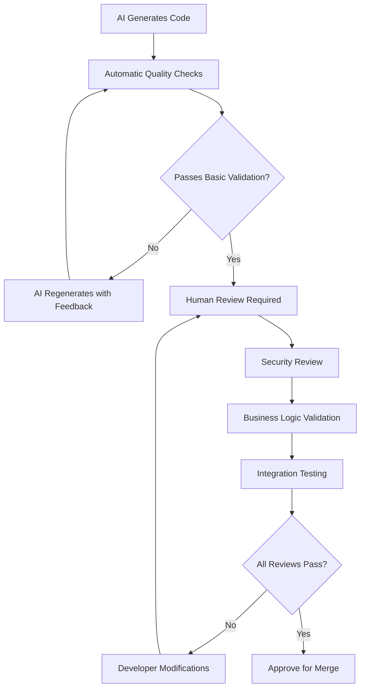

# AI Code Governance

## Purpose

This document establishes comprehensive governance frameworks for AI-assisted development in the Academic Management System, defining standards for AI-generated code, review processes, quality validation procedures, human oversight requirements, and best practices for integrating AI tools like GitHub Copilot into the development workflow while maintaining code quality, security, and maintainability.

## Scope

This document covers:

- AI-assisted development tools integration and configuration
- Code generation standards and quality requirements for AI-generated code
- Human oversight and review processes for AI contributions
- Quality validation and testing procedures for AI-generated code
- Security considerations and compliance requirements for AI-generated code
- Training and onboarding requirements for developers using AI tools

This document does not cover:

- AI model training or customization (vendor-managed services)
- General software development practices (covered in sdlc-process.instructions.md)
- Code review processes for human-generated code (covered in git-workflow.instructions.md)
- Security policies unrelated to AI-generated code (covered in security-compliance.instructions.md)

## Prerequisites

- Understanding of software development lifecycle and code quality principles
- Familiarity with GitHub Copilot and AI-assisted development tools
- Knowledge of code review processes and quality gates
- Understanding of security and compliance requirements for code development

## AI-Assisted Development Integration

### GitHub Copilot Configuration and Standards

```json
{
  "github.copilot": {
    "enable": {
      "*": true,
      "yaml": false,
      "plaintext": false,
      "markdown": false
    },
    "editor.formatOnSave": true,
    "suggestions": {
      "count": 3,
      "cycleCompletions": true
    },
    "advanced": {
      "listCount": 10,
      "inlineSuggestCount": 3
    }
  }
}
```

### AI Tool Integration Guidelines

```csharp
// File: .editorconfig additions for AI-generated code
[*.{cs,ts,js}]
# AI-generated code markers
ai_generated_marker = required
ai_review_required = true
ai_test_coverage_minimum = 90

# Disable AI suggestions for sensitive files
[*secret*]
github_copilot_enabled = false

[*config*]
github_copilot_enabled = false

[*.key]
github_copilot_enabled = false
```

### Project-Level AI Configuration

```yaml
# .github/copilot.yml - Project-specific AI configuration
# Configure GitHub Copilot behavior for the Academia Management System

# Enable Copilot for specific file types and patterns
suggestions:
  enabled_for:
    - "src/**/*.cs" # C# source code
    - "tests/**/*.cs" # Test files
    - "scripts/**/*.ps1" # PowerShell scripts
    - "infrastructure/**/*.bicep" # Bicep templates

  disabled_for:
    - "**/*.config" # Configuration files
    - "**/*.json" # JSON configuration
    - "**/*.yml" # YAML files
    - "**/*.secrets" # Secret files
    - "**/*.env" # Environment files
    - "docs/**/*" # Documentation

# Quality requirements for AI suggestions
quality_standards:
  min_confidence_threshold: 0.7
  require_context_awareness: true
  require_type_safety: true
  require_null_safety: true

# Security constraints
security:
  block_secret_patterns: true
  block_personal_data: true
  require_security_review: true

# Domain-specific context
domain_context:
  - "Academic Management System"
  - "Student Information System"
  - "Course Management"
  - "Enrollment Processing"
  - "CQRS Architecture"
  - "Domain-Driven Design"
  - ".NET 8.0"
  - "Entity Framework Core"
  - "MediatR"
```

## AI-Generated Code Standards

### Code Quality Requirements

```csharp
/// <summary>
/// Standards and validation for AI-generated code in the Academia Management System
/// </summary>
public static class AICodeStandards
{
    /// <summary>
    /// Required attributes for marking AI-generated code
    /// </summary>
    /// <example>
    /// [AIGenerated("GitHub Copilot", "2024-01-15", ReviewStatus.Pending)]
    /// public class StudentEnrollmentService
    /// {
    ///     // AI-generated implementation
    /// }
    /// </example>
    [AttributeUsage(AttributeTargets.Class | AttributeTargets.Method | AttributeTargets.Property)]
    public class AIGeneratedAttribute : Attribute
    {
        public string Tool { get; }
        public DateTime GeneratedDate { get; }
        public ReviewStatus ReviewStatus { get; set; }
        public string? ReviewedBy { get; set; }
        public DateTime? ReviewDate { get; set; }
        public string? Comments { get; set; }

        public AIGeneratedAttribute(string tool, string generatedDate, ReviewStatus reviewStatus = ReviewStatus.Pending)
        {
            Tool = tool;
            GeneratedDate = DateTime.Parse(generatedDate);
            ReviewStatus = reviewStatus;
        }
    }

    public enum ReviewStatus
    {
        Pending,
        Approved,
        RequiresChanges,
        Rejected
    }
}

/// <summary>
/// Example of properly attributed AI-generated code with human review
/// </summary>
[AIGenerated("GitHub Copilot", "2024-01-15", ReviewStatus.Approved)]
public class StudentGPACalculationService
{
    private readonly IAcademicRecordRepository _academicRecordRepository;
    private readonly ILogger<StudentGPACalculationService> _logger;

    public StudentGPACalculationService(
        IAcademicRecordRepository academicRecordRepository,
        ILogger<StudentGPACalculationService> logger)
    {
        _academicRecordRepository = academicRecordRepository ?? throw new ArgumentNullException(nameof(academicRecordRepository));
        _logger = logger ?? throw new ArgumentNullException(nameof(logger));
    }

    /// <summary>
    /// Calculates cumulative GPA for a student using the 4.0 scale
    /// Human Review: Validated business logic and error handling - J.Doe 2024-01-16
    /// </summary>
    /// <param name="studentId">The student ID to calculate GPA for</param>
    /// <param name="cancellationToken">Cancellation token</param>
    /// <returns>The calculated GPA or null if no completed courses</returns>
    public async Task<decimal?> CalculateCumulativeGPAAsync(StudentId studentId, CancellationToken cancellationToken = default)
    {
        try
        {
            _logger.LogDebug("Calculating cumulative GPA for student {StudentId}", studentId);

            var academicRecords = await _academicRecordRepository
                .GetCompletedRecordsAsync(studentId, cancellationToken);

            if (!academicRecords.Any())
            {
                _logger.LogInformation("No completed courses found for student {StudentId}", studentId);
                return null;
            }

            // Filter records that count toward GPA (exclude Pass/Fail, Incomplete, etc.)
            var gradedRecords = academicRecords
                .Where(record => record.Grade.CountsTowardGPA)
                .ToList();

            if (!gradedRecords.Any())
            {
                _logger.LogInformation("No graded courses found for student {StudentId}", studentId);
                return null;
            }

            // Calculate weighted GPA
            var totalGradePoints = gradedRecords.Sum(record =>
                record.Grade.GradePoints * record.Course.CreditHours);
            var totalCreditHours = gradedRecords.Sum(record => record.Course.CreditHours);

            if (totalCreditHours == 0)
            {
                _logger.LogWarning("Total credit hours is zero for student {StudentId}", studentId);
                return null;
            }

            var gpa = totalGradePoints / totalCreditHours;
            var roundedGPA = Math.Round(gpa, 3); // Round to 3 decimal places per academic standards

            _logger.LogDebug("Calculated GPA {GPA} for student {StudentId} ({TotalCredits} credit hours)",
                roundedGPA, studentId, totalCreditHours);

            return roundedGPA;
        }
        catch (Exception ex)
        {
            _logger.LogError(ex, "Error calculating GPA for student {StudentId}", studentId);
            throw;
        }
    }
}
```

### AI Code Documentation Standards

```csharp
/// <summary>
/// Documentation requirements for AI-generated code
/// All AI-generated code must include comprehensive documentation
/// </summary>
public class AIDocumentationStandards
{
    /// <summary>
    /// AI-Generated Method Documentation Template
    /// Generated by: GitHub Copilot
    /// Generated on: 2024-01-15T10:30:00Z
    /// Prompt Context: "Create a method to validate course enrollment prerequisites"
    /// Human Review Required: Yes
    /// Business Logic Validation: Pending
    /// Security Review: Pending
    /// </summary>
    /// <param name="studentId">The unique identifier of the student attempting enrollment</param>
    /// <param name="courseId">The unique identifier of the course for enrollment</param>
    /// <param name="academicTerm">The academic term for the enrollment</param>
    /// <returns>
    /// A Result object containing:
    /// - Success: True if prerequisites are met, False otherwise
    /// - Error: Detailed description of missing prerequisites if validation fails
    /// </returns>
    /// <remarks>
    /// Business Rules Validated by AI:
    /// 1. Student must have completed all prerequisite courses with minimum grade
    /// 2. Prerequisites must be completed before the enrollment term
    /// 3. Student must be in active status
    /// 4. Course must be available for the specified term
    ///
    /// Human Validation Required for:
    /// - Academic policy compliance
    /// - Edge cases and exceptions
    /// - Integration with existing business rules
    /// </remarks>
    /// <example>
    /// <code>
    /// var result = await ValidateCoursePrerequisitesAsync(studentId, courseId, AcademicTerm.Fall2024);
    /// if (result.IsSuccess)
    /// {
    ///     // Proceed with enrollment
    /// }
    /// else
    /// {
    ///     // Handle prerequisite validation failure
    ///     _logger.LogWarning("Prerequisite validation failed: {Error}", result.Error);
    /// }
    /// </code>
    /// </example>
    [AIGenerated("GitHub Copilot", "2024-01-15", ReviewStatus.Pending)]
    public async Task<Result> ValidateCoursePrerequisitesAsync(
        StudentId studentId,
        CourseId courseId,
        AcademicTerm academicTerm)
    {
        // AI-generated implementation with human review annotations
        // TODO: Human review required for business rule validation
        // TODO: Verify academic policy compliance
        // TODO: Add integration tests

        throw new NotImplementedException("Human review and validation required before implementation");
    }
}
```

## Human Oversight and Review Processes

### AI Code Review Workflow



### Human Review Checklist for AI-Generated Code

```csharp
/// <summary>
/// Comprehensive checklist for reviewing AI-generated code
/// </summary>
public class AICodeReviewChecklist
{
    /// <summary>
    /// Functional correctness validation
    /// </summary>
    public class FunctionalReview
    {
        // Business Logic Validation
        public bool DoesImplementationMatchRequirements { get; set; }
        public bool AreEdgeCasesHandled { get; set; }
        public bool IsErrorHandlingAppropriate { get; set; }
        public bool AreBusinessRulesRespected { get; set; }
        public string? BusinessLogicComments { get; set; }

        // Domain Model Integration
        public bool UsesCorrectDomainEntities { get; set; }
        public bool RespectsAggregateRootBoundaries { get; set; }
        public bool FollowsCQRSPattern { get; set; }
        public bool RaisesDomainEventsAppropriately { get; set; }
        public string? DomainModelComments { get; set; }
    }

    /// <summary>
    /// Code quality and maintainability validation
    /// </summary>
    public class QualityReview
    {
        // Code Structure
        public bool FollowsCodingStandards { get; set; }
        public bool HasAppropriateAbstraction { get; set; }
        public bool IsTestable { get; set; }
        public bool HasProperDependencyInjection { get; set; }
        public string? CodeStructureComments { get; set; }

        // Performance Considerations
        public bool HasEfficientAlgorithms { get; set; }
        public bool AvoidsPrematureOptimization { get; set; }
        public bool UsesAsyncProperly { get; set; }
        public bool HasProperResourceManagement { get; set; }
        public string? PerformanceComments { get; set; }
    }

    /// <summary>
    /// Security validation for AI-generated code
    /// </summary>
    public class SecurityReview
    {
        // Input Validation
        public bool ValidatesInputParameters { get; set; }
        public bool PreventsSQLInjection { get; set; }
        public bool PreventsXSS { get; set; }
        public bool HandlesAuthenticationProperly { get; set; }
        public string? SecurityComments { get; set; }

        // Data Protection
        public bool HandlesPersonalDataAppropriately { get; set; }
        public bool EncryptsSensitiveData { get; set; }
        public bool FollowsPrivacyCompliance { get; set; }
        public bool LogsSafelyWithoutExposingSecrets { get; set; }
        public string? DataProtectionComments { get; set; }
    }
}

/// <summary>
/// AI code review service for automated and human review coordination
/// </summary>
public class AICodeReviewService
{
    private readonly ICodeAnalysisService _codeAnalysis;
    private readonly ISecurityScanService _securityScan;
    private readonly ILogger<AICodeReviewService> _logger;

    public async Task<AICodeReviewResult> ReviewAIGeneratedCodeAsync(
        AIGeneratedCodeSubmission submission,
        CancellationToken cancellationToken = default)
    {
        var result = new AICodeReviewResult
        {
            SubmissionId = submission.Id,
            ReviewStartTime = DateTime.UtcNow
        };

        try
        {
            // Stage 1: Automated quality checks
            result.AutomatedChecks = await RunAutomatedChecksAsync(submission, cancellationToken);

            // Stage 2: Security analysis
            result.SecurityAnalysis = await RunSecurityAnalysisAsync(submission, cancellationToken);

            // Stage 3: Business domain validation
            result.DomainValidation = await ValidateDomainIntegrationAsync(submission, cancellationToken);

            // Stage 4: Assign human reviewers based on complexity and risk
            result.RequiredReviewers = DetermineRequiredReviewers(submission, result);

            // Stage 5: Create review tasks
            await CreateReviewTasksAsync(result, cancellationToken);

            result.Status = AIReviewStatus.PendingHumanReview;
            _logger.LogInformation("AI code review initiated for submission {SubmissionId}", submission.Id);
        }
        catch (Exception ex)
        {
            result.Status = AIReviewStatus.Failed;
            result.Error = ex.Message;
            _logger.LogError(ex, "AI code review failed for submission {SubmissionId}", submission.Id);
        }
        finally
        {
            result.ReviewEndTime = DateTime.UtcNow;
        }

        return result;
    }

    private async Task<AutomatedCheckResult> RunAutomatedChecksAsync(
        AIGeneratedCodeSubmission submission,
        CancellationToken cancellationToken)
    {
        var result = new AutomatedCheckResult();

        // Static code analysis
        result.StaticAnalysis = await _codeAnalysis.AnalyzeAsync(submission.Code, cancellationToken);

        // Compilation check
        result.CompilationResult = await CompileCodeAsync(submission.Code, cancellationToken);

        // Unit test generation and execution
        result.GeneratedTests = await GenerateAndRunTestsAsync(submission, cancellationToken);

        // Code complexity analysis
        result.ComplexityMetrics = AnalyzeCodeComplexity(submission.Code);

        return result;
    }

    private List<ReviewerAssignment> DetermineRequiredReviewers(
        AIGeneratedCodeSubmission submission,
        AICodeReviewResult preliminaryResult)
    {
        var reviewers = new List<ReviewerAssignment>();

        // Always require senior developer review for AI-generated code
        reviewers.Add(new ReviewerAssignment
        {
            ReviewerRole = ReviewerRole.SeniorDeveloper,
            ReviewType = ReviewType.CodeQuality,
            Priority = ReviewPriority.Required
        });

        // Security review for high-risk code
        if (IsSecuritySensitive(submission))
        {
            reviewers.Add(new ReviewerAssignment
            {
                ReviewerRole = ReviewerRole.SecurityEngineer,
                ReviewType = ReviewType.Security,
                Priority = ReviewPriority.Required
            });
        }

        // Architecture review for significant changes
        if (IsArchitecturallySignificant(submission))
        {
            reviewers.Add(new ReviewerAssignment
            {
                ReviewerRole = ReviewerRole.SolutionArchitect,
                ReviewType = ReviewType.Architecture,
                Priority = ReviewPriority.Required
            });
        }

        // Business domain expert for complex business logic
        if (HasComplexBusinessLogic(submission))
        {
            reviewers.Add(new ReviewerAssignment
            {
                ReviewerRole = ReviewerRole.DomainExpert,
                ReviewType = ReviewType.BusinessLogic,
                Priority = ReviewPriority.Required
            });
        }

        return reviewers;
    }
}
```

### Review Documentation and Tracking

```csharp
/// <summary>
/// Comprehensive tracking and documentation for AI code reviews
/// </summary>
public class AICodeReviewTracker
{
    /// <summary>
    /// Records detailed review decisions and rationale
    /// </summary>
    public class ReviewDecision
    {
        public Guid ReviewId { get; set; }
        public string ReviewerName { get; set; } = string.Empty;
        public ReviewerRole ReviewerRole { get; set; }
        public DateTime ReviewDate { get; set; }
        public ReviewDecisionType Decision { get; set; }
        public string Rationale { get; set; } = string.Empty;
        public List<ReviewComment> Comments { get; set; } = new();
        public List<RequiredChange> RequiredChanges { get; set; } = new();
        public int TimeSpentMinutes { get; set; }
        public ReviewComplexity ComplexityRating { get; set; }
    }

    public class ReviewComment
    {
        public int LineNumber { get; set; }
        public string FileName { get; set; } = string.Empty;
        public CommentType Type { get; set; }
        public CommentSeverity Severity { get; set; }
        public string Comment { get; set; } = string.Empty;
        public string? SuggestedFix { get; set; }
        public bool IsResolved { get; set; }
        public string? Resolution { get; set; }
    }

    public enum CommentType
    {
        CodeQuality,
        BusinessLogic,
        Security,
        Performance,
        Maintainability,
        Testing,
        Documentation
    }

    public enum CommentSeverity
    {
        Info,
        Warning,
        Error,
        Critical
    }
}

/// <summary>
/// AI review metrics and analytics service
/// </summary>
public class AIReviewMetricsService
{
    /// <summary>
    /// Tracks AI code generation and review metrics for continuous improvement
    /// </summary>
    public async Task<AIReviewMetrics> CalculateReviewMetricsAsync(
        DateTime fromDate,
        DateTime toDate,
        CancellationToken cancellationToken = default)
    {
        var metrics = new AIReviewMetrics
        {
            PeriodStart = fromDate,
            PeriodEnd = toDate
        };

        // AI generation metrics
        metrics.TotalAICodeSubmissions = await CountAISubmissionsAsync(fromDate, toDate, cancellationToken);
        metrics.AcceptedAISubmissions = await CountAcceptedSubmissionsAsync(fromDate, toDate, cancellationToken);
        metrics.AcceptanceRate = (decimal)metrics.AcceptedAISubmissions / metrics.TotalAICodeSubmissions;

        // Review time metrics
        metrics.AverageReviewTimeHours = await CalculateAverageReviewTimeAsync(fromDate, toDate, cancellationToken);
        metrics.AverageChangesPerReview = await CalculateAverageChangesAsync(fromDate, toDate, cancellationToken);

        // Quality metrics
        metrics.DefectRatePostReview = await CalculatePostReviewDefectRateAsync(fromDate, toDate, cancellationToken);
        metrics.SecurityIssuesDetected = await CountSecurityIssuesAsync(fromDate, toDate, cancellationToken);

        // Common issues analysis
        metrics.CommonIssueCategories = await AnalyzeCommonIssuesAsync(fromDate, toDate, cancellationToken);

        return metrics;
    }

    /// <summary>
    /// Generates AI tool effectiveness report
    /// </summary>
    public async Task<AIEffectivenessReport> GenerateEffectivenessReportAsync(
        CancellationToken cancellationToken = default)
    {
        var report = new AIEffectivenessReport
        {
            GeneratedDate = DateTime.UtcNow
        };

        // Productivity metrics
        report.CodeGenerationSpeedUp = await CalculateProductivityGainAsync(cancellationToken);
        report.DeveloperSatisfactionScore = await GetDeveloperFeedbackScoreAsync(cancellationToken);

        // Quality comparison
        report.QualityComparisonVsHumanCode = await CompareQualityMetricsAsync(cancellationToken);

        // Learning and improvement recommendations
        report.ImprovementRecommendations = await GenerateImprovementRecommendationsAsync(cancellationToken);

        return report;
    }
}
```

## Quality Validation and Testing

### AI Code Testing Requirements

```csharp
/// <summary>
/// Specialized testing requirements for AI-generated code
/// </summary>
[TestFixture]
public class AIGeneratedCodeTests : TestBase
{
    /// <summary>
    /// All AI-generated code must have comprehensive unit tests
    /// Minimum 90% code coverage required
    /// </summary>
    [Test]
    [Category("AIGenerated")]
    public async Task AIGenerated_StudentGPACalculation_ShouldHandleAllScenarios()
    {
        // Arrange: Test data for all possible GPA calculation scenarios
        var testScenarios = new[]
        {
            // Normal case: Standard grades with credit hours
            new GPATestScenario
            {
                Name = "Standard GPA Calculation",
                AcademicRecords = CreateStandardGradeRecords(),
                ExpectedGPA = 3.250m,
                Description = "Mixed grades with varying credit hours"
            },

            // Edge case: All A grades
            new GPATestScenario
            {
                Name = "Perfect GPA",
                AcademicRecords = CreateAllAGradeRecords(),
                ExpectedGPA = 4.000m,
                Description = "All A grades should result in perfect 4.0 GPA"
            },

            // Edge case: No completed courses
            new GPATestScenario
            {
                Name = "No Completed Courses",
                AcademicRecords = new List<AcademicRecord>(),
                ExpectedGPA = null,
                Description = "Should return null when no courses are completed"
            },

            // Edge case: Pass/Fail courses only
            new GPATestScenario
            {
                Name = "Pass/Fail Only",
                AcademicRecords = CreatePassFailOnlyRecords(),
                ExpectedGPA = null,
                Description = "Pass/Fail courses should not count toward GPA"
            },

            // Boundary case: Very low GPA
            new GPATestScenario
            {
                Name = "Very Low GPA",
                AcademicRecords = CreateLowGradeRecords(),
                ExpectedGPA = 0.667m,
                Description = "Verify calculation accuracy for low GPAs"
            }
        };

        var gpaService = CreateAIGeneratedGPAService();

        foreach (var scenario in testScenarios)
        {
            // Act
            var studentId = StudentId.New();
            MockAcademicRecords(studentId, scenario.AcademicRecords);

            var result = await gpaService.CalculateCumulativeGPAAsync(studentId);

            // Assert
            Assert.AreEqual(scenario.ExpectedGPA, result, 0.001m,
                $"GPA calculation failed for scenario: {scenario.Name}. {scenario.Description}");
        }
    }

    /// <summary>
    /// AI-generated code must handle error conditions gracefully
    /// </summary>
    [Test]
    [Category("AIGenerated")]
    public async Task AIGenerated_StudentGPACalculation_ShouldHandleExceptions()
    {
        var gpaService = CreateAIGeneratedGPAService();

        // Test null student ID
        await Assert.ThrowsAsync<ArgumentNullException>(
            () => gpaService.CalculateCumulativeGPAAsync(null!));

        // Test database connection failure
        MockDatabaseFailure();
        await Assert.ThrowsAsync<DatabaseException>(
            () => gpaService.CalculateCumulativeGPAAsync(StudentId.New()));

        // Test corrupted data
        MockCorruptedGradeData();
        await Assert.ThrowsAsync<DataCorruptionException>(
            () => gpaService.CalculateCumulativeGPAAsync(StudentId.New()));
    }

    /// <summary>
    /// Performance testing for AI-generated code
    /// </summary>
    [Test]
    [Category("AIGenerated")]
    [Category("Performance")]
    public async Task AIGenerated_StudentGPACalculation_ShouldMeetPerformanceRequirements()
    {
        // Arrange: Large dataset for performance testing
        var studentId = StudentId.New();
        var largeRecordSet = CreateLargeAcademicRecordSet(1000); // 1000 course records
        MockAcademicRecords(studentId, largeRecordSet);

        var gpaService = CreateAIGeneratedGPAService();
        var stopwatch = Stopwatch.StartNew();

        // Act: Multiple calculations to test consistency
        for (int i = 0; i < 10; i++)
        {
            await gpaService.CalculateCumulativeGPAAsync(studentId);
        }

        stopwatch.Stop();

        // Assert: Performance requirements
        var averageTime = stopwatch.ElapsedMilliseconds / 10.0;
        Assert.Less(averageTime, 100, "AI-generated GPA calculation should complete within 100ms on average");

        // Memory usage validation
        var memoryUsage = GC.GetTotalMemory(false);
        Assert.Less(memoryUsage, 50 * 1024 * 1024, "Memory usage should not exceed 50MB for large datasets");
    }
}

/// <summary>
/// Integration testing for AI-generated components
/// </summary>
[TestFixture]
public class AIGeneratedIntegrationTests : IntegrationTestBase
{
    [Test]
    [Category("AIGenerated")]
    [Category("Integration")]
    public async Task AIGenerated_EnrollmentWorkflow_ShouldIntegrateCorrectlyWithExistingSystem()
    {
        // Test that AI-generated enrollment validation integrates properly
        // with existing domain services, event handlers, and data persistence

        using var scope = CreateTestScope();
        var enrollmentService = scope.ServiceProvider.GetRequiredService<IEnrollmentService>();
        var eventBus = scope.ServiceProvider.GetRequiredService<IEventBus>();
        var dbContext = scope.ServiceProvider.GetRequiredService<AcademiaDbContext>();

        // Arrange test data
        var student = await CreateTestStudentAsync(dbContext);
        var course = await CreateTestCourseAsync(dbContext);
        var academicTerm = AcademicTerm.Fall2024;

        var eventsFired = new List<IDomainEvent>();
        eventBus.Subscribe<StudentEnrolledDomainEvent>(evt => eventsFired.Add(evt));

        // Act: Execute AI-generated enrollment logic
        var enrollmentCommand = new EnrollStudentInCourseCommand(student.Id, course.Id, academicTerm);
        var result = await enrollmentService.HandleAsync(enrollmentCommand);

        // Assert: Verify complete integration
        Assert.IsTrue(result.IsSuccess, "AI-generated enrollment should succeed");
        Assert.IsTrue(eventsFired.Any(), "Domain events should be raised");

        // Verify database persistence
        var enrollment = await dbContext.Enrollments
            .FirstOrDefaultAsync(e => e.StudentId == student.Id && e.CourseId == course.Id);
        Assert.IsNotNull(enrollment, "Enrollment should be persisted to database");

        // Verify business rules enforcement
        Assert.AreEqual(EnrollmentStatus.Active, enrollment.Status);
        Assert.AreEqual(academicTerm, enrollment.AcademicTerm);
    }
}
```

### Automated Quality Gates for AI Code

```yaml
# Azure DevOps pipeline quality gates for AI-generated code
name: AI-Generated Code Quality Gate

trigger:
  paths:
    include:
      - "src/**/*.cs" # Only trigger on source code changes

variables:
  - name: "AI_CODE_COVERAGE_THRESHOLD"
    value: "90" # Higher threshold for AI-generated code
  - name: "AI_COMPLEXITY_THRESHOLD"
    value: "10" # Lower complexity threshold for AI code

stages:
  - stage: AICodeValidation
    displayName: "AI-Generated Code Validation"
    jobs:
      - job: DetectAICode
        displayName: "Detect AI-Generated Code"
        steps:
          - task: PowerShell@2
            displayName: "Scan for AI-Generated Code Markers"
            inputs:
              targetType: "inline"
              script: |
                # Scan for AI-generated code attributes and comments
                $aiCodeFiles = @()

                Get-ChildItem -Path "src" -Recurse -Filter "*.cs" | ForEach-Object {
                  $content = Get-Content $_.FullName -Raw
                  if ($content -match '\[AIGenerated\(|AI-Generated|Generated by.*Copilot') {
                    $aiCodeFiles += $_.FullName
                    Write-Host "AI-generated code detected: $($_.FullName)"
                  }
                }

                # Set pipeline variable for downstream tasks
                Write-Host "##vso[task.setvariable variable=AI_CODE_DETECTED]$($aiCodeFiles.Count -gt 0)"
                Write-Host "##vso[task.setvariable variable=AI_CODE_FILES]$($aiCodeFiles -join ';')"

      - job: AICodeQualityAnalysis
        displayName: "AI Code Quality Analysis"
        dependsOn: DetectAICode
        condition: eq(dependencies.DetectAICode.outputs['PowerShell.AI_CODE_DETECTED'], 'True')
        steps:
          - task: UseDotNet@2
            inputs:
              packageType: "sdk"
              version: "8.0.x"

          - task: DotNetCoreCLI@2
            displayName: "Build Solution"
            inputs:
              command: "build"
              configuration: "Release"
              arguments: "--no-restore --verbosity minimal"

          - task: DotNetCoreCLI@2
            displayName: "Run AI Code Tests"
            inputs:
              command: "test"
              projects: "tests/**/*Tests.csproj"
              arguments: '--configuration Release --logger trx --collect:"XPlat Code Coverage" --filter Category=AIGenerated'
              publishTestResults: true

          - task: PublishCodeCoverageResults@1
            displayName: "Publish AI Code Coverage"
            inputs:
              codeCoverageTool: "Cobertura"
              summaryFileLocation: "$(Agent.TempDirectory)/**/coverage.cobertura.xml"
              failIfCoverageEmpty: true

          - task: PowerShell@2
            displayName: "Validate AI Code Coverage"
            inputs:
              targetType: "inline"
              script: |
                # Parse coverage results and validate against threshold
                $coverageFile = Get-ChildItem -Path "$(Agent.TempDirectory)" -Filter "coverage.cobertura.xml" -Recurse | Select-Object -First 1

                if ($coverageFile) {
                  [xml]$coverage = Get-Content $coverageFile.FullName
                  $lineRate = [decimal]$coverage.coverage.'line-rate' * 100
                  
                  Write-Host "AI Code Coverage: $lineRate%"
                  
                  if ($lineRate -lt $(AI_CODE_COVERAGE_THRESHOLD)) {
                    Write-Host "##vso[task.logissue type=error]AI-generated code coverage ($lineRate%) is below threshold ($(AI_CODE_COVERAGE_THRESHOLD)%)"
                    exit 1
                  }
                } else {
                  Write-Host "##vso[task.logissue type=error]Coverage file not found"
                  exit 1
                }

      - job: AISecurityScan
        displayName: "AI Code Security Scan"
        dependsOn: DetectAICode
        condition: eq(dependencies.DetectAICode.outputs['PowerShell.AI_CODE_DETECTED'], 'True')
        steps:
          - task: SecurityCodeScan@2
            displayName: "Security Code Scan"
            inputs:
              targetType: "solution"
              solution: "**/*.sln"
              failOnIssues: true

          - task: PowerShell@2
            displayName: "AI-Specific Security Validation"
            inputs:
              targetType: "inline"
              script: |
                # Additional security checks specific to AI-generated code
                $securityIssues = @()

                # Check for hardcoded secrets in AI-generated code
                $aiFiles = "$(AI_CODE_FILES)" -split ';'
                foreach ($file in $aiFiles) {
                  if (Test-Path $file) {
                    $content = Get-Content $file -Raw
                    
                    # Check for common security anti-patterns
                    if ($content -match 'password\s*=|key\s*=|secret\s*=') {
                      $securityIssues += "Potential hardcoded secret in $file"
                    }
                    
                    if ($content -match 'SQL.*\+.*\$|string\.Format.*SELECT') {
                      $securityIssues += "Potential SQL injection vulnerability in $file"
                    }
                  }
                }

                if ($securityIssues.Count -gt 0) {
                  foreach ($issue in $securityIssues) {
                    Write-Host "##vso[task.logissue type=error]$issue"
                  }
                  exit 1
                }

      - job: AICodeReviewGate
        displayName: "AI Code Review Gate"
        dependsOn: [AICodeQualityAnalysis, AISecurityScan]
        condition: and(succeeded(), eq(dependencies.DetectAICode.outputs['PowerShell.AI_CODE_DETECTED'], 'True'))
        steps:
          - task: PowerShell@2
            displayName: "Verify Human Review Completion"
            inputs:
              targetType: "inline"
              script: |
                # Check that all AI-generated code has completed human review
                $aiFiles = "$(AI_CODE_FILES)" -split ';'
                $unreviewed = @()

                foreach ($file in $aiFiles) {
                  if (Test-Path $file) {
                    $content = Get-Content $file -Raw
                    
                    # Check for review completion markers
                    if ($content -match 'ReviewStatus\.Pending|TODO.*Human.*review|Human.*Review.*Required') {
                      $unreviewed += $file
                    }
                  }
                }

                if ($unreviewed.Count -gt 0) {
                  Write-Host "##vso[task.logissue type=error]AI-generated code requires human review completion:"
                  foreach ($file in $unreviewed) {
                    Write-Host "##vso[task.logissue type=error]  - $file"
                  }
                  exit 1
                }

                Write-Host "All AI-generated code has completed human review"
```

## Training and Best Practices

### Developer Training Requirements

```csharp
/// <summary>
/// Training curriculum for developers using AI-assisted development tools
/// </summary>
public class AIAssistedDevelopmentTraining
{
    /// <summary>
    /// Core competency areas for AI-assisted development
    /// </summary>
    public class CoreCompetencies
    {
        // Understanding AI Capabilities and Limitations
        public bool UnderstandsAIStrengths { get; set; }
        public bool RecognizesAILimitations { get; set; }
        public bool KnowsWhenToUseAI { get; set; }
        public bool KnowsWhenNotToUseAI { get; set; }

        // Prompt Engineering Skills
        public bool CanWriteEffectivePrompts { get; set; }
        public bool UnderstandsContextImportance { get; set; }
        public bool CanIterateOnPrompts { get; set; }
        public bool KnowsDomainSpecificPrompting { get; set; }

        // Review and Validation Skills
        public bool CanCriticallyEvaluateAICode { get; set; }
        public bool UnderstandsSecurityImplications { get; set; }
        public bool CanIdentifyBusinessLogicFlaws { get; set; }
        public bool KnowsTestingRequirements { get; set; }

        // Ethical AI Use
        public bool UnderstandsCopyrightImplications { get; set; }
        public bool KnowsAttributionRequirements { get; set; }
        public bool UnderstandsBiasConsiderations { get; set; }
        public bool FollowsEthicalGuidelines { get; set; }
    }

    /// <summary>
    /// Training modules and assessments
    /// </summary>
    public static readonly List<TrainingModule> RequiredModules = new()
    {
        new TrainingModule
        {
            Name = "AI-Assisted Development Fundamentals",
            Duration = TimeSpan.FromHours(4),
            Description = "Understanding AI capabilities, limitations, and appropriate use cases",
            LearningObjectives = new[]
            {
                "Identify appropriate scenarios for AI assistance",
                "Recognize AI limitations and potential pitfalls",
                "Understand the importance of human oversight"
            },
            Assessment = new Assessment
            {
                Type = AssessmentType.MultipleChoice,
                PassingScore = 85,
                Questions = 20
            }
        },

        new TrainingModule
        {
            Name = "Effective Prompt Engineering",
            Duration = TimeSpan.FromHours(6),
            Description = "Writing effective prompts for code generation and problem-solving",
            LearningObjectives = new[]
            {
                "Write clear, specific prompts for code generation",
                "Provide appropriate context and constraints",
                "Iterate and refine prompts for better results"
            },
            Assessment = new Assessment
            {
                Type = AssessmentType.PracticalExercise,
                PassingScore = 80,
                RequiredSubmissions = 3
            }
        },

        new TrainingModule
        {
            Name = "AI Code Review and Validation",
            Duration = TimeSpan.FromHours(8),
            Description = "Critical evaluation and validation of AI-generated code",
            LearningObjectives = new[]
            {
                "Identify common AI code generation issues",
                "Validate business logic implementation",
                "Ensure security and compliance requirements"
            },
            Assessment = new Assessment
            {
                Type = AssessmentType.CodeReview,
                PassingScore = 90,
                RequiredReviews = 5
            }
        },

        new TrainingModule
        {
            Name = "Security and Compliance in AI-Generated Code",
            Duration = TimeSpan.FromHours(4),
            Description = "Security considerations and compliance requirements for AI-assisted development",
            LearningObjectives = new[]
            {
                "Identify security vulnerabilities in AI-generated code",
                "Ensure compliance with data protection regulations",
                "Implement secure coding practices with AI assistance"
            },
            Assessment = new Assessment
            {
                Type = AssessmentType.SecurityAudit,
                PassingScore = 95,
                RequiredAudits = 2
            }
        }
    };
}

/// <summary>
/// Best practices guide for AI-assisted development
/// </summary>
public static class AIBestPractices
{
    /// <summary>
    /// Guidelines for effective AI prompt engineering
    /// </summary>
    public static readonly Dictionary<string, string> PromptEngineering = new()
    {
        ["Be Specific and Clear"] = @"
            Provide clear, specific requirements and context.
            Bad: 'Create a service for students'
            Good: 'Create a StudentEnrollmentService that validates prerequisites and enforces business rules for course enrollment in the Academia Management System'",

        ["Include Domain Context"] = @"
            Always include relevant domain context and business rules.
            Example: 'In the Academic Management System, students must be in Active status and meet all prerequisites before enrolling in courses.'",

        ["Specify Technical Constraints"] = @"
            Include technical requirements and constraints.
            Example: 'Use .NET 8.0, follow CQRS pattern with MediatR, implement async methods, and include comprehensive error handling.'",

        ["Request Documentation"] = @"
            Always request comprehensive documentation and examples.
            Example: 'Include XML documentation comments, example usage, and unit test examples.'",

        ["Iterate and Refine"] = @"
            Use follow-up prompts to refine and improve the generated code.
            Example: 'Add input validation for null parameters and improve error messages to be more descriptive.'"
    };

    /// <summary>
    /// Code review guidelines for AI-generated code
    /// </summary>
    public static readonly Dictionary<string, string> ReviewGuidelines = new()
    {
        ["Verify Business Logic"] = @"
            Carefully review that business rules are correctly implemented.
            - Check domain invariants and constraints
            - Validate calculation logic (e.g., GPA calculations)
            - Ensure proper aggregate root boundaries",

        ["Security Validation"] = @"
            Perform thorough security review of AI-generated code.
            - Check for SQL injection vulnerabilities
            - Validate input sanitization
            - Ensure proper authentication/authorization
            - Review logging for sensitive data exposure",

        ["Testing Requirements"] = @"
            Ensure comprehensive testing coverage.
            - Minimum 90% code coverage for AI-generated code
            - Include edge cases and error scenarios
            - Validate integration with existing systems
            - Performance testing for critical paths",

        ["Documentation Standards"] = @"
            Verify complete and accurate documentation.
            - XML documentation for all public members
            - Clear explanation of AI generation and human review
            - Example usage and integration patterns
            - Business rule documentation"
    };
}
```

## Related Documentation References

- [Project Overview](./project-overview.instructions.md)
- [SDLC Process](./sdlc-process.instructions.md)
- [Git Workflow](./git-workflow.instructions.md)
- [Security Compliance](./security-compliance.instructions.md)
- [Testing Requirements](./testing-requirements.instructions.md)

## Validation Checklist

Before considering the AI code governance implementation complete, verify:

- [ ] GitHub Copilot and AI tools are properly configured with security constraints
- [ ] AI-generated code attribution and tracking mechanisms are implemented
- [ ] Human review processes are established with clear roles and responsibilities
- [ ] Quality gates enforce higher standards for AI-generated code (90% coverage minimum)
- [ ] Security scanning specifically validates AI-generated code for vulnerabilities
- [ ] Training programs cover AI tool usage, prompt engineering, and review skills
- [ ] Documentation standards require clear marking of AI-generated content
- [ ] Performance testing validates AI-generated code meets system requirements
- [ ] Business logic validation processes ensure domain rule compliance
- [ ] Metrics and analytics track AI tool effectiveness and improvement opportunities
- [ ] Emergency procedures exist for handling AI-generated code issues in production
- [ ] Compliance requirements are met for AI-assisted development in regulated environments
