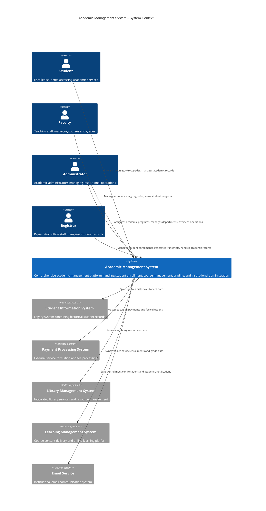

# Architecture Design Guidelines

## Purpose

This document establishes comprehensive architecture design guidelines for the Academic Management System, providing C4 model diagrams, project structure definitions, aggregate boundary specifications, and architectural decision record templates to ensure consistent, maintainable, and scalable system design.

## Scope

This document covers:

- C4 model architecture diagrams using Mermaid
- Project structure organization and justification
- Aggregate boundary definitions and relationships
- Architectural decision record (ADR) templates and process
- Design pattern implementations and standards
- Quality attribute scenarios and trade-offs

This document does not cover:

- Infrastructure deployment configurations
- Database schema implementation details
- Security implementation specifics
- Performance tuning techniques

## Prerequisites

- Understanding of Domain-Driven Design (DDD) principles
- Familiarity with CQRS and Event Sourcing patterns
- Knowledge of .NET 8.0 project structure conventions
- Understanding of architectural documentation practices

## C4 Model Architecture

### Level 1: System Context Diagram



### Level 2: Container Diagram

```mermaid
C4Container
    title Academic Management System - Container Diagram

    Person(student, "Student")
    Person(faculty, "Faculty")
    Person(admin, "Administrator")

    Container_Boundary(aca_boundary, "Academic Management System") {
        Container(web_app, "Web Application", "React SPA", "Single-page application providing user interface for all academic management functions")
        Container(api_gateway, "API Gateway", "Azure API Management", "Routes requests, handles authentication, rate limiting, and API versioning")

        Container(student_api, "Student Service", ".NET 8 Web API", "Handles student management, enrollment, and academic record operations")
        Container(course_api, "Course Service", ".NET 8 Web API", "Manages course catalog, scheduling, and course offering operations")
        Container(grade_api, "Grading Service", ".NET 8 Web API", "Processes grade assignments, calculations, and transcript generation")
        Container(admin_api, "Administration Service", ".NET 8 Web API", "Handles institutional administration, department management, and system configuration")

        ContainerDb(student_db, "Student Database", "Azure SQL Database", "Stores student records, enrollment data, and academic history")
        ContainerDb(course_db, "Course Database", "Azure SQL Database", "Contains course catalog, schedules, and offering information")
        ContainerDb(grade_db, "Grading Database", "Azure SQL Database", "Maintains grade records, transcripts, and assessment data")
        ContainerDb(read_db, "Read Model Database", "Azure SQL Database", "Optimized read models for query performance")

        Container(event_store, "Event Store", "Azure Service Bus", "Stores domain events for event sourcing and system integration")
        Container(cache, "Cache Layer", "Azure Redis Cache", "Distributed caching for performance optimization")
    }

    System_Ext(sis, "Student Information System")
    System_Ext(payment, "Payment Processing System")

    Rel(student, web_app, "Uses", "HTTPS")
    Rel(faculty, web_app, "Uses", "HTTPS")
    Rel(admin, web_app, "Uses", "HTTPS")

    Rel(web_app, api_gateway, "Makes API calls", "HTTPS/REST")

    Rel(api_gateway, student_api, "Routes student requests", "HTTPS/REST")
    Rel(api_gateway, course_api, "Routes course requests", "HTTPS/REST")
    Rel(api_gateway, grade_api, "Routes grading requests", "HTTPS/REST")
    Rel(api_gateway, admin_api, "Routes admin requests", "HTTPS/REST")

    Rel(student_api, student_db, "Reads from and writes to", "SQL/TCP")
    Rel(course_api, course_db, "Reads from and writes to", "SQL/TCP")
    Rel(grade_api, grade_db, "Reads from and writes to", "SQL/TCP")
    Rel(admin_api, read_db, "Reads from", "SQL/TCP")

    Rel(student_api, event_store, "Publishes events", "AMQP")
    Rel(course_api, event_store, "Publishes events", "AMQP")
    Rel(grade_api, event_store, "Publishes events", "AMQP")

    Rel(student_api, cache, "Caches data", "Redis Protocol")
    Rel(course_api, cache, "Caches data", "Redis Protocol")
    Rel(grade_api, cache, "Caches data", "Redis Protocol")

    Rel(student_api, sis, "Synchronizes data", "HTTPS/REST")
    Rel(grade_api, payment, "Processes payments", "HTTPS/REST")

    UpdateLayoutConfig($c4ShapeInRow="3", $c4BoundaryInRow="1")
```



### Level 3: Component Diagram - Student Service

```mermaid
C4Component
    title Student Service - Component Diagram

    Container(web_app, "Web Application", "React SPA")
    Container(api_gateway, "API Gateway", "Azure API Management")

    Container_Boundary(student_service, "Student Service") {
        Component(student_controller, "Student Controller", ".NET Controller", "REST API endpoints for student operations")
        Component(enrollment_controller, "Enrollment Controller", ".NET Controller", "REST API endpoints for course enrollment")

        Component(student_cmd_handler, "Student Command Handlers", "MediatR Handlers", "Processes student-related commands (create, update, enroll)")
        Component(student_query_handler, "Student Query Handlers", "MediatR Handlers", "Handles student-related queries (search, details, history)")

        Component(student_aggregate, "Student Aggregate", "Domain Model", "Student business logic and invariants")
        Component(enrollment_aggregate, "Enrollment Aggregate", "Domain Model", "Enrollment business logic and rules")

        Component(student_repository, "Student Repository", "EF Core Repository", "Data access for student aggregate")
        Component(enrollment_repository, "Enrollment Repository", "EF Core Repository", "Data access for enrollment aggregate")

        Component(enrollment_service, "Enrollment Domain Service", "Domain Service", "Complex enrollment business rules and validations")
        Component(academic_calendar, "Academic Calendar Service", "Domain Service", "Academic term and calendar management")

        Component(event_publisher, "Event Publisher", "Infrastructure", "Publishes domain events to event store")
        Component(notification_handler, "Notification Handlers", "MediatR Handlers", "Handles domain event notifications")
    }

    ContainerDb(student_db, "Student Database", "Azure SQL Database")
    Container(event_store, "Event Store", "Azure Service Bus")
    Container(cache, "Cache Layer", "Azure Redis Cache")

    Rel(api_gateway, student_controller, "Routes requests", "HTTPS/REST")
    Rel(api_gateway, enrollment_controller, "Routes requests", "HTTPS/REST")

    Rel(student_controller, student_cmd_handler, "Sends commands", "Method calls")
    Rel(student_controller, student_query_handler, "Sends queries", "Method calls")
    Rel(enrollment_controller, student_cmd_handler, "Sends commands", "Method calls")
    Rel(enrollment_controller, student_query_handler, "Sends queries", "Method calls")

    Rel(student_cmd_handler, student_aggregate, "Uses", "Method calls")
    Rel(student_cmd_handler, enrollment_aggregate, "Uses", "Method calls")
    Rel(student_cmd_handler, enrollment_service, "Uses", "Method calls")

    Rel(student_query_handler, student_repository, "Queries", "Method calls")
    Rel(student_query_handler, enrollment_repository, "Queries", "Method calls")

    Rel(student_cmd_handler, student_repository, "Saves", "Method calls")
    Rel(student_cmd_handler, enrollment_repository, "Saves", "Method calls")

    Rel(enrollment_service, academic_calendar, "Validates terms", "Method calls")

    Rel(student_aggregate, event_publisher, "Publishes events", "Method calls")
    Rel(enrollment_aggregate, event_publisher, "Publishes events", "Method calls")

    Rel(event_publisher, event_store, "Sends events", "AMQP")
    Rel(notification_handler, cache, "Updates cache", "Redis Protocol")

    Rel(student_repository, student_db, "Reads/Writes", "SQL/TCP")
    Rel(enrollment_repository, student_db, "Reads/Writes", "SQL/TCP")

    UpdateLayoutConfig($c4ShapeInRow="2", $c4BoundaryInRow="1")
```



## Project Structure Organization

### Solution Structure

```
Academia.sln
├── src/
│   ├── Academia.Domain/                          # Core domain logic
│   │   ├── Aggregates/                          # Domain aggregates
│   │   │   ├── StudentAggregate/
│   │   │   │   ├── Student.cs                   # Student aggregate root
│   │   │   │   ├── Enrollment.cs                # Enrollment entity
│   │   │   │   ├── AcademicRecord.cs            # Academic record entity
│   │   │   │   └── Events/                      # Domain events
│   │   │   ├── CourseAggregate/
│   │   │   │   ├── Course.cs                    # Course aggregate root
│   │   │   │   ├── CourseOffering.cs            # Course offering entity
│   │   │   │   └── Events/
│   │   │   ├── ProgramAggregate/
│   │   │   └── DepartmentAggregate/
│   │   ├── ValueObjects/                        # Shared value objects
│   │   │   ├── StudentId.cs
│   │   │   ├── CourseId.cs
│   │   │   ├── PersonalInfo.cs
│   │   │   └── AcademicTerm.cs
│   │   ├── Services/                            # Domain services
│   │   │   ├── IEnrollmentService.cs
│   │   │   └── IAcademicCalendarService.cs
│   │   ├── Repositories/                        # Repository interfaces
│   │   │   ├── IStudentRepository.cs
│   │   │   ├── ICourseRepository.cs
│   │   │   └── IUnitOfWork.cs
│   │   ├── Events/                              # Domain event contracts
│   │   ├── Exceptions/                          # Domain exceptions
│   │   └── SharedKernel/                        # Base domain classes
│   │       ├── AggregateRoot.cs
│   │       ├── Entity.cs
│   │       ├── ValueObject.cs
│   │       └── DomainEvent.cs
│   │
│   ├── Academia.Application/                     # Application services layer
│   │   ├── Commands/                            # Command handlers
│   │   │   ├── Students/
│   │   │   │   ├── CreateStudentCommand.cs
│   │   │   │   ├── CreateStudentCommandHandler.cs
│   │   │   │   ├── EnrollStudentCommand.cs
│   │   │   │   └── EnrollStudentCommandHandler.cs
│   │   │   ├── Courses/
│   │   │   └── Grades/
│   │   ├── Queries/                             # Query handlers
│   │   │   ├── Students/
│   │   │   │   ├── GetStudentQuery.cs
│   │   │   │   ├── GetStudentQueryHandler.cs
│   │   │   │   ├── GetStudentEnrollmentsQuery.cs
│   │   │   │   └── GetStudentEnrollmentsQueryHandler.cs
│   │   │   ├── Courses/
│   │   │   └── Reports/
│   │   ├── EventHandlers/                       # Domain event handlers
│   │   ├── Behaviors/                           # Pipeline behaviors
│   │   │   ├── ValidationBehavior.cs
│   │   │   ├── LoggingBehavior.cs
│   │   │   └── IdempotencyBehavior.cs
│   │   ├── Validators/                          # Command/query validators
│   │   ├── DTOs/                                # Data transfer objects
│   │   └── Interfaces/                          # Application service interfaces
│   │
│   ├── Academia.Infrastructure/                  # Infrastructure implementations
│   │   ├── Persistence/                         # Data access implementation
│   │   │   ├── Repositories/
│   │   │   │   ├── StudentRepository.cs
│   │   │   │   └── CourseRepository.cs
│   │   │   ├── Configurations/                  # EF Core configurations
│   │   │   │   ├── StudentConfiguration.cs
│   │   │   │   └── CourseConfiguration.cs
│   │   │   ├── AcademiaDbContext.cs
│   │   │   └── UnitOfWork.cs
│   │   ├── ExternalServices/                    # External service integrations
│   │   │   ├── PaymentService.cs
│   │   │   └── EmailService.cs
│   │   ├── EventStore/                          # Event sourcing implementation
│   │   ├── Caching/                             # Caching implementations
│   │   └── Configuration/                       # Infrastructure configuration
│   │
│   ├── Academia.API/                            # Web API project
│   │   ├── Controllers/                         # API controllers
│   │   │   ├── StudentsController.cs
│   │   │   ├── CoursesController.cs
│   │   │   └── EnrollmentsController.cs
│   │   ├── Middleware/                          # Custom middleware
│   │   │   ├── ExceptionHandlingMiddleware.cs
│   │   │   └── CorrelationIdMiddleware.cs
│   │   ├── Configuration/                       # API configuration
│   │   │   ├── ServiceCollectionExtensions.cs
│   │   │   └── SwaggerConfiguration.cs
│   │   ├── Models/                              # API models
│   │   │   ├── Requests/
│   │   │   └── Responses/
│   │   ├── Program.cs
│   │   └── appsettings.json
│   │
│   └── Academia.ReadModels/                     # Read model projections
│       ├── Students/
│       │   ├── StudentReadModel.cs
│       │   └── EnrollmentReadModel.cs
│       ├── Courses/
│       │   ├── CourseReadModel.cs
│       │   └── CourseOfferingReadModel.cs
│       ├── Projections/                         # Event projection handlers
│       └── Repositories/                        # Read model repositories
│
├── tests/
│   ├── Academia.Domain.Tests/                   # Domain unit tests
│   │   ├── Aggregates/
│   │   │   ├── StudentTests.cs
│   │   │   └── CourseTests.cs
│   │   ├── ValueObjects/
│   │   └── Services/
│   ├── Academia.Application.Tests/              # Application layer tests
│   │   ├── Commands/
│   │   ├── Queries/
│   │   └── Behaviors/
│   ├── Academia.Infrastructure.Tests/           # Infrastructure tests
│   │   ├── Repositories/
│   │   └── ExternalServices/
│   ├── Academia.API.Tests/                      # Integration tests
│   │   ├── Controllers/
│   │   └── Scenarios/
│   └── Academia.EndToEnd.Tests/                 # End-to-end tests
│       ├── StudentManagement/
│       └── CourseManagement/
│
├── docs/                                        # Documentation
│   ├── architecture/
│   │   ├── decisions/                           # ADRs
│   │   └── diagrams/
│   ├── api/                                     # API documentation
│   └── deployment/
│
├── scripts/                                     # Build and deployment scripts
│   ├── build.ps1
│   ├── deploy.ps1
│   └── database/
│       ├── migrations/
│       └── seed-data/
│
├── .github/                                     # GitHub workflows
│   ├── workflows/
│   └── templates/
│
└── tools/                                       # Development tools
    ├── code-generators/
    └── analysis/
```

### Project Structure Justification

#### Domain Layer Isolation

- **Pure Business Logic**: Domain layer contains only business rules without external dependencies
- **Aggregate Boundaries**: Clear separation between different business concepts
- **Event-Driven Communication**: Domain events enable loose coupling between aggregates

#### Application Layer Orchestration

- **CQRS Separation**: Commands and queries handled separately for optimized processing
- **Cross-Cutting Concerns**: Behaviors handle validation, logging, and other concerns uniformly
- **Event Handling**: Dedicated handlers for domain events maintain consistency

#### Infrastructure Flexibility

- **Repository Pattern**: Abstracts data access allowing for different storage implementations
- **External Service Integration**: Isolates external dependencies behind interfaces
- **Configuration Management**: Centralized configuration with environment-specific overrides

#### Testing Strategy Alignment

- **Test Pyramid Structure**: Unit tests for domain logic, integration tests for workflows, E2E tests for scenarios
- **Layer-Specific Testing**: Each layer has focused test coverage for its responsibilities
- **Test Data Management**: Centralized test data and fixtures for consistency

## Aggregate Boundary Definitions

### Student Aggregate Boundary

```csharp
// Student aggregate boundary encompasses student lifecycle management
public class Student : AggregateRoot<StudentId>
{
    // Aggregate root properties
    public StudentNumber StudentNumber { get; private set; }
    public PersonalInfo PersonalInfo { get; private set; }
    public ContactInfo ContactInfo { get; private set; }
    public StudentStatus Status { get; private set; }
    public AcademicRecord AcademicRecord { get; private set; }

    // Internal entities (part of the aggregate)
    private readonly List<Enrollment> _enrollments = new();
    public IReadOnlyList<Enrollment> Enrollments => _enrollments.AsReadOnly();

    // Business invariants and rules
    public Result EnrollInCourse(Course course, AcademicTerm term)
    {
        // Invariant: Student must be active
        if (Status != StudentStatus.Active)
            return Result.Failure("Student must be active to enroll");

        // Invariant: Cannot exceed credit limit
        var currentCredits = _enrollments
            .Where(e => e.AcademicTerm == term && e.Status == EnrollmentStatus.Active)
            .Sum(e => e.Credits);

        if (currentCredits + course.Credits > MaxCreditsPerTerm)
            return Result.Failure($"Would exceed maximum credits per term ({MaxCreditsPerTerm})");

        // Invariant: No duplicate enrollments
        if (_enrollments.Any(e => e.CourseId == course.Id && e.AcademicTerm == term))
            return Result.Failure("Already enrolled in this course for the term");

        var enrollment = new Enrollment(course.Id, Id, term, course.Credits);
        _enrollments.Add(enrollment);

        AddDomainEvent(new StudentEnrolledInCourse(Id, course.Id, term));
        return Result.Success();
    }

    // Consistency boundary: Operations that must be transactionally consistent
    public void UpdateContactInformation(ContactInfo newContactInfo)
    {
        ContactInfo = newContactInfo;
        AddDomainEvent(new StudentContactInfoUpdated(Id, newContactInfo));
    }

    private const int MaxCreditsPerTerm = 21;
}
```

### Course Aggregate Boundary

```csharp
// Course aggregate manages course definition and offerings
public class Course : AggregateRoot<CourseId>
{
    public CourseCode Code { get; private set; }
    public CourseTitle Title { get; private set; }
    public Credits Credits { get; private set; }
    public DepartmentId DepartmentId { get; private set; }
    public Prerequisites Prerequisites { get; private set; }
    public CourseStatus Status { get; private set; }

    // Course offerings are part of the course aggregate
    private readonly List<CourseOffering> _offerings = new();
    public IReadOnlyList<CourseOffering> Offerings => _offerings.AsReadOnly();

    public Result ScheduleOffering(
        AcademicTerm term,
        FacultyId instructorId,
        Schedule schedule,
        int capacity)
    {
        // Invariant: Course must be active
        if (Status != CourseStatus.Active)
            return Result.Failure("Cannot schedule offerings for inactive courses");

        // Invariant: No conflicting schedules for the same term
        if (_offerings.Any(o => o.AcademicTerm == term && o.Schedule.ConflictsWith(schedule)))
            return Result.Failure("Schedule conflicts with existing offering");

        var offering = new CourseOffering(
            Id,
            term,
            instructorId,
            schedule,
            capacity);

        _offerings.Add(offering);

        AddDomainEvent(new CourseOfferingScheduled(Id, offering.Id, term, instructorId));
        return Result.Success();
    }
}
```

### Academic Program Aggregate Boundary

```csharp
// Academic Program aggregate manages degree requirements and curriculum
public class AcademicProgram : AggregateRoot<ProgramId>
{
    public ProgramCode Code { get; private set; }
    public ProgramTitle Title { get; private set; }
    public DegreeType DegreeType { get; private set; }
    public DepartmentId DepartmentId { get; private set; }
    public GraduationRequirements Requirements { get; private set; }
    public ProgramStatus Status { get; private set; }

    // Program curriculum is part of the aggregate
    private readonly List<CurriculumComponent> _curriculum = new();
    public IReadOnlyList<CurriculumComponent> Curriculum => _curriculum.AsReadOnly();

    // Cross-aggregate reference (by ID only)
    public bool CanStudentGraduate(StudentId studentId, AcademicRecord academicRecord)
    {
        // Business rule: All requirements must be met
        return Requirements.AreMetBy(academicRecord) &&
               academicRecord.CumulativeGPA >= Requirements.MinimumGPA &&
               academicRecord.TotalCredits >= Requirements.MinimumCredits;
    }

    public Result UpdateRequirements(GraduationRequirements newRequirements)
    {
        // Invariant: Cannot change requirements for programs with enrolled students
        // This requires a domain service to check across aggregates
        Requirements = newRequirements;
        AddDomainEvent(new ProgramRequirementsUpdated(Id, newRequirements));
        return Result.Success();
    }
}
```

### Aggregate Boundary Guidelines

1. **Transactional Consistency**: Only data that must change together belongs in the same aggregate
2. **Business Invariant Enforcement**: Aggregates enforce business rules within their boundary
3. **Reference by Identity**: Aggregates reference other aggregates by ID, not direct object references
4. **Size Considerations**: Keep aggregates small to avoid concurrency issues and performance problems
5. **Event-Driven Communication**: Use domain events for communication between aggregates

## Architectural Decision Records (ADR)

### ADR Template

```markdown
# ADR-001: [Short Title of Solved Problem and Solution]

## Status

[Proposed | Accepted | Deprecated | Superseded by ADR-XXX]

## Date

[YYYY-MM-DD when the decision was last updated]

## Context

[Describe the architectural problem or design issue that you're addressing.
Include the forces at play: business requirements, technology constraints,
team capabilities, etc. Be factual and avoid opinions.]

## Decision

[State the architecture decision and provide clear reasoning.
Explain why this particular solution was chosen over alternatives.]

## Consequences

### Positive

- [Benefit 1]
- [Benefit 2]

### Negative

- [Trade-off 1]
- [Risk 1]

### Neutral

- [Impact that is neither clearly positive nor negative]

## Alternatives Considered

### Alternative 1: [Name]

- **Description**: [Brief description]
- **Pros**: [Benefits]
- **Cons**: [Drawbacks]
- **Why rejected**: [Reason]

### Alternative 2: [Name]

- **Description**: [Brief description]
- **Pros**: [Benefits]
- **Cons**: [Drawbacks]
- **Why rejected**: [Reason]

## Implementation Notes

[Any specific implementation guidance, patterns to follow,
or code examples that help implement this decision.]

## Related Decisions

- Related to ADR-XXX
- Supersedes ADR-XXX
- Influences ADR-XXX

## References

- [Link to relevant documentation]
- [Link to external resources]
- [Link to discussion threads or meeting notes]
```

### Example ADR: CQRS Implementation

````markdown
# ADR-003: Implement CQRS with Separate Read and Write Models

## Status

Accepted

## Date

2024-01-15

## Context

The Academic Management System needs to handle complex business workflows while providing fast query performance for reporting and user interfaces. The system has different optimization requirements for command processing (consistency, business rule enforcement) and query processing (performance, flexibility, denormalization).

Traditional CRUD operations with a single model become challenging when:

- Complex business logic requires multiple database operations
- Query performance suffers due to normalized data structures
- Different stakeholders need different views of the same data
- Scaling read and write operations independently becomes necessary

## Decision

Implement Command Query Responsibility Segregation (CQRS) with:

- Separate command handlers for write operations using domain aggregates
- Separate query handlers for read operations using optimized read models
- MediatR library for command and query dispatching
- Event-driven synchronization between write and read models
- Azure SQL Database for both command and query stores (shared infrastructure)

## Consequences

### Positive

- **Performance**: Query models optimized for specific use cases
- **Scalability**: Read and write sides can scale independently
- **Flexibility**: Different data models for different concerns
- **Business Logic Clarity**: Commands focus on business rules, queries focus on data retrieval
- **Testability**: Clear separation enables focused testing strategies

### Negative

- **Complexity**: Additional infrastructure and synchronization logic required
- **Eventual Consistency**: Read models may be temporarily out of sync
- **Learning Curve**: Team needs to understand CQRS patterns and event-driven architecture
- **Debugging**: Distributed nature makes troubleshooting more complex

### Neutral

- **Data Storage**: Using same database technology for both sides reduces operational complexity
- **Event Store**: Domain events provide audit trail but require additional storage

## Alternatives Considered

### Alternative 1: Traditional CRUD with Repository Pattern

- **Description**: Single model with repository abstraction for data access
- **Pros**: Simpler to implement, familiar pattern, single source of truth
- **Cons**: Poor query performance, complex business logic mixed with data access
- **Why rejected**: Doesn't address performance and complexity requirements

### Alternative 2: CQRS with Separate Databases

- **Description**: Completely separate databases for read and write operations
- **Pros**: Maximum performance optimization, true separation of concerns
- **Cons**: Increased operational complexity, data synchronization challenges, higher costs
- **Why rejected**: Adds unnecessary operational overhead for current scale

### Alternative 3: Event Sourcing with CQRS

- **Description**: Store events as source of truth, build projections for queries
- **Pros**: Complete audit trail, temporal queries, rebuild capabilities
- **Cons**: High complexity, challenging debugging, significant learning curve
- **Why rejected**: Complexity outweighs benefits for current requirements

## Implementation Notes

### Command Side Implementation

```csharp
public class EnrollStudentCommandHandler : IRequestHandler<EnrollStudentCommand, Result>
{
    private readonly IStudentRepository _studentRepository;
    private readonly ICourseRepository _courseRepository;
    private readonly IUnitOfWork _unitOfWork;

    public async Task<Result> Handle(EnrollStudentCommand request, CancellationToken cancellationToken)
    {
        // Load aggregates, apply business rules, persist changes
        // Publish domain events for read model synchronization
    }
}
```
````

### Query Side Implementation

```csharp
public class GetStudentEnrollmentsQueryHandler : IRequestHandler<GetStudentEnrollmentsQuery, PagedResult<EnrollmentDto>>
{
    private readonly IReadOnlyRepository<EnrollmentReadModel> _readRepository;

    public async Task<PagedResult<EnrollmentDto>> Handle(GetStudentEnrollmentsQuery request, CancellationToken cancellationToken)
    {
        // Query optimized read models directly
        // Apply filtering, sorting, pagination
    }
}
```

### Event Synchronization

- Domain events published after successful command execution
- Event handlers update read models asynchronously
- Retry mechanisms for failed projections
- Monitoring for synchronization lag

## Related Decisions

- Related to ADR-002 (Event-Driven Architecture)
- Influences ADR-004 (Database Strategy)
- Influences ADR-005 (Caching Strategy)

## References

- [CQRS Pattern Documentation](https://docs.microsoft.com/en-us/azure/architecture/patterns/cqrs)
- [MediatR Documentation](https://github.com/jbogard/MediatR)
- [Team Architecture Discussion - 2024-01-10](internal-link)

````

## Quality Attribute Scenarios

### Performance Scenarios
```markdown
**Scenario PA-1**: Course Enrollment Query Performance
- **Source**: Student user interface
- **Stimulus**: Request for available courses with filtering
- **Environment**: Peak enrollment period with 1000+ concurrent users
- **Artifact**: Course query service
- **Response**: Return filtered course list
- **Response Measure**: 95% of queries complete within 100ms

**Scenario PA-2**: Enrollment Command Processing
- **Source**: Student enrollment request
- **Stimulus**: Enroll student in course command
- **Environment**: Normal system load
- **Artifact**: Enrollment command handler
- **Response**: Process enrollment with business rule validation
- **Response Measure**: 99% of commands complete within 200ms
````

### Scalability Scenarios

```markdown
**Scenario SC-1**: Concurrent User Load

- **Source**: Multiple student users
- **Stimulus**: 5000 concurrent active users during registration
- **Environment**: Peak enrollment period
- **Artifact**: Web API and database infrastructure
- **Response**: System continues to operate within performance thresholds
- **Response Measure**: No more than 1% increase in response times

**Scenario SC-2**: Data Volume Growth

- **Source**: Institutional growth
- **Stimulus**: 500% increase in student population over 5 years
- **Environment**: Production system
- **Artifact**: Database and query processing
- **Response**: System accommodates increased data volume
- **Response Measure**: Query performance degradation less than 10%
```

### Availability Scenarios

```markdown
**Scenario AV-1**: Database Failover

- **Source**: Database server failure
- **Stimulus**: Primary database becomes unavailable
- **Environment**: Production system during business hours
- **Artifact**: Database infrastructure and connection handling
- **Response**: System fails over to secondary database
- **Response Measure**: Service restoration within 30 seconds, no data loss

**Scenario AV-2**: Service Recovery

- **Source**: Application service crash
- **Stimulus**: Unhandled exception causes service termination
- **Environment**: Production system with active users
- **Artifact**: Container orchestration and health monitoring
- **Response**: Service automatically restarts
- **Response Measure**: Service available within 10 seconds
```

## Design Pattern Implementation

### Repository Pattern with Unit of Work

```csharp
public interface IStudentRepository
{
    Task<Student?> GetByIdAsync(StudentId id, CancellationToken cancellationToken = default);
    Task<Student?> GetByStudentNumberAsync(StudentNumber studentNumber, CancellationToken cancellationToken = default);
    Task<IEnumerable<Student>> GetBySearchCriteriaAsync(StudentSearchCriteria criteria, CancellationToken cancellationToken = default);
    void Add(Student student);
    void Update(Student student);
    void Remove(Student student);
}

public interface IUnitOfWork : IDisposable
{
    Task<int> SaveChangesAsync(CancellationToken cancellationToken = default);
    Task BeginTransactionAsync(CancellationToken cancellationToken = default);
    Task CommitTransactionAsync(CancellationToken cancellationToken = default);
    Task RollbackTransactionAsync(CancellationToken cancellationToken = default);
}
```

### Specification Pattern for Complex Queries

```csharp
public abstract class Specification<T>
{
    public abstract Expression<Func<T, bool>> ToExpression();

    public bool IsSatisfiedBy(T entity)
    {
        return ToExpression().Compile()(entity);
    }

    public static implicit operator Expression<Func<T, bool>>(Specification<T> specification)
    {
        return specification.ToExpression();
    }
}

public class ActiveStudentsInTermSpecification : Specification<Student>
{
    private readonly AcademicTerm _term;

    public ActiveStudentsInTermSpecification(AcademicTerm term)
    {
        _term = term;
    }

    public override Expression<Func<Student, bool>> ToExpression()
    {
        return student => student.Status == StudentStatus.Active &&
                         student.Enrollments.Any(e => e.AcademicTerm == _term);
    }
}
```

### Factory Pattern for Aggregate Creation

```csharp
public class StudentFactory
{
    private readonly IStudentNumberGenerator _numberGenerator;
    private readonly ILogger<StudentFactory> _logger;

    public StudentFactory(
        IStudentNumberGenerator numberGenerator,
        ILogger<StudentFactory> logger)
    {
        _numberGenerator = numberGenerator;
        _logger = logger;
    }

    public async Task<Student> CreateStudentAsync(
        PersonalInfo personalInfo,
        ContactInfo contactInfo,
        ProgramId programId)
    {
        var studentId = StudentId.New();
        var studentNumber = await _numberGenerator.GenerateAsync();

        var student = Student.Create(
            studentId,
            studentNumber,
            personalInfo,
            contactInfo,
            programId);

        _logger.LogInformation("Created new student {StudentId} with number {StudentNumber}",
            studentId, studentNumber);

        return student;
    }
}
```

## Related Documentation References

- [Project Overview](./project-overview.instructions.md)
- [CQRS Implementation Guidelines](./cqrs-implementation.instructions.md)
- [Domain Glossary](./domain-glossary.instructions.md)
- [Testing Requirements](./testing-requirements.instructions.md)

## Validation Checklist

Before considering the architecture design implementation complete, verify:

- [ ] C4 model diagrams accurately represent system architecture at all levels
- [ ] Project structure follows domain-driven design principles and separation of concerns
- [ ] Aggregate boundaries are properly defined with clear business invariants
- [ ] ADR template and process are established for architectural decisions
- [ ] Quality attribute scenarios cover performance, scalability, and availability requirements
- [ ] Design patterns are consistently applied across the solution
- [ ] Cross-cutting concerns are properly addressed in the architecture
- [ ] Dependencies flow inward toward the domain layer (clean architecture)
- [ ] Testing strategy aligns with architectural layers and boundaries
- [ ] Documentation supports both development and operational teams
- [ ] Architecture supports current requirements and anticipated growth
- [ ] All major architectural decisions are documented and justified
