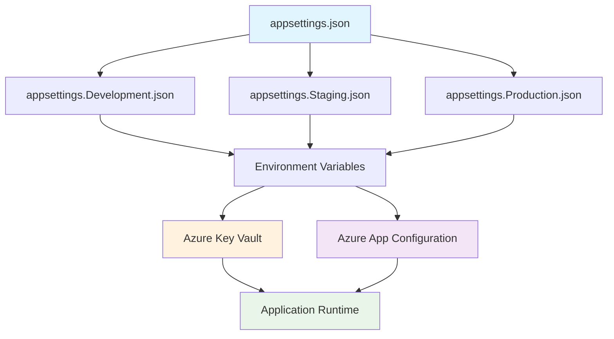

# Configuration Management Guidelines

## Purpose

This document establishes comprehensive configuration management standards for the Academic Management System, defining configuration hierarchy, Azure Key Vault integration, environment-specific settings, secrets rotation patterns, and secure configuration practices to ensure consistent and secure application deployment across all environments.

## Scope

This document covers:

- Configuration hierarchy and environment management
- Azure Key Vault integration for secrets management
- Application settings structure and validation
- Secrets rotation and lifecycle management
- Configuration security and access control

This document does not cover:

- Infrastructure-specific configurations (covered in azure-infrastructure.instructions.md)
- Database connection string management beyond secret storage
- Third-party service API key management
- Configuration backup and disaster recovery procedures

## Prerequisites

- Understanding of .NET 8.0 configuration system
- Familiarity with Azure Key Vault service
- Knowledge of configuration binding and options pattern
- Understanding of environment-specific deployment strategies

## Configuration Architecture

### Configuration Hierarchy



### Configuration Sources Priority

```yaml
Configuration Priority (High to Low): 1. Command Line Arguments
  2. Environment Variables
  3. Azure Key Vault Secrets
  4. Azure App Configuration
  5. appsettings.{Environment}.json
  6. appsettings.json
  7. Default Values in Code
```

## Configuration Structure

### Base Configuration Schema

```json
{
  "Logging": {
    "LogLevel": {
      "Default": "Information",
      "Microsoft.AspNetCore": "Warning",
      "Academia": "Information"
    },
    "Serilog": {
      "MinimumLevel": {
        "Default": "Information",
        "Override": {
          "Microsoft": "Warning",
          "System": "Warning"
        }
      },
      "WriteTo": [
        {
          "Name": "Console",
          "Args": {
            "theme": "Serilog.Sinks.SystemConsole.Themes.AnsiConsoleTheme::Code, Serilog.Sinks.Console"
          }
        }
      ]
    }
  },
  "ConnectionStrings": {
    "DefaultConnection": "Server=(localdb)\\mssqllocaldb;Database=Academia;Trusted_Connection=true;MultipleActiveResultSets=true"
  },
  "Academia": {
    "Database": {
      "CommandTimeout": 30,
      "EnableSensitiveDataLogging": false,
      "EnableDetailedErrors": false
    },
    "Authentication": {
      "Authority": "https://login.microsoftonline.com/{tenant-id}",
      "Audience": "api://academia-api",
      "RequireHttpsMetadata": true
    },
    "Features": {
      "EnableSwagger": false,
      "EnableHealthChecks": true,
      "EnableMetrics": true,
      "EnableDistributedTracing": true
    },
    "Cache": {
      "DefaultExpiration": "00:15:00",
      "SlidingExpiration": "00:05:00",
      "AbsoluteExpiration": "01:00:00"
    },
    "RateLimiting": {
      "EnableRateLimiting": true,
      "WindowSize": "00:01:00",
      "PermitLimit": 100,
      "QueueLimit": 10
    },
    "MessageBroker": {
      "RetryAttempts": 3,
      "InitialDelay": "00:00:02",
      "MaxDelay": "00:00:30",
      "BackoffMultiplier": 2.0
    },
    "FileStorage": {
      "MaxFileSize": 10485760,
      "AllowedExtensions": [".pdf", ".doc", ".docx", ".jpg", ".png"],
      "ScanForMalware": true
    }
  }
}
```

### Environment-Specific Configurations

#### Development Configuration

```json
{
  "Logging": {
    "LogLevel": {
      "Default": "Debug",
      "Academia": "Debug"
    },
    "Serilog": {
      "WriteTo": [
        {
          "Name": "Console"
        },
        {
          "Name": "File",
          "Args": {
            "path": "logs/academia-dev-.txt",
            "rollingInterval": "Day",
            "retainedFileCountLimit": 7
          }
        }
      ]
    }
  },
  "Academia": {
    "Database": {
      "EnableSensitiveDataLogging": true,
      "EnableDetailedErrors": true
    },
    "Features": {
      "EnableSwagger": true
    },
    "RateLimiting": {
      "EnableRateLimiting": false
    }
  }
}
```

#### Production Configuration

```json
{
  "Logging": {
    "LogLevel": {
      "Default": "Warning",
      "Academia": "Information"
    },
    "Serilog": {
      "WriteTo": [
        {
          "Name": "ApplicationInsights",
          "Args": {
            "connectionString": "{ApplicationInsights:ConnectionString}"
          }
        }
      ]
    }
  },
  "Academia": {
    "Authentication": {
      "RequireHttpsMetadata": true
    },
    "Features": {
      "EnableSwagger": false
    },
    "Cache": {
      "DefaultExpiration": "00:30:00",
      "AbsoluteExpiration": "02:00:00"
    }
  }
}
```

## Configuration Implementation

### Configuration Service Registration

```csharp
// Program.cs
public class Program
{
    public static void Main(string[] args)
    {
        var builder = WebApplication.CreateBuilder(args);

        // Configure configuration sources
        ConfigureConfiguration(builder);

        // Configure services
        ConfigureServices(builder.Services, builder.Configuration);

        var app = builder.Build();

        // Configure pipeline
        ConfigurePipeline(app);

        app.Run();
    }

    private static void ConfigureConfiguration(WebApplicationBuilder builder)
    {
        var environment = builder.Environment.EnvironmentName;

        // Base configuration
        builder.Configuration
            .AddJsonFile("appsettings.json", optional: false, reloadOnChange: true)
            .AddJsonFile($"appsettings.{environment}.json", optional: true, reloadOnChange: true)
            .AddEnvironmentVariables("ACADEMIA_");

        // Add Azure Key Vault if not in development
        if (!builder.Environment.IsDevelopment())
        {
            AddAzureKeyVault(builder);
        }

        // Add Azure App Configuration if configured
        var appConfigConnectionString = builder.Configuration.GetConnectionString("AppConfiguration");
        if (!string.IsNullOrEmpty(appConfigConnectionString))
        {
            AddAzureAppConfiguration(builder, appConfigConnectionString);
        }
    }

    private static void AddAzureKeyVault(WebApplicationBuilder builder)
    {
        var keyVaultName = builder.Configuration["Academia:KeyVault:Name"];
        if (string.IsNullOrEmpty(keyVaultName))
        {
            return;
        }

        var keyVaultUri = new Uri($"https://{keyVaultName}.vault.azure.net/");

        builder.Configuration.AddAzureKeyVault(
            keyVaultUri,
            new DefaultAzureCredential(),
            new AzureKeyVaultConfigurationOptions
            {
                Manager = new AcademiaKeyVaultSecretManager(),
                ReloadInterval = TimeSpan.FromMinutes(5)
            });
    }

    private static void AddAzureAppConfiguration(WebApplicationBuilder builder, string connectionString)
    {
        builder.Configuration.AddAzureAppConfiguration(options =>
        {
            options.Connect(connectionString)
                .Select(KeyFilter.Any)
                .Select(KeyFilter.Any, builder.Environment.EnvironmentName)
                .ConfigureRefresh(refresh =>
                {
                    refresh.Register("Academia:RefreshToken", refreshAll: true)
                        .SetCacheExpiration(TimeSpan.FromMinutes(5));
                });
        });
    }

    private static void ConfigureServices(IServiceCollection services, IConfiguration configuration)
    {
        // Configure strongly-typed configuration
        services.Configure<AcademiaConfiguration>(
            configuration.GetSection("Academia"));

        services.Configure<DatabaseConfiguration>(
            configuration.GetSection("Academia:Database"));

        services.Configure<AuthenticationConfiguration>(
            configuration.GetSection("Academia:Authentication"));

        services.Configure<CacheConfiguration>(
            configuration.GetSection("Academia:Cache"));

        // Add configuration validation
        services.AddSingleton<IValidateOptions<AcademiaConfiguration>, AcademiaConfigurationValidator>();

        // Add configuration change monitoring
        services.AddSingleton<IConfigurationMonitor, ConfigurationMonitor>();

        // Register other services...
    }
}
```

### Configuration Models

```csharp
public class AcademiaConfiguration
{
    public const string SectionName = "Academia";

    public DatabaseConfiguration Database { get; set; } = new();
    public AuthenticationConfiguration Authentication { get; set; } = new();
    public FeaturesConfiguration Features { get; set; } = new();
    public CacheConfiguration Cache { get; set; } = new();
    public RateLimitingConfiguration RateLimiting { get; set; } = new();
    public MessageBrokerConfiguration MessageBroker { get; set; } = new();
    public FileStorageConfiguration FileStorage { get; set; } = new();
}

public class DatabaseConfiguration
{
    public int CommandTimeout { get; set; } = 30;
    public bool EnableSensitiveDataLogging { get; set; } = false;
    public bool EnableDetailedErrors { get; set; } = false;
    public int MaxRetryCount { get; set; } = 3;
    public TimeSpan MaxRetryDelay { get; set; } = TimeSpan.FromSeconds(30);

    [Required]
    public string ConnectionString { get; set; } = string.Empty;
}

public class AuthenticationConfiguration
{
    [Required, Url]
    public string Authority { get; set; } = string.Empty;

    [Required]
    public string Audience { get; set; } = string.Empty;

    public bool RequireHttpsMetadata { get; set; } = true;
    public TimeSpan TokenValidationTimeout { get; set; } = TimeSpan.FromMinutes(5);

    public string ClientId { get; set; } = string.Empty;
    public string ClientSecret { get; set; } = string.Empty;
}

public class CacheConfiguration
{
    public TimeSpan DefaultExpiration { get; set; } = TimeSpan.FromMinutes(15);
    public TimeSpan SlidingExpiration { get; set; } = TimeSpan.FromMinutes(5);
    public TimeSpan AbsoluteExpiration { get; set; } = TimeSpan.FromHours(1);

    public string RedisConnectionString { get; set; } = string.Empty;
    public bool UseRedis => !string.IsNullOrEmpty(RedisConnectionString);
}

public class RateLimitingConfiguration
{
    public bool EnableRateLimiting { get; set; } = true;
    public TimeSpan WindowSize { get; set; } = TimeSpan.FromMinutes(1);
    public int PermitLimit { get; set; } = 100;
    public int QueueLimit { get; set; } = 10;
}

public class MessageBrokerConfiguration
{
    public int RetryAttempts { get; set; } = 3;
    public TimeSpan InitialDelay { get; set; } = TimeSpan.FromSeconds(2);
    public TimeSpan MaxDelay { get; set; } = TimeSpan.FromSeconds(30);
    public double BackoffMultiplier { get; set; } = 2.0;

    public string ServiceBusConnectionString { get; set; } = string.Empty;
}

public class FileStorageConfiguration
{
    public long MaxFileSize { get; set; } = 10_485_760; // 10MB
    public string[] AllowedExtensions { get; set; } = Array.Empty<string>();
    public bool ScanForMalware { get; set; } = true;

    public string StorageAccountConnectionString { get; set; } = string.Empty;
    public string ContainerName { get; set; } = "documents";
}

public class FeaturesConfiguration
{
    public bool EnableSwagger { get; set; } = false;
    public bool EnableHealthChecks { get; set; } = true;
    public bool EnableMetrics { get; set; } = true;
    public bool EnableDistributedTracing { get; set; } = true;
}
```

### Configuration Validation

```csharp
public class AcademiaConfigurationValidator : IValidateOptions<AcademiaConfiguration>
{
    public ValidateOptionsResult Validate(string? name, AcademiaConfiguration options)
    {
        var errors = new List<string>();

        // Validate Database Configuration
        if (string.IsNullOrEmpty(options.Database.ConnectionString))
        {
            errors.Add("Database connection string is required");
        }

        if (options.Database.CommandTimeout <= 0)
        {
            errors.Add("Database command timeout must be greater than 0");
        }

        // Validate Authentication Configuration
        if (string.IsNullOrEmpty(options.Authentication.Authority))
        {
            errors.Add("Authentication authority is required");
        }

        if (string.IsNullOrEmpty(options.Authentication.Audience))
        {
            errors.Add("Authentication audience is required");
        }

        if (!Uri.TryCreate(options.Authentication.Authority, UriKind.Absolute, out _))
        {
            errors.Add("Authentication authority must be a valid URL");
        }

        // Validate Cache Configuration
        if (options.Cache.DefaultExpiration <= TimeSpan.Zero)
        {
            errors.Add("Cache default expiration must be greater than zero");
        }

        // Validate Rate Limiting Configuration
        if (options.RateLimiting.EnableRateLimiting)
        {
            if (options.RateLimiting.PermitLimit <= 0)
            {
                errors.Add("Rate limiting permit limit must be greater than 0");
            }

            if (options.RateLimiting.WindowSize <= TimeSpan.Zero)
            {
                errors.Add("Rate limiting window size must be greater than zero");
            }
        }

        // Validate File Storage Configuration
        if (options.FileStorage.MaxFileSize <= 0)
        {
            errors.Add("File storage max file size must be greater than 0");
        }

        return errors.Count > 0
            ? ValidateOptionsResult.Fail(errors)
            : ValidateOptionsResult.Success;
    }
}
```

## Azure Key Vault Integration

### Key Vault Secret Manager

```csharp
public class AcademiaKeyVaultSecretManager : KeyVaultSecretManager
{
    private const string SecretPrefix = "academia-";

    public override bool Load(SecretProperties secret)
    {
        // Only load secrets with our prefix
        return secret.Name.StartsWith(SecretPrefix, StringComparison.OrdinalIgnoreCase);
    }

    public override string GetKey(KeyVaultSecret secret)
    {
        // Transform secret name to configuration key
        var key = secret.Name[SecretPrefix.Length..];

        // Convert kebab-case to nested configuration format
        return key.Replace('-', ':');
    }
}
```

### Secret Naming Conventions

```yaml
Key Vault Secret Naming:
  Pattern: "academia-{section}-{subsection}-{key}"

  Examples:
    - academia-database-connectionstring → Academia:Database:ConnectionString
    - academia-authentication-clientsecret → Academia:Authentication:ClientSecret
    - academia-cache-redisconnectionstring → Academia:Cache:RedisConnectionString
    - academia-messagebroker-servicebusconnectionstring → Academia:MessageBroker:ServiceBusConnectionString
    - academia-filestorage-storageaccountconnectionstring → Academia:FileStorage:StorageAccountConnectionString

  Special Cases:
    - academia-applicationinsights-connectionstring → ApplicationInsights:ConnectionString
    - academia-appconfig-connectionstring → ConnectionStrings:AppConfiguration
```

### Key Vault Access Configuration

```csharp
public static class KeyVaultExtensions
{
    public static void AddAcademiaKeyVault(
        this IServiceCollection services,
        IConfiguration configuration)
    {
        var keyVaultOptions = configuration.GetSection("Academia:KeyVault")
            .Get<KeyVaultOptions>() ?? new KeyVaultOptions();

        if (string.IsNullOrEmpty(keyVaultOptions.Name))
        {
            return;
        }

        services.AddSingleton<ISecretManager, KeyVaultSecretManager>();
        services.Configure<KeyVaultOptions>(configuration.GetSection("Academia:KeyVault"));
    }
}

public interface ISecretManager
{
    Task<string?> GetSecretAsync(string name, CancellationToken cancellationToken = default);
    Task SetSecretAsync(string name, string value, CancellationToken cancellationToken = default);
    Task DeleteSecretAsync(string name, CancellationToken cancellationToken = default);
}

public class KeyVaultSecretManager : ISecretManager
{
    private readonly SecretClient _secretClient;
    private readonly ILogger<KeyVaultSecretManager> _logger;

    public KeyVaultSecretManager(
        IOptions<KeyVaultOptions> options,
        ILogger<KeyVaultSecretManager> logger)
    {
        _logger = logger;

        var keyVaultUri = new Uri($"https://{options.Value.Name}.vault.azure.net/");
        _secretClient = new SecretClient(keyVaultUri, new DefaultAzureCredential());
    }

    public async Task<string?> GetSecretAsync(string name, CancellationToken cancellationToken = default)
    {
        try
        {
            var response = await _secretClient.GetSecretAsync(name, cancellationToken: cancellationToken);
            return response.Value.Value;
        }
        catch (RequestFailedException ex) when (ex.Status == 404)
        {
            _logger.LogWarning("Secret {SecretName} not found in Key Vault", name);
            return null;
        }
        catch (Exception ex)
        {
            _logger.LogError(ex, "Error retrieving secret {SecretName} from Key Vault", name);
            throw;
        }
    }

    public async Task SetSecretAsync(string name, string value, CancellationToken cancellationToken = default)
    {
        try
        {
            await _secretClient.SetSecretAsync(name, value, cancellationToken);
            _logger.LogInformation("Successfully updated secret {SecretName} in Key Vault", name);
        }
        catch (Exception ex)
        {
            _logger.LogError(ex, "Error setting secret {SecretName} in Key Vault", name);
            throw;
        }
    }

    public async Task DeleteSecretAsync(string name, CancellationToken cancellationToken = default)
    {
        try
        {
            await _secretClient.StartDeleteSecretAsync(name, cancellationToken);
            _logger.LogInformation("Successfully deleted secret {SecretName} from Key Vault", name);
        }
        catch (Exception ex)
        {
            _logger.LogError(ex, "Error deleting secret {SecretName} from Key Vault", name);
            throw;
        }
    }
}

public class KeyVaultOptions
{
    public string Name { get; set; } = string.Empty;
    public TimeSpan RefreshInterval { get; set; } = TimeSpan.FromMinutes(5);
}
```

## Secrets Rotation Strategy

### Secrets Rotation Service

```csharp
public interface ISecretsRotationService
{
    Task<RotationResult> RotateSecretAsync(string secretName, CancellationToken cancellationToken = default);
    Task<IReadOnlyList<SecretRotationStatus>> GetRotationStatusAsync(CancellationToken cancellationToken = default);
    Task ScheduleRotationAsync(string secretName, TimeSpan interval, CancellationToken cancellationToken = default);
}

public class SecretsRotationService : ISecretsRotationService
{
    private readonly ISecretManager _secretManager;
    private readonly ISecretsRotationRepository _rotationRepository;
    private readonly IServiceProvider _serviceProvider;
    private readonly ILogger<SecretsRotationService> _logger;

    public SecretsRotationService(
        ISecretManager secretManager,
        ISecretsRotationRepository rotationRepository,
        IServiceProvider serviceProvider,
        ILogger<SecretsRotationService> logger)
    {
        _secretManager = secretManager;
        _rotationRepository = rotationRepository;
        _serviceProvider = serviceProvider;
        _logger = logger;
    }

    public async Task<RotationResult> RotateSecretAsync(
        string secretName,
        CancellationToken cancellationToken = default)
    {
        try
        {
            _logger.LogInformation("Starting rotation for secret {SecretName}", secretName);

            // Get current secret value
            var currentValue = await _secretManager.GetSecretAsync(secretName, cancellationToken);
            if (string.IsNullOrEmpty(currentValue))
            {
                return RotationResult.Failure("Secret not found");
            }

            // Generate new secret value
            var newValue = await GenerateNewSecretValueAsync(secretName, cancellationToken);

            // Update external systems with new value
            var updateResult = await UpdateExternalSystemsAsync(secretName, newValue, cancellationToken);
            if (!updateResult.IsSuccess)
            {
                return updateResult;
            }

            // Update Key Vault with new value
            await _secretManager.SetSecretAsync(secretName, newValue, cancellationToken);

            // Record successful rotation
            await _rotationRepository.RecordSuccessfulRotationAsync(
                secretName,
                DateTime.UtcNow,
                cancellationToken);

            _logger.LogInformation("Successfully rotated secret {SecretName}", secretName);
            return RotationResult.Success();
        }
        catch (Exception ex)
        {
            _logger.LogError(ex, "Error rotating secret {SecretName}", secretName);

            await _rotationRepository.RecordFailedRotationAsync(
                secretName,
                DateTime.UtcNow,
                ex.Message,
                cancellationToken);

            return RotationResult.Failure(ex.Message);
        }
    }

    private async Task<string> GenerateNewSecretValueAsync(
        string secretName,
        CancellationToken cancellationToken)
    {
        // Get appropriate generator based on secret type
        var generator = _serviceProvider.GetKeyedService<ISecretValueGenerator>(secretName);
        if (generator == null)
        {
            // Default to random password generation
            generator = _serviceProvider.GetRequiredService<IPasswordGenerator>();
        }

        return await generator.GenerateAsync(cancellationToken);
    }

    private async Task<RotationResult> UpdateExternalSystemsAsync(
        string secretName,
        string newValue,
        CancellationToken cancellationToken)
    {
        var updaters = _serviceProvider.GetServices<IExternalSystemUpdater>()
            .Where(u => u.CanHandle(secretName));

        foreach (var updater in updaters)
        {
            var result = await updater.UpdateAsync(secretName, newValue, cancellationToken);
            if (!result.IsSuccess)
            {
                return result;
            }
        }

        return RotationResult.Success();
    }
}

public interface ISecretValueGenerator
{
    Task<string> GenerateAsync(CancellationToken cancellationToken = default);
}

public class PasswordGenerator : ISecretValueGenerator
{
    public Task<string> GenerateAsync(CancellationToken cancellationToken = default)
    {
        const string chars = "ABCDEFGHIJKLMNOPQRSTUVWXYZabcdefghijklmnopqrstuvwxyz0123456789!@#$%^&*";
        const int length = 32;

        var random = new Random();
        var password = new string(Enumerable.Repeat(chars, length)
            .Select(s => s[random.Next(s.Length)])
            .ToArray());

        return Task.FromResult(password);
    }
}
```

## Configuration Monitoring

### Configuration Change Monitoring

```csharp
public interface IConfigurationMonitor
{
    event EventHandler<ConfigurationChangedEventArgs> ConfigurationChanged;
    Task StartMonitoringAsync(CancellationToken cancellationToken = default);
    Task StopMonitoringAsync();
}

public class ConfigurationMonitor : IConfigurationMonitor, IDisposable
{
    private readonly IConfiguration _configuration;
    private readonly ILogger<ConfigurationMonitor> _logger;
    private readonly Timer _refreshTimer;
    private readonly Dictionary<string, string> _lastKnownValues;

    public event EventHandler<ConfigurationChangedEventArgs>? ConfigurationChanged;

    public ConfigurationMonitor(
        IConfiguration configuration,
        ILogger<ConfigurationMonitor> logger)
    {
        _configuration = configuration;
        _logger = logger;
        _lastKnownValues = new Dictionary<string, string>();
        _refreshTimer = new Timer(CheckForChanges, null, Timeout.Infinite, Timeout.Infinite);

        // Initialize with current values
        CaptureCurrentValues();
    }

    public Task StartMonitoringAsync(CancellationToken cancellationToken = default)
    {
        _logger.LogInformation("Starting configuration monitoring");

        // Check every 30 seconds
        _refreshTimer.Change(TimeSpan.Zero, TimeSpan.FromSeconds(30));

        return Task.CompletedTask;
    }

    public Task StopMonitoringAsync()
    {
        _logger.LogInformation("Stopping configuration monitoring");

        _refreshTimer.Change(Timeout.Infinite, Timeout.Infinite);

        return Task.CompletedTask;
    }

    private void CheckForChanges(object? state)
    {
        try
        {
            var monitoredKeys = new[]
            {
                "Academia:Database:ConnectionString",
                "Academia:Authentication:Authority",
                "Academia:Cache:RedisConnectionString",
                "Academia:MessageBroker:ServiceBusConnectionString"
            };

            foreach (var key in monitoredKeys)
            {
                var currentValue = _configuration[key] ?? string.Empty;

                if (_lastKnownValues.TryGetValue(key, out var lastValue) && lastValue != currentValue)
                {
                    _logger.LogInformation("Configuration change detected for key: {Key}", key);

                    var eventArgs = new ConfigurationChangedEventArgs(key, lastValue, currentValue);
                    ConfigurationChanged?.Invoke(this, eventArgs);
                }

                _lastKnownValues[key] = currentValue;
            }
        }
        catch (Exception ex)
        {
            _logger.LogError(ex, "Error checking for configuration changes");
        }
    }

    private void CaptureCurrentValues()
    {
        var monitoredKeys = new[]
        {
            "Academia:Database:ConnectionString",
            "Academia:Authentication:Authority",
            "Academia:Cache:RedisConnectionString",
            "Academia:MessageBroker:ServiceBusConnectionString"
        };

        foreach (var key in monitoredKeys)
        {
            _lastKnownValues[key] = _configuration[key] ?? string.Empty;
        }
    }

    public void Dispose()
    {
        _refreshTimer?.Dispose();
        GC.SuppressFinalize(this);
    }
}

public class ConfigurationChangedEventArgs : EventArgs
{
    public string Key { get; }
    public string OldValue { get; }
    public string NewValue { get; }

    public ConfigurationChangedEventArgs(string key, string oldValue, string newValue)
    {
        Key = key;
        OldValue = oldValue;
        NewValue = newValue;
    }
}
```

## Environment-Specific Deployment

### Environment Configuration Management

```yaml
# Development Environment
Environment: Development
Variables:
  ACADEMIA_Database__ConnectionString: "Server=(localdb)\\mssqllocaldb;Database=Academia_Dev;Trusted_Connection=true"
  ACADEMIA_Features__EnableSwagger: "true"
  ACADEMIA_Logging__LogLevel__Default: "Debug"
  ACADEMIA_RateLimiting__EnableRateLimiting: "false"

# Staging Environment
Environment: Staging
Variables:
  ACADEMIA_KeyVault__Name: "kv-aca-stg-secrets-001"
  ACADEMIA_Features__EnableSwagger: "true"
  ACADEMIA_Logging__LogLevel__Default: "Information"

# Production Environment
Environment: Production
Variables:
  ACADEMIA_KeyVault__Name: "kv-aca-prd-secrets-001"
  ACADEMIA_Features__EnableSwagger: "false"
  ACADEMIA_Logging__LogLevel__Default: "Warning"
  ACADEMIA_Authentication__RequireHttpsMetadata: "true"
```

### Configuration Deployment Scripts

```powershell
# Deploy-Configuration.ps1
param(
    [Parameter(Mandatory = $true)]
    [ValidateSet("Development", "Staging", "Production")]
    [string]$Environment,

    [Parameter(Mandatory = $true)]
    [string]$KeyVaultName,

    [Parameter(Mandatory = $false)]
    [string]$ConfigurationFile = "appsettings.$Environment.json"
)

# Load configuration from file
$config = Get-Content $ConfigurationFile | ConvertFrom-Json

# Extract secrets that should be stored in Key Vault
$secrets = @{
    "academia-database-connectionstring" = $config.ConnectionStrings.DefaultConnection
    "academia-authentication-clientsecret" = $config.Academia.Authentication.ClientSecret
    "academia-cache-redisconnectionstring" = $config.Academia.Cache.RedisConnectionString
    "academia-messagebroker-servicebusconnectionstring" = $config.Academia.MessageBroker.ServiceBusConnectionString
}

# Deploy secrets to Key Vault
foreach ($secret in $secrets.GetEnumerator()) {
    if (![string]::IsNullOrEmpty($secret.Value)) {
        Write-Host "Deploying secret: $($secret.Key)"

        az keyvault secret set `
            --vault-name $KeyVaultName `
            --name $secret.Key `
            --value $secret.Value `
            --only-show-errors
    }
}

# Set up App Configuration if connection string is provided
$appConfigConnectionString = $config.ConnectionStrings.AppConfiguration
if (![string]::IsNullOrEmpty($appConfigConnectionString)) {
    Write-Host "Configuring App Configuration settings"

    # Deploy non-secret settings to App Configuration
    $nonSecretSettings = @{
        "Academia:Features:EnableSwagger" = $config.Academia.Features.EnableSwagger
        "Academia:Cache:DefaultExpiration" = $config.Academia.Cache.DefaultExpiration
        "Academia:RateLimiting:PermitLimit" = $config.Academia.RateLimiting.PermitLimit
    }

    foreach ($setting in $nonSecretSettings.GetEnumerator()) {
        az appconfig kv set `
            --connection-string $appConfigConnectionString `
            --key $setting.Key `
            --value $setting.Value `
            --label $Environment `
            --only-show-errors
    }
}

Write-Host "Configuration deployment completed for $Environment environment"
```

## Related Documentation References

- [Azure Infrastructure Guidelines](./azure-infrastructure.instructions.md)
- [Security Compliance Guidelines](./security-compliance.instructions.md)
- [Deployment Operations](./deployment-operations.instructions.md)
- [Monitoring and Observability](./monitoring-observability.instructions.md)

## Validation Checklist

Before considering the configuration management implementation complete, verify:

- [ ] Configuration hierarchy is properly structured with environment-specific overrides
- [ ] Azure Key Vault integration is configured with appropriate secret naming conventions
- [ ] Strongly-typed configuration models are implemented with validation
- [ ] Configuration change monitoring is implemented and operational
- [ ] Secrets rotation strategy is defined and automated
- [ ] Environment-specific deployment scripts are tested and functional
- [ ] Configuration validation catches invalid settings at startup
- [ ] Secret access is properly secured with managed identities
- [ ] Configuration sources are prioritized correctly
- [ ] Non-secret settings use App Configuration for centralized management
- [ ] Configuration documentation is complete and up-to-date
- [ ] Emergency configuration rollback procedures are documented
