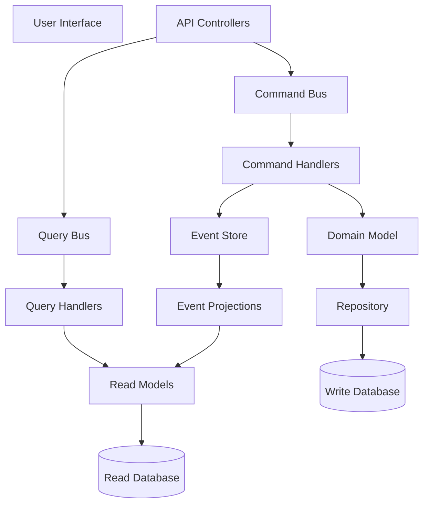

# CQRS Implementation Guidelines

## Purpose

This document provides comprehensive implementation guidelines for Command Query Responsibility Segregation (CQRS) pattern in the Academic Management System, including MediatR integration, command and query patterns, validation strategies, and idempotency implementation to ensure reliable and maintainable business logic execution.

## Scope

This document covers:

- CQRS pattern implementation with MediatR
- Command handling with validation and error management
- Query handling with pagination and performance optimization
- Event sourcing integration patterns
- Idempotency implementation for reliable operations
- Cross-cutting concerns and middleware integration

This document does not cover:

- Event store implementation details
- Database schema design patterns
- Infrastructure configuration specifics
- Performance tuning methodologies

## Prerequisites

- Understanding of CQRS and Event Sourcing concepts
- Familiarity with .NET 8.0 and C# 12 features
- Knowledge of MediatR library patterns
- Understanding of Domain-Driven Design principles

## CQRS Architecture Overview

### Command Query Separation



### Core Components

#### MediatR Configuration

```csharp
// Program.cs
using MediatR;
using FluentValidation;

var builder = WebApplication.CreateBuilder(args);

// Register MediatR
builder.Services.AddMediatR(cfg => {
    cfg.RegisterServicesFromAssembly(typeof(Program).Assembly);
    cfg.AddBehavior<ValidationBehavior<,>>();
    cfg.AddBehavior<LoggingBehavior<,>>();
    cfg.AddBehavior<IdempotencyBehavior<,>>();
});

// Register FluentValidation
builder.Services.AddValidatorsFromAssembly(typeof(Program).Assembly);

var app = builder.Build();
```

## Command Implementation Pattern

### Command Structure

```csharp
using MediatR;

public record EnrollStudentInCourseCommand : IRequest<Result<EnrollmentId>>
{
    public StudentId StudentId { get; init; }
    public CourseId CourseId { get; init; }
    public AcademicTerm AcademicTerm { get; init; }
    public IdempotencyKey IdempotencyKey { get; init; }

    public EnrollStudentInCourseCommand(
        StudentId studentId,
        CourseId courseId,
        AcademicTerm academicTerm,
        IdempotencyKey? idempotencyKey = null)
    {
        StudentId = studentId;
        CourseId = courseId;
        AcademicTerm = academicTerm;
        IdempotencyKey = idempotencyKey ?? IdempotencyKey.New();
    }
}
```

### Command Validation

```csharp
using FluentValidation;

public class EnrollStudentInCourseCommandValidator : AbstractValidator<EnrollStudentInCourseCommand>
{
    public EnrollStudentInCourseCommandValidator()
    {
        RuleFor(x => x.StudentId)
            .NotEmpty()
            .WithMessage("Student ID is required");

        RuleFor(x => x.CourseId)
            .NotEmpty()
            .WithMessage("Course ID is required");

        RuleFor(x => x.AcademicTerm)
            .NotEmpty()
            .Must(BeValidAcademicTerm)
            .WithMessage("Academic term must be current or future term");

        RuleFor(x => x.IdempotencyKey)
            .NotEmpty()
            .WithMessage("Idempotency key is required");
    }

    private bool BeValidAcademicTerm(AcademicTerm term)
    {
        return term.StartDate >= DateOnly.FromDateTime(DateTime.UtcNow.Date);
    }
}
```

### Command Handler Implementation

```csharp
public class EnrollStudentInCourseCommandHandler : IRequestHandler<EnrollStudentInCourseCommand, Result<EnrollmentId>>
{
    private readonly IStudentRepository _studentRepository;
    private readonly ICourseRepository _courseRepository;
    private readonly IEnrollmentRepository _enrollmentRepository;
    private readonly IAcademicTermService _academicTermService;
    private readonly IUnitOfWork _unitOfWork;
    private readonly ILogger<EnrollStudentInCourseCommandHandler> _logger;

    public EnrollStudentInCourseCommandHandler(
        IStudentRepository studentRepository,
        ICourseRepository courseRepository,
        IEnrollmentRepository enrollmentRepository,
        IAcademicTermService academicTermService,
        IUnitOfWork unitOfWork,
        ILogger<EnrollStudentInCourseCommandHandler> logger)
    {
        _studentRepository = studentRepository ?? throw new ArgumentNullException(nameof(studentRepository));
        _courseRepository = courseRepository ?? throw new ArgumentNullException(nameof(courseRepository));
        _enrollmentRepository = enrollmentRepository ?? throw new ArgumentNullException(nameof(enrollmentRepository));
        _academicTermService = academicTermService ?? throw new ArgumentNullException(nameof(academicTermService));
        _unitOfWork = unitOfWork ?? throw new ArgumentNullException(nameof(unitOfWork));
        _logger = logger ?? throw new ArgumentNullException(nameof(logger));
    }

    public async Task<Result<EnrollmentId>> Handle(
        EnrollStudentInCourseCommand request,
        CancellationToken cancellationToken)
    {
        _logger.LogInformation(
            "Processing enrollment for student {StudentId} in course {CourseId} for term {AcademicTerm}",
            request.StudentId, request.CourseId, request.AcademicTerm);

        try
        {
            // Validate enrollment period
            var enrollmentPeriodResult = await _academicTermService
                .ValidateEnrollmentPeriodAsync(request.AcademicTerm, cancellationToken);

            if (enrollmentPeriodResult.IsFailure)
            {
                _logger.LogWarning("Enrollment period validation failed: {Error}", enrollmentPeriodResult.Error);
                return Result.Failure<EnrollmentId>(enrollmentPeriodResult.Error);
            }

            // Load aggregates
            var student = await _studentRepository.GetByIdAsync(request.StudentId, cancellationToken);
            if (student == null)
            {
                _logger.LogWarning("Student {StudentId} not found", request.StudentId);
                return Result.Failure<EnrollmentId>("Student not found");
            }

            var course = await _courseRepository.GetByIdAsync(request.CourseId, cancellationToken);
            if (course == null)
            {
                _logger.LogWarning("Course {CourseId} not found", request.CourseId);
                return Result.Failure<EnrollmentId>("Course not found");
            }

            // Check for existing enrollment
            var existingEnrollment = await _enrollmentRepository
                .GetByStudentAndCourseAsync(request.StudentId, request.CourseId, request.AcademicTerm, cancellationToken);

            if (existingEnrollment != null)
            {
                _logger.LogInformation("Student {StudentId} already enrolled in course {CourseId}",
                    request.StudentId, request.CourseId);
                return Result.Success(existingEnrollment.Id);
            }

            // Validate business rules
            var enrollmentValidation = await student.ValidateEnrollmentAsync(course, request.AcademicTerm);
            if (enrollmentValidation.IsFailure)
            {
                _logger.LogWarning("Enrollment validation failed: {Error}", enrollmentValidation.Error);
                return Result.Failure<EnrollmentId>(enrollmentValidation.Error);
            }

            // Create enrollment
            var enrollmentResult = student.EnrollInCourse(course, request.AcademicTerm);
            if (enrollmentResult.IsFailure)
            {
                _logger.LogError("Failed to create enrollment: {Error}", enrollmentResult.Error);
                return Result.Failure<EnrollmentId>(enrollmentResult.Error);
            }

            var enrollment = enrollmentResult.Value;

            // Persist changes
            _enrollmentRepository.Add(enrollment);
            await _unitOfWork.SaveChangesAsync(cancellationToken);

            _logger.LogInformation("Successfully enrolled student {StudentId} in course {CourseId} with enrollment ID {EnrollmentId}",
                request.StudentId, request.CourseId, enrollment.Id);

            return Result.Success(enrollment.Id);
        }
        catch (Exception ex)
        {
            _logger.LogError(ex, "Error processing enrollment for student {StudentId} in course {CourseId}",
                request.StudentId, request.CourseId);
            return Result.Failure<EnrollmentId>("An error occurred while processing the enrollment");
        }
    }
}
```

## Query Implementation Pattern

### Query Structure

```csharp
public record GetStudentEnrollmentsQuery : IRequest<PagedResult<EnrollmentDto>>
{
    public StudentId StudentId { get; init; }
    public AcademicTerm? AcademicTerm { get; init; }
    public EnrollmentStatus? Status { get; init; }
    public int PageNumber { get; init; } = 1;
    public int PageSize { get; init; } = 20;
    public string? SortBy { get; init; } = "EnrollmentDate";
    public SortDirection SortDirection { get; init; } = SortDirection.Descending;

    public GetStudentEnrollmentsQuery(StudentId studentId)
    {
        StudentId = studentId;
    }
}
```

### Query Handler Implementation

```csharp
public class GetStudentEnrollmentsQueryHandler : IRequestHandler<GetStudentEnrollmentsQuery, PagedResult<EnrollmentDto>>
{
    private readonly IReadOnlyRepository<EnrollmentReadModel> _readRepository;
    private readonly ILogger<GetStudentEnrollmentsQueryHandler> _logger;

    public GetStudentEnrollmentsQueryHandler(
        IReadOnlyRepository<EnrollmentReadModel> readRepository,
        ILogger<GetStudentEnrollmentsQueryHandler> logger)
    {
        _readRepository = readRepository ?? throw new ArgumentNullException(nameof(readRepository));
        _logger = logger ?? throw new ArgumentNullException(nameof(logger));
    }

    public async Task<PagedResult<EnrollmentDto>> Handle(
        GetStudentEnrollmentsQuery request,
        CancellationToken cancellationToken)
    {
        _logger.LogInformation("Retrieving enrollments for student {StudentId}", request.StudentId);

        try
        {
            var query = _readRepository.Query()
                .Where(e => e.StudentId == request.StudentId);

            // Apply filters
            if (request.AcademicTerm.HasValue)
                query = query.Where(e => e.AcademicTerm == request.AcademicTerm.Value);

            if (request.Status.HasValue)
                query = query.Where(e => e.Status == request.Status.Value);

            // Apply sorting
            query = request.SortBy?.ToLowerInvariant() switch
            {
                "coursecode" => request.SortDirection == SortDirection.Ascending
                    ? query.OrderBy(e => e.CourseCode)
                    : query.OrderByDescending(e => e.CourseCode),
                "coursetitle" => request.SortDirection == SortDirection.Ascending
                    ? query.OrderBy(e => e.CourseTitle)
                    : query.OrderByDescending(e => e.CourseTitle),
                "credits" => request.SortDirection == SortDirection.Ascending
                    ? query.OrderBy(e => e.Credits)
                    : query.OrderByDescending(e => e.Credits),
                _ => request.SortDirection == SortDirection.Ascending
                    ? query.OrderBy(e => e.EnrollmentDate)
                    : query.OrderByDescending(e => e.EnrollmentDate)
            };

            // Get total count for pagination
            var totalCount = await query.CountAsync(cancellationToken);

            // Apply pagination
            var items = await query
                .Skip((request.PageNumber - 1) * request.PageSize)
                .Take(request.PageSize)
                .Select(e => new EnrollmentDto
                {
                    Id = e.Id,
                    StudentId = e.StudentId,
                    CourseId = e.CourseId,
                    CourseCode = e.CourseCode,
                    CourseTitle = e.CourseTitle,
                    Credits = e.Credits,
                    AcademicTerm = e.AcademicTerm,
                    Status = e.Status,
                    EnrollmentDate = e.EnrollmentDate,
                    LastModifiedDate = e.LastModifiedDate
                })
                .ToListAsync(cancellationToken);

            _logger.LogInformation("Retrieved {Count} enrollments for student {StudentId} (Page {PageNumber}/{TotalPages})",
                items.Count, request.StudentId, request.PageNumber, (int)Math.Ceiling((double)totalCount / request.PageSize));

            return new PagedResult<EnrollmentDto>(items, totalCount, request.PageNumber, request.PageSize);
        }
        catch (Exception ex)
        {
            _logger.LogError(ex, "Error retrieving enrollments for student {StudentId}", request.StudentId);
            throw;
        }
    }
}
```

### Query Response Models

```csharp
public record EnrollmentDto
{
    public EnrollmentId Id { get; init; }
    public StudentId StudentId { get; init; }
    public CourseId CourseId { get; init; }
    public string CourseCode { get; init; } = string.Empty;
    public string CourseTitle { get; init; } = string.Empty;
    public int Credits { get; init; }
    public AcademicTerm AcademicTerm { get; init; }
    public EnrollmentStatus Status { get; init; }
    public DateTime EnrollmentDate { get; init; }
    public DateTime LastModifiedDate { get; init; }
}

public record PagedResult<T>
{
    public IReadOnlyList<T> Items { get; init; }
    public int TotalCount { get; init; }
    public int PageNumber { get; init; }
    public int PageSize { get; init; }
    public int TotalPages => (int)Math.Ceiling((double)TotalCount / PageSize);
    public bool HasNextPage => PageNumber < TotalPages;
    public bool HasPreviousPage => PageNumber > 1;

    public PagedResult(IReadOnlyList<T> items, int totalCount, int pageNumber, int pageSize)
    {
        Items = items ?? throw new ArgumentNullException(nameof(items));
        TotalCount = totalCount;
        PageNumber = pageNumber;
        PageSize = pageSize;
    }
}
```

## Cross-Cutting Concerns

### Validation Behavior

```csharp
public class ValidationBehavior<TRequest, TResponse> : IPipelineBehavior<TRequest, TResponse>
    where TRequest : IRequest<TResponse>
{
    private readonly IEnumerable<IValidator<TRequest>> _validators;
    private readonly ILogger<ValidationBehavior<TRequest, TResponse>> _logger;

    public ValidationBehavior(
        IEnumerable<IValidator<TRequest>> validators,
        ILogger<ValidationBehavior<TRequest, TResponse>> logger)
    {
        _validators = validators;
        _logger = logger;
    }

    public async Task<TResponse> Handle(
        TRequest request,
        RequestHandlerDelegate<TResponse> next,
        CancellationToken cancellationToken)
    {
        if (!_validators.Any())
            return await next();

        var context = new ValidationContext<TRequest>(request);
        var validationResults = await Task.WhenAll(
            _validators.Select(v => v.ValidateAsync(context, cancellationToken)));

        var failures = validationResults
            .SelectMany(r => r.Errors)
            .Where(f => f != null)
            .ToArray();

        if (failures.Length != 0)
        {
            _logger.LogWarning("Validation failed for {RequestType}: {ValidationErrors}",
                typeof(TRequest).Name, string.Join(", ", failures.Select(f => f.ErrorMessage)));

            throw new ValidationException(failures);
        }

        return await next();
    }
}
```

### Logging Behavior

```csharp
public class LoggingBehavior<TRequest, TResponse> : IPipelineBehavior<TRequest, TResponse>
    where TRequest : IRequest<TResponse>
{
    private readonly ILogger<LoggingBehavior<TRequest, TResponse>> _logger;

    public LoggingBehavior(ILogger<LoggingBehavior<TRequest, TResponse>> logger)
    {
        _logger = logger;
    }

    public async Task<TResponse> Handle(
        TRequest request,
        RequestHandlerDelegate<TResponse> next,
        CancellationToken cancellationToken)
    {
        var requestName = typeof(TRequest).Name;
        var requestId = Guid.NewGuid();

        _logger.LogInformation("Starting request {RequestName} with ID {RequestId}: {@Request}",
            requestName, requestId, request);

        var stopwatch = Stopwatch.StartNew();

        try
        {
            var response = await next();

            stopwatch.Stop();

            _logger.LogInformation("Completed request {RequestName} with ID {RequestId} in {ElapsedMilliseconds}ms",
                requestName, requestId, stopwatch.ElapsedMilliseconds);

            return response;
        }
        catch (Exception ex)
        {
            stopwatch.Stop();

            _logger.LogError(ex, "Request {RequestName} with ID {RequestId} failed after {ElapsedMilliseconds}ms",
                requestName, requestId, stopwatch.ElapsedMilliseconds);

            throw;
        }
    }
}
```

## Idempotency Implementation

### Idempotency Key Value Object

```csharp
public record IdempotencyKey
{
    public string Value { get; }

    private IdempotencyKey(string value)
    {
        if (string.IsNullOrWhiteSpace(value))
            throw new ArgumentException("Idempotency key cannot be null or empty", nameof(value));

        if (value.Length > 255)
            throw new ArgumentException("Idempotency key cannot exceed 255 characters", nameof(value));

        Value = value;
    }

    public static IdempotencyKey New() => new(Guid.NewGuid().ToString("N"));

    public static IdempotencyKey From(string value) => new(value);

    public static implicit operator string(IdempotencyKey key) => key.Value;

    public static implicit operator IdempotencyKey(string value) => From(value);

    public override string ToString() => Value;
}
```

### Idempotency Behavior

```csharp
public class IdempotencyBehavior<TRequest, TResponse> : IPipelineBehavior<TRequest, TResponse>
    where TRequest : IRequest<TResponse>
{
    private readonly IIdempotencyService _idempotencyService;
    private readonly ILogger<IdempotencyBehavior<TRequest, TResponse>> _logger;

    public IdempotencyBehavior(
        IIdempotencyService idempotencyService,
        ILogger<IdempotencyBehavior<TRequest, TResponse>> logger)
    {
        _idempotencyService = idempotencyService;
        _logger = logger;
    }

    public async Task<TResponse> Handle(
        TRequest request,
        RequestHandlerDelegate<TResponse> next,
        CancellationToken cancellationToken)
    {
        // Skip idempotency check for queries
        if (request is IQuery)
            return await next();

        // Extract idempotency key from request
        var idempotencyKey = ExtractIdempotencyKey(request);
        if (idempotencyKey == null)
            return await next();

        var requestType = typeof(TRequest).Name;

        // Check for existing result
        var existingResult = await _idempotencyService
            .GetResultAsync<TResponse>(idempotencyKey, cancellationToken);

        if (existingResult != null)
        {
            _logger.LogInformation("Returning cached result for idempotent request {RequestType} with key {IdempotencyKey}",
                requestType, idempotencyKey);
            return existingResult;
        }

        // Execute request
        var response = await next();

        // Store result for future idempotency checks
        await _idempotencyService.StoreResultAsync(idempotencyKey, response, TimeSpan.FromHours(24), cancellationToken);

        _logger.LogInformation("Stored result for idempotent request {RequestType} with key {IdempotencyKey}",
            requestType, idempotencyKey);

        return response;
    }

    private IdempotencyKey? ExtractIdempotencyKey(TRequest request)
    {
        var property = typeof(TRequest).GetProperty("IdempotencyKey");
        return property?.GetValue(request) as IdempotencyKey;
    }
}
```

### Idempotency Service Implementation

```csharp
public interface IIdempotencyService
{
    Task<T?> GetResultAsync<T>(IdempotencyKey key, CancellationToken cancellationToken = default);
    Task StoreResultAsync<T>(IdempotencyKey key, T result, TimeSpan expiry, CancellationToken cancellationToken = default);
    Task RemoveResultAsync(IdempotencyKey key, CancellationToken cancellationToken = default);
}

public class RedisIdempotencyService : IIdempotencyService
{
    private readonly IDistributedCache _cache;
    private readonly ILogger<RedisIdempotencyService> _logger;
    private readonly JsonSerializerOptions _jsonOptions;

    public RedisIdempotencyService(
        IDistributedCache cache,
        ILogger<RedisIdempotencyService> logger)
    {
        _cache = cache;
        _logger = logger;
        _jsonOptions = new JsonSerializerOptions
        {
            PropertyNamingPolicy = JsonNamingPolicy.CamelCase,
            WriteIndented = false
        };
    }

    public async Task<T?> GetResultAsync<T>(IdempotencyKey key, CancellationToken cancellationToken = default)
    {
        try
        {
            var cacheKey = $"idempotency:{key}";
            var cachedValue = await _cache.GetStringAsync(cacheKey, cancellationToken);

            if (string.IsNullOrEmpty(cachedValue))
                return default;

            var result = JsonSerializer.Deserialize<T>(cachedValue, _jsonOptions);
            _logger.LogDebug("Retrieved cached result for idempotency key {IdempotencyKey}", key);

            return result;
        }
        catch (Exception ex)
        {
            _logger.LogError(ex, "Error retrieving cached result for idempotency key {IdempotencyKey}", key);
            return default;
        }
    }

    public async Task StoreResultAsync<T>(
        IdempotencyKey key,
        T result,
        TimeSpan expiry,
        CancellationToken cancellationToken = default)
    {
        try
        {
            var cacheKey = $"idempotency:{key}";
            var serializedResult = JsonSerializer.Serialize(result, _jsonOptions);

            var options = new DistributedCacheEntryOptions
            {
                AbsoluteExpirationRelativeToNow = expiry
            };

            await _cache.SetStringAsync(cacheKey, serializedResult, options, cancellationToken);

            _logger.LogDebug("Stored result for idempotency key {IdempotencyKey} with expiry {Expiry}",
                key, expiry);
        }
        catch (Exception ex)
        {
            _logger.LogError(ex, "Error storing result for idempotency key {IdempotencyKey}", key);
            throw;
        }
    }

    public async Task RemoveResultAsync(IdempotencyKey key, CancellationToken cancellationToken = default)
    {
        try
        {
            var cacheKey = $"idempotency:{key}";
            await _cache.RemoveAsync(cacheKey, cancellationToken);

            _logger.LogDebug("Removed cached result for idempotency key {IdempotencyKey}", key);
        }
        catch (Exception ex)
        {
            _logger.LogError(ex, "Error removing cached result for idempotency key {IdempotencyKey}", key);
            throw;
        }
    }
}
```

## Event Integration

### Domain Event Publishing

```csharp
public class EventPublishingBehavior<TRequest, TResponse> : IPipelineBehavior<TRequest, TResponse>
    where TRequest : IRequest<TResponse>
{
    private readonly IDomainEventDispatcher _eventDispatcher;
    private readonly ILogger<EventPublishingBehavior<TRequest, TResponse>> _logger;

    public EventPublishingBehavior(
        IDomainEventDispatcher eventDispatcher,
        ILogger<EventPublishingBehavior<TRequest, TResponse>> logger)
    {
        _eventDispatcher = eventDispatcher;
        _logger = logger;
    }

    public async Task<TResponse> Handle(
        TRequest request,
        RequestHandlerDelegate<TResponse> next,
        CancellationToken cancellationToken)
    {
        var response = await next();

        // Publish domain events after successful command execution
        if (request is ICommand)
        {
            try
            {
                await _eventDispatcher.DispatchEventsAsync(cancellationToken);
                _logger.LogInformation("Successfully dispatched domain events for {RequestType}", typeof(TRequest).Name);
            }
            catch (Exception ex)
            {
                _logger.LogError(ex, "Error dispatching domain events for {RequestType}", typeof(TRequest).Name);
                throw;
            }
        }

        return response;
    }
}
```

### Event Handler Example

```csharp
public class StudentEnrolledInCourseEventHandler : INotificationHandler<StudentEnrolledInCourse>
{
    private readonly IEmailService _emailService;
    private readonly IStudentRepository _studentRepository;
    private readonly ICourseRepository _courseRepository;
    private readonly ILogger<StudentEnrolledInCourseEventHandler> _logger;

    public StudentEnrolledInCourseEventHandler(
        IEmailService emailService,
        IStudentRepository studentRepository,
        ICourseRepository courseRepository,
        ILogger<StudentEnrolledInCourseEventHandler> logger)
    {
        _emailService = emailService;
        _studentRepository = studentRepository;
        _courseRepository = courseRepository;
        _logger = logger;
    }

    public async Task Handle(StudentEnrolledInCourse notification, CancellationToken cancellationToken)
    {
        _logger.LogInformation("Processing enrollment confirmation for student {StudentId} in course {CourseId}",
            notification.StudentId, notification.CourseId);

        try
        {
            var student = await _studentRepository.GetByIdAsync(notification.StudentId, cancellationToken);
            var course = await _courseRepository.GetByIdAsync(notification.CourseId, cancellationToken);

            if (student == null || course == null)
            {
                _logger.LogWarning("Could not find student or course for enrollment confirmation");
                return;
            }

            var emailContent = new EnrollmentConfirmationEmail
            {
                StudentEmail = student.Email,
                StudentName = student.FullName,
                CourseCode = course.Code,
                CourseTitle = course.Title,
                AcademicTerm = notification.AcademicTerm.ToString(),
                EnrollmentDate = notification.EnrollmentDate
            };

            await _emailService.SendEnrollmentConfirmationAsync(emailContent, cancellationToken);

            _logger.LogInformation("Sent enrollment confirmation email to {StudentEmail} for course {CourseCode}",
                student.Email, course.Code);
        }
        catch (Exception ex)
        {
            _logger.LogError(ex, "Error processing enrollment confirmation for student {StudentId} in course {CourseId}",
                notification.StudentId, notification.CourseId);
            throw;
        }
    }
}
```

## API Controller Integration

### Controller Implementation

```csharp
[ApiController]
[Route("api/[controller]")]
public class EnrollmentsController : ControllerBase
{
    private readonly IMediator _mediator;
    private readonly ILogger<EnrollmentsController> _logger;

    public EnrollmentsController(IMediator mediator, ILogger<EnrollmentsController> logger)
    {
        _mediator = mediator;
        _logger = logger;
    }

    /// <summary>
    /// Enrolls a student in a course
    /// </summary>
    /// <param name="request">Enrollment request details</param>
    /// <param name="cancellationToken">Cancellation token</param>
    /// <returns>Enrollment result with enrollment ID</returns>
    [HttpPost]
    [ProducesResponseType(typeof(EnrollmentResponse), StatusCodes.Status201Created)]
    [ProducesResponseType(typeof(ProblemDetails), StatusCodes.Status400BadRequest)]
    [ProducesResponseType(typeof(ProblemDetails), StatusCodes.Status404NotFound)]
    public async Task<IActionResult> EnrollStudent(
        [FromBody] EnrollStudentRequest request,
        CancellationToken cancellationToken)
    {
        try
        {
            var command = new EnrollStudentInCourseCommand(
                StudentId.From(request.StudentId),
                CourseId.From(request.CourseId),
                AcademicTerm.Parse(request.AcademicTerm),
                string.IsNullOrEmpty(request.IdempotencyKey)
                    ? IdempotencyKey.New()
                    : IdempotencyKey.From(request.IdempotencyKey));

            var result = await _mediator.Send(command, cancellationToken);

            if (result.IsFailure)
            {
                return BadRequest(new ProblemDetails
                {
                    Title = "Enrollment Failed",
                    Detail = result.Error,
                    Status = StatusCodes.Status400BadRequest
                });
            }

            var response = new EnrollmentResponse
            {
                EnrollmentId = result.Value.ToString(),
                StudentId = request.StudentId,
                CourseId = request.CourseId,
                AcademicTerm = request.AcademicTerm,
                Status = "Enrolled",
                EnrollmentDate = DateTime.UtcNow
            };

            return Created($"/api/enrollments/{result.Value}", response);
        }
        catch (ValidationException ex)
        {
            return BadRequest(new ValidationProblemDetails(
                ex.Errors.ToDictionary(
                    kvp => kvp.PropertyName,
                    kvp => new[] { kvp.ErrorMessage })));
        }
    }

    /// <summary>
    /// Gets student enrollments with optional filtering and pagination
    /// </summary>
    /// <param name="studentId">Student identifier</param>
    /// <param name="academicTerm">Optional academic term filter</param>
    /// <param name="status">Optional enrollment status filter</param>
    /// <param name="pageNumber">Page number (default: 1)</param>
    /// <param name="pageSize">Page size (default: 20)</param>
    /// <param name="sortBy">Sort field (default: EnrollmentDate)</param>
    /// <param name="sortDirection">Sort direction (default: Descending)</param>
    /// <param name="cancellationToken">Cancellation token</param>
    /// <returns>Paged list of enrollments</returns>
    [HttpGet("student/{studentId}")]
    [ProducesResponseType(typeof(PagedResult<EnrollmentDto>), StatusCodes.Status200OK)]
    [ProducesResponseType(typeof(ProblemDetails), StatusCodes.Status400BadRequest)]
    public async Task<IActionResult> GetStudentEnrollments(
        [FromRoute] string studentId,
        [FromQuery] string? academicTerm = null,
        [FromQuery] EnrollmentStatus? status = null,
        [FromQuery] int pageNumber = 1,
        [FromQuery] int pageSize = 20,
        [FromQuery] string? sortBy = "EnrollmentDate",
        [FromQuery] SortDirection sortDirection = SortDirection.Descending,
        CancellationToken cancellationToken = default)
    {
        try
        {
            var query = new GetStudentEnrollmentsQuery(StudentId.From(studentId))
            {
                AcademicTerm = string.IsNullOrEmpty(academicTerm) ? null : AcademicTerm.Parse(academicTerm),
                Status = status,
                PageNumber = pageNumber,
                PageSize = Math.Min(pageSize, 100), // Limit max page size
                SortBy = sortBy,
                SortDirection = sortDirection
            };

            var result = await _mediator.Send(query, cancellationToken);
            return Ok(result);
        }
        catch (ArgumentException ex)
        {
            return BadRequest(new ProblemDetails
            {
                Title = "Invalid Request",
                Detail = ex.Message,
                Status = StatusCodes.Status400BadRequest
            });
        }
    }
}
```

## Performance Optimization

### Query Caching Implementation

```csharp
public class QueryCachingBehavior<TRequest, TResponse> : IPipelineBehavior<TRequest, TResponse>
    where TRequest : IRequest<TResponse>
{
    private readonly IDistributedCache _cache;
    private readonly ILogger<QueryCachingBehavior<TRequest, TResponse>> _logger;

    public QueryCachingBehavior(
        IDistributedCache cache,
        ILogger<QueryCachingBehavior<TRequest, TResponse>> logger)
    {
        _cache = cache;
        _logger = logger;
    }

    public async Task<TResponse> Handle(
        TRequest request,
        RequestHandlerDelegate<TResponse> next,
        CancellationToken cancellationToken)
    {
        // Only cache queries
        if (request is not IQuery cachableQuery)
            return await next();

        var cacheKey = GenerateCacheKey(request);
        var cachedResponse = await GetFromCacheAsync<TResponse>(cacheKey, cancellationToken);

        if (cachedResponse != null)
        {
            _logger.LogDebug("Cache hit for query {QueryType} with key {CacheKey}",
                typeof(TRequest).Name, cacheKey);
            return cachedResponse;
        }

        var response = await next();

        if (response != null)
        {
            await SetCacheAsync(cacheKey, response, cachableQuery.CacheDuration, cancellationToken);
            _logger.LogDebug("Cached query result for {QueryType} with key {CacheKey}",
                typeof(TRequest).Name, cacheKey);
        }

        return response;
    }

    private string GenerateCacheKey(TRequest request)
    {
        var requestType = typeof(TRequest).Name;
        var requestJson = JsonSerializer.Serialize(request);
        var hash = SHA256.HashData(Encoding.UTF8.GetBytes(requestJson));
        var hashString = Convert.ToBase64String(hash);

        return $"query:{requestType}:{hashString}";
    }

    private async Task<T?> GetFromCacheAsync<T>(string key, CancellationToken cancellationToken)
    {
        try
        {
            var cachedValue = await _cache.GetStringAsync(key, cancellationToken);
            return string.IsNullOrEmpty(cachedValue)
                ? default
                : JsonSerializer.Deserialize<T>(cachedValue);
        }
        catch (Exception ex)
        {
            _logger.LogWarning(ex, "Error retrieving from cache with key {CacheKey}", key);
            return default;
        }
    }

    private async Task SetCacheAsync<T>(
        string key,
        T value,
        TimeSpan duration,
        CancellationToken cancellationToken)
    {
        try
        {
            var options = new DistributedCacheEntryOptions
            {
                AbsoluteExpirationRelativeToNow = duration
            };

            var serializedValue = JsonSerializer.Serialize(value);
            await _cache.SetStringAsync(key, serializedValue, options, cancellationToken);
        }
        catch (Exception ex)
        {
            _logger.LogWarning(ex, "Error setting cache with key {CacheKey}", key);
        }
    }
}
```

## Related Documentation References

- [Project Overview](./project-overview.instructions.md)
- [Architecture Design Patterns](./architecture-design.instructions.md)
- [Testing Requirements](./testing-requirements.instructions.md)
- [Monitoring and Observability](./monitoring-observability.instructions.md)

## Validation Checklist

Before considering the CQRS implementation complete, verify:

- [ ] MediatR is properly configured with all required behaviors
- [ ] Commands include validation using FluentValidation
- [ ] Command handlers implement proper error handling and logging
- [ ] Queries support pagination, filtering, and sorting
- [ ] Query handlers use read models optimized for specific scenarios
- [ ] Idempotency is implemented for all commands using distributed caching
- [ ] Cross-cutting concerns (validation, logging, caching) are implemented as behaviors
- [ ] Domain events are properly published and handled
- [ ] API controllers properly integrate with MediatR
- [ ] Performance optimization through query caching is implemented
- [ ] All handlers follow consistent error handling patterns
- [ ] Unit tests cover command and query handlers with comprehensive scenarios
- [ ] Integration tests validate end-to-end CQRS workflows
