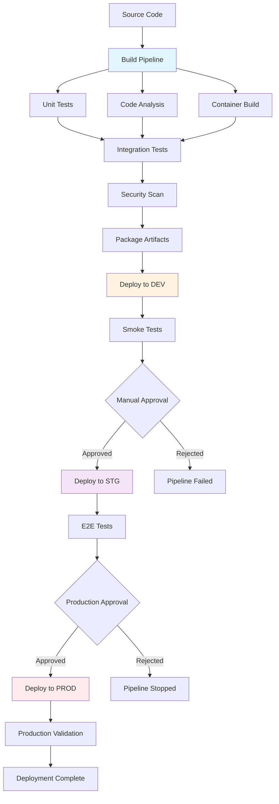

# Deployment Operations Guidelines

## Purpose

This document establishes comprehensive deployment operations standards for the Academic Management System, defining CI/CD pipeline implementation, environment management strategies, Azure DevOps integration, deployment automation, rollback procedures, and infrastructure as code practices to ensure reliable and consistent software delivery.

## Scope

This document covers:

- Azure DevOps CI/CD pipeline configuration
- Environment promotion strategies and approval processes
- Automated deployment with Bicep templates
- Database migration and deployment strategies
- Monitoring and rollback procedures

This document does not cover:

- Manual deployment procedures
- Local development environment setup
- Third-party deployment tools beyond Azure DevOps
- Disaster recovery and backup procedures

## Prerequisites

- Understanding of Azure DevOps services and capabilities
- Familiarity with YAML pipeline syntax
- Knowledge of Bicep infrastructure as code
- Understanding of containerization and Azure App Service deployment

## CI/CD Pipeline Architecture

### Pipeline Overview



### Azure DevOps Pipeline Configuration

```yaml
# azure-pipelines.yml
name: $(Date:yyyyMMdd)$(Rev:.r)

trigger:
  branches:
    include:
      - main
      - develop
      - release/*
  paths:
    exclude:
      - docs/*
      - README.md

pr:
  branches:
    include:
      - main
      - develop

variables:
  - group: "Academia-Common"
  - name: buildConfiguration
    value: "Release"
  - name: vmImageName
    value: "ubuntu-latest"

stages:
  - stage: Build
    displayName: "Build and Test"
    jobs:
      - job: Build
        displayName: "Build Application"
        pool:
          vmImage: $(vmImageName)

        steps:
          - checkout: self
            fetchDepth: 0

          - task: GitVersion@5
            displayName: "Calculate Version"
            inputs:
              runtime: "core"
              configFilePath: "GitVersion.yml"

          - task: UseDotNet@2
            displayName: "Install .NET 8.0"
            inputs:
              packageType: "sdk"
              version: "8.0.x"

          - task: DotNetCoreCLI@2
            displayName: "Restore NuGet Packages"
            inputs:
              command: "restore"
              projects: "**/*.csproj"

          - task: DotNetCoreCLI@2
            displayName: "Build Application"
            inputs:
              command: "build"
              projects: "**/*.csproj"
              arguments: "--configuration $(buildConfiguration) --no-restore /p:Version=$(GitVersion.AssemblySemVer)"

          - task: DotNetCoreCLI@2
            displayName: "Run Unit Tests"
            inputs:
              command: "test"
              projects: "**/tests/**/*Tests.csproj"
              arguments: '--configuration $(buildConfiguration) --no-build --collect:"XPlat Code Coverage" --logger trx --results-directory $(Agent.TempDirectory)/TestResults'

          - task: PublishTestResults@2
            displayName: "Publish Test Results"
            condition: succeededOrFailed()
            inputs:
              testResultsFormat: "VSTest"
              testResultsFiles: "**/*.trx"
              searchFolder: "$(Agent.TempDirectory)/TestResults"

          - task: PublishCodeCoverageResults@1
            displayName: "Publish Code Coverage"
            inputs:
              codeCoverageTool: "Cobertura"
              summaryFileLocation: "$(Agent.TempDirectory)/TestResults/**/coverage.cobertura.xml"

          - task: SonarCloudPrepare@1
            displayName: "Prepare SonarCloud Analysis"
            inputs:
              SonarCloud: "SonarCloud-Academia"
              organization: "university"
              scannerMode: "MSBuild"
              projectKey: "university_academia-management"
              projectName: "Academia Management System"

          - task: SonarCloudAnalyze@1
            displayName: "Run SonarCloud Analysis"

          - task: SonarCloudPublish@1
            displayName: "Publish SonarCloud Results"
            inputs:
              pollingTimeoutSec: "300"

          - task: Docker@2
            displayName: "Build Docker Image"
            inputs:
              containerRegistry: "ACR-Academia"
              repository: "academia/api"
              command: "build"
              Dockerfile: "src/Academia.API/Dockerfile"
              tags: |
                $(GitVersion.SemVer)
                latest

          - task: Docker@2
            displayName: "Push Docker Image"
            inputs:
              containerRegistry: "ACR-Academia"
              repository: "academia/api"
              command: "push"
              tags: |
                $(GitVersion.SemVer)
                latest

          - task: PublishBuildArtifacts@1
            displayName: "Publish Build Artifacts"
            inputs:
              PathtoPublish: "$(Build.ArtifactStagingDirectory)"
              ArtifactName: "drop"

  - stage: DeployDevelopment
    displayName: "Deploy to Development"
    dependsOn: Build
    condition: and(succeeded(), eq(variables['Build.SourceBranch'], 'refs/heads/develop'))

    variables:
      - group: "Academia-Development"

    jobs:
      - deployment: DeployDev
        displayName: "Deploy to Development Environment"
        pool:
          vmImage: $(vmImageName)
        environment: "Academia-Development"

        strategy:
          runOnce:
            deploy:
              steps:
                - template: templates/deploy-infrastructure.yml
                  parameters:
                    environment: "dev"
                    resourceGroupName: "$(DEV_RESOURCE_GROUP)"
                    subscriptionId: "$(DEV_SUBSCRIPTION_ID)"

                - template: templates/deploy-application.yml
                  parameters:
                    environment: "dev"
                    appServiceName: "$(DEV_APP_SERVICE_NAME)"
                    imageTag: "$(Build.BuildId)"

                - template: templates/run-smoke-tests.yml
                  parameters:
                    environment: "dev"
                    baseUrl: "$(DEV_BASE_URL)"

  - stage: DeployStaging
    displayName: "Deploy to Staging"
    dependsOn: DeployDevelopment
    condition: and(succeeded(), or(eq(variables['Build.SourceBranch'], 'refs/heads/main'), startsWith(variables['Build.SourceBranch'], 'refs/heads/release/')))

    variables:
      - group: "Academia-Staging"

    jobs:
      - deployment: DeployStaging
        displayName: "Deploy to Staging Environment"
        pool:
          vmImage: $(vmImageName)
        environment: "Academia-Staging"

        strategy:
          runOnce:
            deploy:
              steps:
                - template: templates/deploy-infrastructure.yml
                  parameters:
                    environment: "stg"
                    resourceGroupName: "$(STG_RESOURCE_GROUP)"
                    subscriptionId: "$(STG_SUBSCRIPTION_ID)"

                - template: templates/deploy-application.yml
                  parameters:
                    environment: "stg"
                    appServiceName: "$(STG_APP_SERVICE_NAME)"
                    imageTag: "$(Build.BuildId)"

                - template: templates/run-integration-tests.yml
                  parameters:
                    environment: "stg"
                    baseUrl: "$(STG_BASE_URL)"

  - stage: DeployProduction
    displayName: "Deploy to Production"
    dependsOn: DeployStaging
    condition: and(succeeded(), eq(variables['Build.SourceBranch'], 'refs/heads/main'))

    variables:
      - group: "Academia-Production"

    jobs:
      - deployment: DeployProduction
        displayName: "Deploy to Production Environment"
        pool:
          vmImage: $(vmImageName)
        environment: "Academia-Production"

        strategy:
          runOnce:
            deploy:
              steps:
                - template: templates/deploy-infrastructure.yml
                  parameters:
                    environment: "prd"
                    resourceGroupName: "$(PRD_RESOURCE_GROUP)"
                    subscriptionId: "$(PRD_SUBSCRIPTION_ID)"

                - template: templates/deploy-application.yml
                  parameters:
                    environment: "prd"
                    appServiceName: "$(PRD_APP_SERVICE_NAME)"
                    imageTag: "$(Build.BuildId)"

                - template: templates/run-production-validation.yml
                  parameters:
                    environment: "prd"
                    baseUrl: "$(PRD_BASE_URL)"
```

### Deployment Templates

#### Infrastructure Deployment Template

```yaml
# templates/deploy-infrastructure.yml
parameters:
  - name: environment
    type: string
  - name: resourceGroupName
    type: string
  - name: subscriptionId
    type: string

steps:
  - task: AzureCLI@2
    displayName: "Deploy Infrastructure with Bicep"
    inputs:
      azureSubscription: "Academia-ServiceConnection-${{ parameters.environment }}"
      scriptType: "bash"
      scriptLocation: "inlineScript"
      inlineScript: |
        # Set deployment variables
        ENVIRONMENT=${{ parameters.environment }}
        RESOURCE_GROUP=${{ parameters.resourceGroupName }}
        LOCATION="East US 2"
        DEPLOYMENT_NAME="academia-infrastructure-$(Build.BuildId)"

        echo "Deploying infrastructure for environment: $ENVIRONMENT"
        echo "Resource Group: $RESOURCE_GROUP"
        echo "Deployment Name: $DEPLOYMENT_NAME"

        # Validate Bicep template
        az deployment group validate \
          --resource-group $RESOURCE_GROUP \
          --template-file infrastructure/main.bicep \
          --parameters environment=$ENVIRONMENT \
          --parameters buildId=$(Build.BuildId) \
          --parameters @infrastructure/parameters.$ENVIRONMENT.json

        if [ $? -ne 0 ]; then
          echo "Bicep template validation failed"
          exit 1
        fi

        # Deploy infrastructure
        az deployment group create \
          --resource-group $RESOURCE_GROUP \
          --name $DEPLOYMENT_NAME \
          --template-file infrastructure/main.bicep \
          --parameters environment=$ENVIRONMENT \
          --parameters buildId=$(Build.BuildId) \
          --parameters @infrastructure/parameters.$ENVIRONMENT.json \
          --verbose

        # Capture deployment outputs
        DEPLOYMENT_OUTPUTS=$(az deployment group show \
          --resource-group $RESOURCE_GROUP \
          --name $DEPLOYMENT_NAME \
          --query properties.outputs \
          --output json)

        echo "Deployment outputs:"
        echo $DEPLOYMENT_OUTPUTS

        # Set pipeline variables from outputs
        APP_SERVICE_NAME=$(echo $DEPLOYMENT_OUTPUTS | jq -r '.appServiceName.value')
        DATABASE_NAME=$(echo $DEPLOYMENT_OUTPUTS | jq -r '.databaseName.value')

        echo "##vso[task.setvariable variable=appServiceName;]$APP_SERVICE_NAME"
        echo "##vso[task.setvariable variable=databaseName;]$DATABASE_NAME"

  - task: AzureCLI@2
    displayName: "Configure Application Settings"
    inputs:
      azureSubscription: "Academia-ServiceConnection-${{ parameters.environment }}"
      scriptType: "bash"
      scriptLocation: "inlineScript"
      inlineScript: |
        APP_SERVICE_NAME=$(appServiceName)
        RESOURCE_GROUP=${{ parameters.resourceGroupName }}

        # Configure application settings
        az webapp config appsettings set \
          --resource-group $RESOURCE_GROUP \
          --name $APP_SERVICE_NAME \
          --settings \
            ASPNETCORE_ENVIRONMENT=${{ parameters.environment }} \
            ApplicationInsights__ConnectionString="$(APP_INSIGHTS_CONNECTION_STRING)" \
            Academia__KeyVault__Name="$(KEY_VAULT_NAME)" \
            DOCKER_REGISTRY_SERVER_URL="$(CONTAINER_REGISTRY_URL)" \
            DOCKER_REGISTRY_SERVER_USERNAME="$(CONTAINER_REGISTRY_USERNAME)" \
            DOCKER_REGISTRY_SERVER_PASSWORD="$(CONTAINER_REGISTRY_PASSWORD)"
```

#### Application Deployment Template

```yaml
# templates/deploy-application.yml
parameters:
  - name: environment
    type: string
  - name: appServiceName
    type: string
  - name: imageTag
    type: string

steps:
  - task: AzureCLI@2
    displayName: "Run Database Migrations"
    inputs:
      azureSubscription: "Academia-ServiceConnection-${{ parameters.environment }}"
      scriptType: "bash"
      scriptLocation: "inlineScript"
      inlineScript: |
        echo "Running database migrations for ${{ parameters.environment }}"

        # Get database connection string from Key Vault
        CONNECTION_STRING=$(az keyvault secret show \
          --vault-name "$(KEY_VAULT_NAME)" \
          --name "academia-database-connectionstring" \
          --query value \
          --output tsv)

        # Run Entity Framework migrations
        dotnet ef database update \
          --project src/Academia.Infrastructure \
          --startup-project src/Academia.API \
          --connection "$CONNECTION_STRING" \
          --verbose

        echo "Database migrations completed successfully"

  - task: AzureWebAppContainer@1
    displayName: "Deploy Container to App Service"
    inputs:
      azureSubscription: "Academia-ServiceConnection-${{ parameters.environment }}"
      appName: "${{ parameters.appServiceName }}"
      containers: "$(CONTAINER_REGISTRY_URL)/academia/api:${{ parameters.imageTag }}"

  - task: AzureCLI@2
    displayName: "Wait for Application Startup"
    inputs:
      azureSubscription: "Academia-ServiceConnection-${{ parameters.environment }}"
      scriptType: "bash"
      scriptLocation: "inlineScript"
      inlineScript: |
        APP_URL="https://${{ parameters.appServiceName }}.azurewebsites.net"
        HEALTH_ENDPOINT="$APP_URL/health"

        echo "Waiting for application to start at: $APP_URL"

        # Wait up to 5 minutes for health endpoint to respond
        for i in {1..60}; do
          HTTP_STATUS=$(curl -s -o /dev/null -w "%{http_code}" $HEALTH_ENDPOINT || echo "000")
          
          if [ "$HTTP_STATUS" = "200" ]; then
            echo "Application is healthy (attempt $i/60)"
            break
          elif [ "$i" = "60" ]; then
            echo "Application failed to start within timeout period"
            exit 1
          else
            echo "Application not ready yet (attempt $i/60, status: $HTTP_STATUS)"
            sleep 5
          fi
        done

        echo "Application deployment completed successfully"

  - task: AzureCLI@2
    displayName: "Configure Deployment Slot (Production Only)"
    condition: eq('${{ parameters.environment }}', 'prd')
    inputs:
      azureSubscription: "Academia-ServiceConnection-${{ parameters.environment }}"
      scriptType: "bash"
      scriptLocation: "inlineScript"
      inlineScript: |
        RESOURCE_GROUP="$(PRD_RESOURCE_GROUP)"
        APP_SERVICE_NAME="${{ parameters.appServiceName }}"

        # Create staging slot if it doesn't exist
        az webapp deployment slot create \
          --resource-group $RESOURCE_GROUP \
          --name $APP_SERVICE_NAME \
          --slot staging \
          --configuration-source $APP_SERVICE_NAME

        # Deploy to staging slot first
        az webapp config container set \
          --resource-group $RESOURCE_GROUP \
          --name $APP_SERVICE_NAME \
          --slot staging \
          --docker-custom-image-name "$(CONTAINER_REGISTRY_URL)/academia/api:${{ parameters.imageTag }}"

        # Wait for staging slot to be ready
        STAGING_URL="https://$APP_SERVICE_NAME-staging.azurewebsites.net/health"

        for i in {1..30}; do
          HTTP_STATUS=$(curl -s -o /dev/null -w "%{http_code}" $STAGING_URL || echo "000")
          
          if [ "$HTTP_STATUS" = "200" ]; then
            echo "Staging slot is ready"
            break
          elif [ "$i" = "30" ]; then
            echo "Staging slot failed to start"
            exit 1
          else
            echo "Waiting for staging slot (attempt $i/30)"
            sleep 10
          fi
        done

        # Swap slots (zero downtime deployment)
        az webapp deployment slot swap \
          --resource-group $RESOURCE_GROUP \
          --name $APP_SERVICE_NAME \
          --slot staging \
          --target-slot production

        echo "Blue-green deployment completed successfully"
```

### Testing Templates

```yaml
# templates/run-smoke-tests.yml
parameters:
  - name: environment
    type: string
  - name: baseUrl
    type: string

steps:
  - task: DotNetCoreCLI@2
    displayName: 'Run Smoke Tests'
    inputs:
      command: 'test'
      projects: '**/tests/**/*SmokeTests.csproj'
      arguments: '--configuration Release --logger trx --results-directory $(Agent.TempDirectory)/SmokeTestResults'
    env:
      TEST_BASE_URL: '${{ parameters.baseUrl }}'
      ENVIRONMENT: '${{ parameters.environment }}'

  - task: PublishTestResults@2
    displayName: 'Publish Smoke Test Results'
    condition: succeededOrFailed()
    inputs:
      testResultsFormat: 'VSTest'
      testResultsFiles: '**/*.trx'
      searchFolder: '$(Agent.TempDirectory)/SmokeTestResults'
      testRunTitle: 'Smoke Tests - ${{ parameters.environment }}'

# templates/run-integration-tests.yml
parameters:
  - name: environment
    type: string
  - name: baseUrl
    type: string

steps:
  - task: DotNetCoreCLI@2
    displayName: 'Run Integration Tests'
    inputs:
      command: 'test'
      projects: '**/tests/**/*IntegrationTests.csproj'
      arguments: '--configuration Release --logger trx --results-directory $(Agent.TempDirectory)/IntegrationTestResults'
    env:
      TEST_BASE_URL: '${{ parameters.baseUrl }}'
      ENVIRONMENT: '${{ parameters.environment }}'

  - task: PublishTestResults@2
    displayName: 'Publish Integration Test Results'
    condition: succeededOrFailed()
    inputs:
      testResultsFormat: 'VSTest'
      testResultsFiles: '**/*.trx'
      searchFolder: '$(Agent.TempDirectory)/IntegrationTestResults'
      testRunTitle: 'Integration Tests - ${{ parameters.environment }}'
```

## Database Migration Strategy

### Database Deployment Pipeline

```yaml
# Database migration strategy
steps:
  - task: DotNetCoreCLI@2
    displayName: "Generate Migration Script"
    inputs:
      command: "custom"
      custom: "ef"
      arguments: "migrations script --project src/Academia.Infrastructure --startup-project src/Academia.API --output $(Build.ArtifactStagingDirectory)/migration.sql --idempotent"

  - task: SqlAzureDacpacDeployment@1
    displayName: "Run Database Migration"
    inputs:
      azureSubscription: "Academia-ServiceConnection-$(Environment)"
      AuthenticationType: "servicePrincipal"
      ServerName: "$(DATABASE_SERVER_NAME).database.windows.net"
      DatabaseName: "$(DATABASE_NAME)"
      deployType: "SqlTask"
      SqlFile: "$(Build.ArtifactStagingDirectory)/migration.sql"
      IpDetectionMethod: "AutoDetect"

  - task: AzureCLI@2
    displayName: "Validate Database Schema"
    inputs:
      azureSubscription: "Academia-ServiceConnection-$(Environment)"
      scriptType: "bash"
      scriptLocation: "inlineScript"
      inlineScript: |
        # Run schema validation queries
        sqlcmd -S $(DATABASE_SERVER_NAME).database.windows.net \
               -d $(DATABASE_NAME) \
               -U $(DATABASE_USER) \
               -P $(DATABASE_PASSWORD) \
               -Q "SELECT COUNT(*) FROM INFORMATION_SCHEMA.TABLES WHERE TABLE_TYPE = 'BASE TABLE'"

        # Verify critical tables exist
        sqlcmd -S $(DATABASE_SERVER_NAME).database.windows.net \
               -d $(DATABASE_NAME) \
               -U $(DATABASE_USER) \
               -P $(DATABASE_PASSWORD) \
               -Q "SELECT name FROM sys.tables WHERE name IN ('Students', 'Courses', 'Enrollments')"
```

### Zero-Downtime Database Updates

```csharp
// Database migration service for zero-downtime deployments
public interface IDatabaseMigrationService
{
    Task<MigrationStatus> GetMigrationStatusAsync(CancellationToken cancellationToken = default);
    Task<MigrationResult> ApplyMigrationAsync(string migrationVersion, CancellationToken cancellationToken = default);
    Task<bool> ValidateSchemaCompatibilityAsync(string newVersion, CancellationToken cancellationToken = default);
}

public class DatabaseMigrationService : IDatabaseMigrationService
{
    private readonly AcademiaDbContext _context;
    private readonly ILogger<DatabaseMigrationService> _logger;

    public DatabaseMigrationService(
        AcademiaDbContext context,
        ILogger<DatabaseMigrationService> logger)
    {
        _context = context;
        _logger = logger;
    }

    public async Task<MigrationStatus> GetMigrationStatusAsync(CancellationToken cancellationToken = default)
    {
        var appliedMigrations = await _context.Database.GetAppliedMigrationsAsync(cancellationToken);
        var pendingMigrations = await _context.Database.GetPendingMigrationsAsync(cancellationToken);

        return new MigrationStatus
        {
            AppliedMigrations = appliedMigrations.ToList(),
            PendingMigrations = pendingMigrations.ToList(),
            DatabaseExists = await _context.Database.CanConnectAsync(cancellationToken)
        };
    }

    public async Task<MigrationResult> ApplyMigrationAsync(
        string migrationVersion,
        CancellationToken cancellationToken = default)
    {
        _logger.LogInformation("Applying database migration: {MigrationVersion}", migrationVersion);

        try
        {
            // Check if migration can be applied safely
            var canApply = await ValidateSchemaCompatibilityAsync(migrationVersion, cancellationToken);
            if (!canApply)
            {
                return MigrationResult.Failure("Migration would cause breaking changes");
            }

            // Apply migration with timeout
            using var cts = CancellationTokenSource.CreateLinkedTokenSource(cancellationToken);
            cts.CancelAfter(TimeSpan.FromMinutes(10)); // 10-minute timeout

            await _context.Database.MigrateAsync(cts.Token);

            _logger.LogInformation("Successfully applied migration: {MigrationVersion}", migrationVersion);
            return MigrationResult.Success();
        }
        catch (Exception ex)
        {
            _logger.LogError(ex, "Failed to apply migration: {MigrationVersion}", migrationVersion);
            return MigrationResult.Failure(ex.Message);
        }
    }

    public async Task<bool> ValidateSchemaCompatibilityAsync(
        string newVersion,
        CancellationToken cancellationToken = default)
    {
        try
        {
            // Validate that the new schema is backward compatible
            // This would involve checking for:
            // - Dropped tables or columns
            // - Changed column types that might cause data loss
            // - New non-nullable columns without defaults

            var pendingMigrations = await _context.Database.GetPendingMigrationsAsync(cancellationToken);

            foreach (var migration in pendingMigrations)
            {
                // Analyze migration for breaking changes
                if (await ContainsBreakingChangesAsync(migration, cancellationToken))
                {
                    _logger.LogWarning("Migration {Migration} contains breaking changes", migration);
                    return false;
                }
            }

            return true;
        }
        catch (Exception ex)
        {
            _logger.LogError(ex, "Error validating schema compatibility for version {Version}", newVersion);
            return false;
        }
    }

    private async Task<bool> ContainsBreakingChangesAsync(string migration, CancellationToken cancellationToken)
    {
        // Implementation would analyze the migration SQL to detect:
        // 1. DROP TABLE or DROP COLUMN statements
        // 2. ALTER COLUMN statements that change data types
        // 3. New NOT NULL columns without DEFAULT values

        // This is a simplified implementation
        // In practice, you'd analyze the actual migration SQL
        return await Task.FromResult(false);
    }
}
```

## Rollback and Recovery Procedures

### Automated Rollback Strategy

```yaml
# Rollback pipeline template
parameters:
  - name: environment
    type: string
  - name: rollbackVersion
    type: string

steps:
  - task: AzureCLI@2
    displayName: "Initiate Application Rollback"
    inputs:
      azureSubscription: "Academia-ServiceConnection-${{ parameters.environment }}"
      scriptType: "bash"
      scriptLocation: "inlineScript"
      inlineScript: |
        ENVIRONMENT=${{ parameters.environment }}
        ROLLBACK_VERSION=${{ parameters.rollbackVersion }}

        echo "Initiating rollback to version: $ROLLBACK_VERSION"

        # Get current deployment info
        CURRENT_IMAGE=$(az webapp config container show \
          --resource-group $(RESOURCE_GROUP) \
          --name $(APP_SERVICE_NAME) \
          --query 'image' \
          --output tsv)

        echo "Current image: $CURRENT_IMAGE"
        echo "Rolling back to: $(CONTAINER_REGISTRY_URL)/academia/api:$ROLLBACK_VERSION"

        # Deploy previous version
        az webapp config container set \
          --resource-group $(RESOURCE_GROUP) \
          --name $(APP_SERVICE_NAME) \
          --docker-custom-image-name "$(CONTAINER_REGISTRY_URL)/academia/api:$ROLLBACK_VERSION"

        # Wait for application to be ready
        APP_URL="https://$(APP_SERVICE_NAME).azurewebsites.net/health"

        for i in {1..30}; do
          HTTP_STATUS=$(curl -s -o /dev/null -w "%{http_code}" $APP_URL || echo "000")
          
          if [ "$HTTP_STATUS" = "200" ]; then
            echo "Application rollback completed successfully"
            break
          elif [ "$i" = "30" ]; then
            echo "Application rollback failed - service not responding"
            exit 1
          else
            echo "Waiting for application (attempt $i/30)"
            sleep 10
          fi
        done

  - task: AzureCLI@2
    displayName: "Database Rollback (if required)"
    inputs:
      azureSubscription: "Academia-ServiceConnection-${{ parameters.environment }}"
      scriptType: "bash"
      scriptLocation: "inlineScript"
      inlineScript: |
        # Only perform database rollback if explicitly required
        # This should be used cautiously as it may cause data loss

        if [ "$(PERFORM_DATABASE_ROLLBACK)" = "true" ]; then
          echo "WARNING: Performing database rollback - this may cause data loss"
          
          # Restore from point-in-time backup
          RESTORE_TIME="$(ROLLBACK_TIMESTAMP)"
          NEW_DB_NAME="$(DATABASE_NAME)-restored-$(date +%Y%m%d%H%M%S)"
          
          az sql db restore \
            --resource-group $(RESOURCE_GROUP) \
            --server $(DATABASE_SERVER_NAME) \
            --name $(DATABASE_NAME) \
            --dest-name $NEW_DB_NAME \
            --time $RESTORE_TIME
          
          # Update application connection string to point to restored database
          az webapp config connection-string set \
            --resource-group $(RESOURCE_GROUP) \
            --name $(APP_SERVICE_NAME) \
            --connection-string-type SQLAzure \
            --settings DefaultConnection="$(RESTORED_CONNECTION_STRING)"
          
          echo "Database rollback completed"
        else
          echo "Skipping database rollback"
        fi

  - task: DotNetCoreCLI@2
    displayName: "Validate Rollback"
    inputs:
      command: "test"
      projects: "**/tests/**/*SmokeTests.csproj"
      arguments: "--configuration Release --logger trx"
    env:
      TEST_BASE_URL: "https://$(APP_SERVICE_NAME).azurewebsites.net"
```

### Disaster Recovery Procedures

```powershell
# Disaster Recovery Script
param(
    [Parameter(Mandatory = $true)]
    [string]$Environment,

    [Parameter(Mandatory = $true)]
    [string]$BackupTimestamp,

    [Parameter(Mandatory = $false)]
    [switch]$DryRun = $false
)

Write-Host "Starting disaster recovery procedure for environment: $Environment"
Write-Host "Backup timestamp: $BackupTimestamp"
Write-Host "Dry run mode: $DryRun"

# Load environment configuration
$config = Get-Content "disaster-recovery/config.$Environment.json" | ConvertFrom-Json

# Validate prerequisites
Write-Host "Validating prerequisites..."

# Check Azure CLI login
$context = az account show | ConvertFrom-Json
if (-not $context) {
    Write-Error "Not logged into Azure CLI"
    exit 1
}

Write-Host "Logged in as: $($context.user.name)"
Write-Host "Subscription: $($context.name)"

# Restore database from backup
Write-Host "Restoring database from backup..."

if (-not $DryRun) {
    az sql db restore `
        --resource-group $config.resourceGroup `
        --server $config.databaseServer `
        --name $config.databaseName `
        --dest-name "$($config.databaseName)-recovered-$(Get-Date -Format 'yyyyMMddHHmmss')" `
        --time $BackupTimestamp
}

# Restore application from container registry
Write-Host "Identifying application version from backup timestamp..."

# Get the container image tag closest to the backup timestamp
$imageTag = az acr repository show-tags `
    --name $config.containerRegistry `
    --repository "academia/api" `
    --orderby time_desc `
    --query "[0]" `
    --output tsv

Write-Host "Using container image tag: $imageTag"

if (-not $DryRun) {
    # Deploy the recovered application
    az webapp config container set `
        --resource-group $config.resourceGroup `
        --name $config.appServiceName `
        --docker-custom-image-name "$($config.containerRegistryUrl)/academia/api:$imageTag"
}

# Validate recovery
Write-Host "Validating recovery..."

$healthUrl = "https://$($config.appServiceName).azurewebsites.net/health"
$maxRetries = 30

for ($i = 1; $i -le $maxRetries; $i++) {
    try {
        $response = Invoke-RestMethod -Uri $healthUrl -Method GET -TimeoutSec 10

        if ($response.status -eq "Healthy") {
            Write-Host "Application recovery validated successfully"
            break
        }
    }
    catch {
        Write-Host "Attempt $i/$maxRetries - Application not ready yet"
        Start-Sleep -Seconds 10
    }

    if ($i -eq $maxRetries) {
        Write-Error "Application recovery validation failed"
        exit 1
    }
}

Write-Host "Disaster recovery completed successfully"
Write-Host "Please run comprehensive tests to validate system functionality"
```

## Related Documentation References

- [Azure Infrastructure Guidelines](./azure-infrastructure.instructions.md)
- [Configuration Management](./configuration-management.instructions.md)
- [Testing Requirements](./testing-requirements.instructions.md)
- [Monitoring and Observability](./monitoring-observability.instructions.md)

## Validation Checklist

Before considering the deployment operations implementation complete, verify:

- [ ] CI/CD pipeline builds, tests, and deploys automatically on commits
- [ ] Infrastructure deployment uses Bicep templates with environment-specific parameters
- [ ] Database migrations are automated and support zero-downtime deployments
- [ ] Blue-green deployment is configured for production with slot swapping
- [ ] Rollback procedures are automated and tested
- [ ] Environment promotion requires appropriate approvals
- [ ] Security scanning is integrated into the build pipeline
- [ ] Smoke tests and integration tests validate deployments
- [ ] Disaster recovery procedures are documented and tested
- [ ] Container images are scanned for vulnerabilities
- [ ] Configuration secrets are managed through Key Vault
- [ ] Deployment monitoring provides visibility into release health
