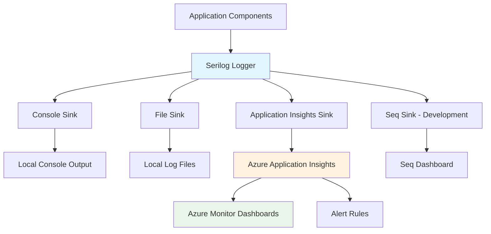

# Monitoring and Observability Guidelines

## Purpose

This document establishes comprehensive monitoring and observability standards for the Academic Management System, defining structured logging with Serilog, OpenTelemetry implementation for distributed tracing, metrics collection and alerting, performance monitoring, and operational dashboards to ensure system reliability and performance visibility.

## Scope

This document covers:

- Structured logging implementation with Serilog and Application Insights
- OpenTelemetry distributed tracing configuration
- Metrics collection using Prometheus and Azure Monitor
- Performance monitoring and APM integration
- Alerting and notification strategies

This document does not cover:

- Infrastructure monitoring (covered in azure-infrastructure.instructions.md)
- Security monitoring and SIEM integration
- Business intelligence and analytics reporting
- Third-party service monitoring beyond integration points

## Prerequisites

- Understanding of observability concepts (logs, metrics, traces)
- Familiarity with Serilog structured logging
- Knowledge of OpenTelemetry standards
- Understanding of Azure Monitor and Application Insights

## Logging Architecture

### Structured Logging with Serilog



### Serilog Configuration

```csharp
// Program.cs - Logging configuration
public static class LoggingExtensions
{
    public static void ConfigureLogging(this WebApplicationBuilder builder)
    {
        builder.Host.UseSerilog((context, services, configuration) =>
        {
            var environment = context.HostingEnvironment.EnvironmentName;
            var appInsightsConnectionString = context.Configuration.GetConnectionString("ApplicationInsights");

            configuration
                .ReadFrom.Configuration(context.Configuration)
                .ReadFrom.Services(services)
                .Enrich.FromLogContext()
                .Enrich.WithProperty("Environment", environment)
                .Enrich.WithProperty("ApplicationName", "Academia.API")
                .Enrich.WithProperty("Version", GetApplicationVersion())
                .Enrich.WithCorrelationId()
                .Enrich.WithUserInfo()
                .WriteTo.Console(
                    outputTemplate: "[{Timestamp:HH:mm:ss} {Level:u3}] {Message:lj} {Properties:j}{NewLine}{Exception}")
                .WriteTo.File(
                    path: "logs/academia-.txt",
                    rollingInterval: RollingInterval.Day,
                    retainedFileCountLimit: 7,
                    outputTemplate: "{Timestamp:yyyy-MM-dd HH:mm:ss.fff zzz} [{Level:u3}] {Message:lj} {Properties:j}{NewLine}{Exception}")
                .WriteTo.ApplicationInsights(
                    connectionString: appInsightsConnectionString,
                    telemetryConverter: TelemetryConverter.Traces);

            // Development-specific sinks
            if (environment == "Development")
            {
                var seqUrl = context.Configuration.GetValue<string>("Serilog:Seq:Url");
                if (!string.IsNullOrEmpty(seqUrl))
                {
                    configuration.WriteTo.Seq(seqUrl);
                }
            }
        });
    }

    private static string GetApplicationVersion()
    {
        return Assembly.GetExecutingAssembly()
            .GetCustomAttribute<AssemblyInformationalVersionAttribute>()?
            .InformationalVersion ?? "Unknown";
    }
}

// Custom enrichers for contextual information
public class CorrelationIdEnricher : ILogEventEnricher
{
    public void Enrich(LogEvent logEvent, ILogEventPropertyFactory propertyFactory)
    {
        var correlationId = Activity.Current?.Id ?? Guid.NewGuid().ToString();
        var property = propertyFactory.CreateProperty("CorrelationId", correlationId);
        logEvent.AddProperty(property);
    }
}

public class UserInfoEnricher : ILogEventEnricher
{
    private readonly IHttpContextAccessor _httpContextAccessor;

    public UserInfoEnricher(IHttpContextAccessor httpContextAccessor)
    {
        _httpContextAccessor = httpContextAccessor;
    }

    public void Enrich(LogEvent logEvent, ILogEventPropertyFactory propertyFactory)
    {
        var context = _httpContextAccessor.HttpContext;
        if (context?.User?.Identity?.IsAuthenticated == true)
        {
            var userId = context.User.FindFirst(ClaimTypes.NameIdentifier)?.Value ?? "Unknown";
            var userRole = context.User.FindFirst(ClaimTypes.Role)?.Value ?? "Unknown";

            var userProperty = propertyFactory.CreateProperty("UserId", userId);
            var roleProperty = propertyFactory.CreateProperty("UserRole", userRole);

            logEvent.AddProperty(userProperty);
            logEvent.AddProperty(roleProperty);
        }
    }
}
```

### Application Logging Patterns

```csharp
// Structured logging in application services
public class EnrollmentService : IEnrollmentService
{
    private readonly ILogger<EnrollmentService> _logger;
    private readonly IStudentRepository _studentRepository;
    private readonly ICourseRepository _courseRepository;

    public EnrollmentService(
        ILogger<EnrollmentService> logger,
        IStudentRepository studentRepository,
        ICourseRepository courseRepository)
    {
        _logger = logger;
        _studentRepository = studentRepository;
        _courseRepository = courseRepository;
    }

    public async Task<Result<EnrollmentId>> EnrollStudentAsync(
        StudentId studentId,
        CourseId courseId,
        AcademicTerm term,
        CancellationToken cancellationToken = default)
    {
        using var activity = ApplicationDiagnostics.ActivitySource.StartActivity("EnrollStudent");
        activity?.SetTag("student.id", studentId.ToString());
        activity?.SetTag("course.id", courseId.ToString());
        activity?.SetTag("term", term.ToString());

        _logger.LogInformation(
            "Starting student enrollment process for {StudentId} in course {CourseId} for term {Term}",
            studentId, courseId, term);

        var stopwatch = Stopwatch.StartNew();

        try
        {
            // Validate student exists and is active
            var student = await _studentRepository.GetByIdAsync(studentId, cancellationToken);
            if (student == null)
            {
                _logger.LogWarning(
                    "Enrollment failed: Student {StudentId} not found",
                    studentId);

                activity?.SetStatus(ActivityStatusCode.Error, "Student not found");
                return Result<EnrollmentId>.Failure("Student not found");
            }

            if (student.Status != StudentStatus.Active)
            {
                _logger.LogWarning(
                    "Enrollment failed: Student {StudentId} has status {Status}, expected {ExpectedStatus}",
                    studentId, student.Status, StudentStatus.Active);

                activity?.SetStatus(ActivityStatusCode.Error, "Student not active");
                return Result<EnrollmentId>.Failure("Student is not active");
            }

            // Validate course exists and is available
            var course = await _courseRepository.GetByIdAsync(courseId, cancellationToken);
            if (course == null)
            {
                _logger.LogWarning(
                    "Enrollment failed: Course {CourseId} not found",
                    courseId);

                activity?.SetStatus(ActivityStatusCode.Error, "Course not found");
                return Result<EnrollmentId>.Failure("Course not found");
            }

            // Perform enrollment
            var enrollmentResult = student.EnrollInCourse(course, term);
            if (enrollmentResult.IsFailure)
            {
                _logger.LogWarning(
                    "Enrollment validation failed for student {StudentId} in course {CourseId}: {Error}",
                    studentId, courseId, enrollmentResult.Error);

                activity?.SetStatus(ActivityStatusCode.Error, enrollmentResult.Error);
                return Result<EnrollmentId>.Failure(enrollmentResult.Error);
            }

            // Save changes
            await _studentRepository.UpdateAsync(student, cancellationToken);

            stopwatch.Stop();

            _logger.LogInformation(
                "Successfully enrolled student {StudentId} in course {CourseId} for term {Term}. " +
                "Enrollment ID: {EnrollmentId}. Duration: {Duration}ms",
                studentId, courseId, term, enrollmentResult.Value, stopwatch.ElapsedMilliseconds);

            activity?.SetStatus(ActivityStatusCode.Ok);
            activity?.SetTag("enrollment.id", enrollmentResult.Value.ToString());
            activity?.SetTag("duration.ms", stopwatch.ElapsedMilliseconds);

            // Emit custom metrics
            ApplicationMetrics.EnrollmentCreated.WithTags(
                ("course", course.Code.Value),
                ("term", term.ToString())
            ).Increment();

            ApplicationMetrics.EnrollmentDuration.Record(stopwatch.ElapsedMilliseconds);

            return enrollmentResult;
        }
        catch (Exception ex)
        {
            stopwatch.Stop();

            _logger.LogError(ex,
                "Unexpected error during enrollment for student {StudentId} in course {CourseId}. Duration: {Duration}ms",
                studentId, courseId, stopwatch.ElapsedMilliseconds);

            activity?.SetStatus(ActivityStatusCode.Error, ex.Message);
            activity?.SetTag("duration.ms", stopwatch.ElapsedMilliseconds);

            ApplicationMetrics.EnrollmentErrors.WithTags(
                ("error.type", ex.GetType().Name)
            ).Increment();

            throw;
        }
    }
}

// Domain event logging
public class StudentEnrolledDomainEventHandler : IDomainEventHandler<StudentEnrolledDomainEvent>
{
    private readonly ILogger<StudentEnrolledDomainEventHandler> _logger;
    private readonly INotificationService _notificationService;

    public StudentEnrolledDomainEventHandler(
        ILogger<StudentEnrolledDomainEventHandler> logger,
        INotificationService notificationService)
    {
        _logger = logger;
        _notificationService = notificationService;
    }

    public async Task Handle(StudentEnrolledDomainEvent domainEvent, CancellationToken cancellationToken)
    {
        _logger.LogInformation(
            "Processing domain event {EventType} for student {StudentId} enrolled in course {CourseId}",
            nameof(StudentEnrolledDomainEvent), domainEvent.StudentId, domainEvent.CourseId);

        try
        {
            await _notificationService.SendEnrollmentConfirmationAsync(
                domainEvent.StudentId,
                domainEvent.CourseId,
                domainEvent.EnrollmentDate,
                cancellationToken);

            _logger.LogInformation(
                "Successfully processed enrollment notification for student {StudentId}",
                domainEvent.StudentId);
        }
        catch (Exception ex)
        {
            _logger.LogError(ex,
                "Failed to send enrollment notification for student {StudentId} in course {CourseId}",
                domainEvent.StudentId, domainEvent.CourseId);
            throw;
        }
    }
}
```

## Distributed Tracing with OpenTelemetry

### OpenTelemetry Configuration

```csharp
// OpenTelemetry service registration
public static class OpenTelemetryExtensions
{
    public static IServiceCollection AddAcademiaOpenTelemetry(
        this IServiceCollection services,
        IConfiguration configuration)
    {
        var applicationInsightsConnectionString = configuration.GetConnectionString("ApplicationInsights");

        services.AddOpenTelemetry()
            .WithTracing(builder =>
            {
                builder
                    .AddSource(ApplicationDiagnostics.ActivitySourceName)
                    .SetSampler(new TraceIdRatioBasedSampler(0.1)) // Sample 10% of traces
                    .AddAspNetCoreInstrumentation(options =>
                    {
                        options.RecordException = true;
                        options.EnableGrpcAspNetCoreSupport = true;
                        options.Filter = (httpContext) =>
                        {
                            // Don't trace health check endpoints
                            return !httpContext.Request.Path.StartsWithSegments("/health");
                        };
                    })
                    .AddHttpClientInstrumentation()
                    .AddEntityFrameworkCoreInstrumentation(options =>
                    {
                        options.SetDbStatementForText = true;
                        options.SetDbStatementForStoredProcedure = true;
                    })
                    .AddSqlClientInstrumentation(options =>
                    {
                        options.SetDbStatementForText = true;
                        options.RecordException = true;
                    });

                // Add exporters based on environment
                if (!string.IsNullOrEmpty(applicationInsightsConnectionString))
                {
                    builder.AddAzureMonitorTraceExporter(options =>
                    {
                        options.ConnectionString = applicationInsightsConnectionString;
                    });
                }

                // Add console exporter for development
                if (configuration.GetValue<bool>("OpenTelemetry:UseConsoleExporter"))
                {
                    builder.AddConsoleExporter();
                }
            })
            .WithMetrics(builder =>
            {
                builder
                    .AddMeter(ApplicationMetrics.MeterName)
                    .AddAspNetCoreInstrumentation()
                    .AddHttpClientInstrumentation()
                    .AddRuntimeInstrumentation();

                if (!string.IsNullOrEmpty(applicationInsightsConnectionString))
                {
                    builder.AddAzureMonitorMetricExporter(options =>
                    {
                        options.ConnectionString = applicationInsightsConnectionString;
                    });
                }

                if (configuration.GetValue<bool>("OpenTelemetry:UseConsoleExporter"))
                {
                    builder.AddConsoleExporter();
                }
            });

        return services;
    }
}

// Application diagnostics and activity sources
public static class ApplicationDiagnostics
{
    public const string ActivitySourceName = "Academia.API";
    public static readonly ActivitySource ActivitySource = new(ActivitySourceName);

    public static class Activities
    {
        public const string EnrollStudent = "EnrollStudent";
        public const string ProcessGrade = "ProcessGrade";
        public const string GenerateTranscript = "GenerateTranscript";
        public const string ValidatePrerequisites = "ValidatePrerequisites";
    }
}

// Custom instrumentation for domain operations
public class DomainInstrumentation : IDisposable
{
    private readonly ActivityListener _activityListener;

    public DomainInstrumentation()
    {
        _activityListener = new ActivityListener
        {
            ShouldListenTo = _ => true,
            Sample = (ref ActivityCreationOptions<ActivityContext> options) => ActivitySamplingResult.AllData,
            ActivityStarted = OnActivityStarted,
            ActivityStopped = OnActivityStopped
        };

        ActivitySource.AddActivityListener(_activityListener);
    }

    private static void OnActivityStarted(Activity activity)
    {
        // Add custom tags for domain activities
        if (activity.Source.Name == ApplicationDiagnostics.ActivitySourceName)
        {
            activity.SetTag("academia.operation", activity.OperationName);
            activity.SetTag("academia.timestamp", DateTimeOffset.UtcNow.ToString("O"));
        }
    }

    private static void OnActivityStopped(Activity activity)
    {
        // Log activity completion
        if (activity.Source.Name == ApplicationDiagnostics.ActivitySourceName)
        {
            var duration = activity.Duration.TotalMilliseconds;
            activity.SetTag("academia.duration_ms", duration);

            // Record metrics
            ApplicationMetrics.OperationDuration.WithTags(
                ("operation", activity.OperationName ?? "unknown")
            ).Record(duration);
        }
    }

    public void Dispose()
    {
        _activityListener?.Dispose();
        GC.SuppressFinalize(this);
    }
}
```

### Custom Tracing in Application Layers

```csharp
// Repository layer tracing
public class StudentRepository : IStudentRepository
{
    private readonly AcademiaDbContext _context;
    private readonly ILogger<StudentRepository> _logger;

    public async Task<Student?> GetByIdAsync(StudentId id, CancellationToken cancellationToken = default)
    {
        using var activity = ApplicationDiagnostics.ActivitySource.StartActivity("StudentRepository.GetById");
        activity?.SetTag("student.id", id.ToString());

        try
        {
            var student = await _context.Students
                .Include(s => s.Enrollments)
                .FirstOrDefaultAsync(s => s.Id == id, cancellationToken);

            activity?.SetTag("student.found", student != null);

            if (student != null)
            {
                activity?.SetTag("student.status", student.Status.ToString());
                activity?.SetTag("student.enrollment_count", student.Enrollments.Count);
            }

            return student;
        }
        catch (Exception ex)
        {
            activity?.SetStatus(ActivityStatusCode.Error, ex.Message);
            activity?.SetTag("error.type", ex.GetType().Name);
            throw;
        }
    }
}

// Command handler tracing
public class EnrollStudentInCourseCommandHandler : IRequestHandler<EnrollStudentInCourseCommand, Result<EnrollmentId>>
{
    private readonly IStudentRepository _studentRepository;
    private readonly ICourseRepository _courseRepository;
    private readonly IUnitOfWork _unitOfWork;
    private readonly ILogger<EnrollStudentInCourseCommandHandler> _logger;

    public async Task<Result<EnrollmentId>> Handle(
        EnrollStudentInCourseCommand request,
        CancellationToken cancellationToken)
    {
        using var activity = ApplicationDiagnostics.ActivitySource.StartActivity("Command.EnrollStudentInCourse");
        activity?.SetTag("command.type", nameof(EnrollStudentInCourseCommand));
        activity?.SetTag("student.id", request.StudentId.ToString());
        activity?.SetTag("course.id", request.CourseId.ToString());
        activity?.SetTag("term", request.AcademicTerm.ToString());

        try
        {
            // Implementation with nested spans
            using var validateActivity = ApplicationDiagnostics.ActivitySource.StartActivity("ValidateEnrollmentEligibility");

            var student = await _studentRepository.GetByIdAsync(request.StudentId, cancellationToken);
            validateActivity?.SetTag("student.found", student != null);

            if (student == null)
            {
                activity?.SetStatus(ActivityStatusCode.Error, "Student not found");
                return Result<EnrollmentId>.Failure("Student not found");
            }

            var course = await _courseRepository.GetByIdAsync(request.CourseId, cancellationToken);
            validateActivity?.SetTag("course.found", course != null);

            if (course == null)
            {
                activity?.SetStatus(ActivityStatusCode.Error, "Course not found");
                return Result<EnrollmentId>.Failure("Course not found");
            }

            validateActivity?.SetStatus(ActivityStatusCode.Ok);

            // Perform enrollment
            using var enrollActivity = ApplicationDiagnostics.ActivitySource.StartActivity("PerformEnrollment");

            var result = student.EnrollInCourse(course, request.AcademicTerm);
            if (result.IsFailure)
            {
                enrollActivity?.SetStatus(ActivityStatusCode.Error, result.Error);
                activity?.SetStatus(ActivityStatusCode.Error, result.Error);
                return Result<EnrollmentId>.Failure(result.Error);
            }

            await _unitOfWork.SaveChangesAsync(cancellationToken);

            activity?.SetTag("enrollment.id", result.Value.ToString());
            activity?.SetStatus(ActivityStatusCode.Ok);

            return result;
        }
        catch (Exception ex)
        {
            activity?.SetStatus(ActivityStatusCode.Error, ex.Message);
            activity?.SetTag("error.type", ex.GetType().Name);
            throw;
        }
    }
}
```

## Metrics and Performance Monitoring

### Custom Metrics Definition

```csharp
// Application metrics using System.Diagnostics.Metrics
public static class ApplicationMetrics
{
    public const string MeterName = "Academia.API";
    private static readonly Meter Meter = new(MeterName);

    // Business metrics
    public static readonly Counter<int> EnrollmentCreated = Meter.CreateCounter<int>(
        "academia.enrollments.created",
        "count",
        "Number of successful enrollments");

    public static readonly Counter<int> EnrollmentErrors = Meter.CreateCounter<int>(
        "academia.enrollments.errors",
        "count",
        "Number of enrollment errors");

    public static readonly Counter<int> GradesAssigned = Meter.CreateCounter<int>(
        "academia.grades.assigned",
        "count",
        "Number of grades assigned");

    public static readonly Counter<int> StudentsCreated = Meter.CreateCounter<int>(
        "academia.students.created",
        "count",
        "Number of students created");

    // Performance metrics
    public static readonly Histogram<double> EnrollmentDuration = Meter.CreateHistogram<double>(
        "academia.enrollment.duration",
        "ms",
        "Duration of enrollment operations");

    public static readonly Histogram<double> OperationDuration = Meter.CreateHistogram<double>(
        "academia.operation.duration",
        "ms",
        "Duration of various operations");

    public static readonly Histogram<double> DatabaseQueryDuration = Meter.CreateHistogram<double>(
        "academia.database.query.duration",
        "ms",
        "Duration of database queries");

    // System metrics
    public static readonly UpDownCounter<int> ActiveEnrollments = Meter.CreateUpDownCounter<int>(
        "academia.enrollments.active",
        "count",
        "Current number of active enrollments");

    public static readonly UpDownCounter<int> ActiveStudents = Meter.CreateUpDownCounter<int>(
        "academia.students.active",
        "count",
        "Current number of active students");

    // Custom gauges
    public static readonly ObservableGauge<double> DatabaseConnectionPoolSize = Meter.CreateObservableGauge<double>(
        "academia.database.connection_pool.size",
        "connections",
        "Current database connection pool size");

    public static readonly ObservableGauge<double> MemoryUsage = Meter.CreateObservableGauge<double>(
        "academia.process.memory.usage",
        "bytes",
        "Current memory usage");
}

// Metrics middleware for HTTP requests
public class MetricsMiddleware
{
    private readonly RequestDelegate _next;
    private readonly ILogger<MetricsMiddleware> _logger;

    private static readonly Counter<int> HttpRequests = ApplicationMetrics.Meter.CreateCounter<int>(
        "academia.http.requests",
        "count",
        "Total HTTP requests");

    private static readonly Histogram<double> HttpRequestDuration = ApplicationMetrics.Meter.CreateHistogram<double>(
        "academia.http.request.duration",
        "ms",
        "HTTP request duration");

    public MetricsMiddleware(RequestDelegate next, ILogger<MetricsMiddleware> logger)
    {
        _next = next;
        _logger = logger;
    }

    public async Task InvokeAsync(HttpContext context)
    {
        var stopwatch = Stopwatch.StartNew();
        var method = context.Request.Method;
        var path = context.Request.Path.Value ?? "/";

        try
        {
            await _next(context);
        }
        finally
        {
            stopwatch.Stop();
            var statusCode = context.Response.StatusCode;
            var duration = stopwatch.ElapsedMilliseconds;

            // Record metrics with tags
            HttpRequests.WithTags(
                ("method", method),
                ("endpoint", path),
                ("status_code", statusCode.ToString())
            ).Increment();

            HttpRequestDuration.WithTags(
                ("method", method),
                ("endpoint", path),
                ("status_code", statusCode.ToString())
            ).Record(duration);
        }
    }
}
```

### Performance Monitoring Service

```csharp
public interface IPerformanceMonitoringService
{
    Task<PerformanceReport> GenerateReportAsync(TimeSpan period, CancellationToken cancellationToken = default);
    Task<List<PerformanceAlert>> CheckPerformanceThresholdsAsync(CancellationToken cancellationToken = default);
}

public class PerformanceMonitoringService : IPerformanceMonitoringService
{
    private readonly IMetricsRepository _metricsRepository;
    private readonly IAlertingService _alertingService;
    private readonly ILogger<PerformanceMonitoringService> _logger;

    public PerformanceMonitoringService(
        IMetricsRepository metricsRepository,
        IAlertingService alertingService,
        ILogger<PerformanceMonitoringService> logger)
    {
        _metricsRepository = metricsRepository;
        _alertingService = alertingService;
        _logger = logger;
    }

    public async Task<PerformanceReport> GenerateReportAsync(
        TimeSpan period,
        CancellationToken cancellationToken = default)
    {
        var endTime = DateTime.UtcNow;
        var startTime = endTime - period;

        _logger.LogInformation(
            "Generating performance report for period {StartTime} to {EndTime}",
            startTime, endTime);

        var metrics = await _metricsRepository.GetMetricsAsync(startTime, endTime, cancellationToken);

        return new PerformanceReport
        {
            Period = period,
            StartTime = startTime,
            EndTime = endTime,
            RequestCount = metrics.Sum(m => m.HttpRequests),
            AverageResponseTime = metrics.Average(m => m.ResponseTime),
            ErrorRate = CalculateErrorRate(metrics),
            EnrollmentCount = metrics.Sum(m => m.EnrollmentCount),
            DatabaseQueryAverageTime = metrics.Average(m => m.DatabaseQueryTime),
            MemoryUsage = metrics.LastOrDefault()?.MemoryUsage ?? 0
        };
    }

    public async Task<List<PerformanceAlert>> CheckPerformanceThresholdsAsync(
        CancellationToken cancellationToken = default)
    {
        var alerts = new List<PerformanceAlert>();
        var currentMetrics = await _metricsRepository.GetCurrentMetricsAsync(cancellationToken);

        // Check response time threshold (> 2 seconds)
        if (currentMetrics.AverageResponseTime > 2000)
        {
            alerts.Add(new PerformanceAlert
            {
                AlertType = AlertType.HighResponseTime,
                Severity = AlertSeverity.Warning,
                Message = $"Average response time is {currentMetrics.AverageResponseTime}ms (threshold: 2000ms)",
                Timestamp = DateTime.UtcNow
            });
        }

        // Check error rate threshold (> 5%)
        if (currentMetrics.ErrorRate > 0.05)
        {
            alerts.Add(new PerformanceAlert
            {
                AlertType = AlertType.HighErrorRate,
                Severity = AlertSeverity.Critical,
                Message = $"Error rate is {currentMetrics.ErrorRate:P2} (threshold: 5%)",
                Timestamp = DateTime.UtcNow
            });
        }

        // Check memory usage (> 1GB)
        if (currentMetrics.MemoryUsage > 1_000_000_000)
        {
            alerts.Add(new PerformanceAlert
            {
                AlertType = AlertType.HighMemoryUsage,
                Severity = AlertSeverity.Warning,
                Message = $"Memory usage is {currentMetrics.MemoryUsage / 1_000_000}MB (threshold: 1000MB)",
                Timestamp = DateTime.UtcNow
            });
        }

        // Send alerts if any were triggered
        foreach (var alert in alerts)
        {
            await _alertingService.SendAlertAsync(alert, cancellationToken);
        }

        return alerts;
    }

    private static double CalculateErrorRate(List<MetricsSnapshot> metrics)
    {
        var totalRequests = metrics.Sum(m => m.HttpRequests);
        var errorRequests = metrics.Sum(m => m.HttpErrors);

        return totalRequests > 0 ? (double)errorRequests / totalRequests : 0;
    }
}
```

## Health Checks and Diagnostics

### Comprehensive Health Checks

```csharp
public static class HealthCheckExtensions
{
    public static IServiceCollection AddAcademiaHealthChecks(
        this IServiceCollection services,
        IConfiguration configuration)
    {
        services.AddHealthChecks()
            .AddDbContextCheck<AcademiaDbContext>("database")
            .AddAzureServiceBusQueue(
                configuration.GetConnectionString("ServiceBus") ?? string.Empty,
                "enrollment-events",
                "servicebus")
            .AddAzureBlobStorage(
                configuration.GetConnectionString("StorageAccount") ?? string.Empty,
                "documents",
                "blobstorage")
            .AddRedis(
                configuration.GetConnectionString("Redis") ?? string.Empty,
                "redis")
            .AddApplicationInsightsPublisher()
            .AddCheck<ExternalApiHealthCheck>("external-api")
            .AddCheck<BusinessLogicHealthCheck>("business-logic");

        return services;
    }
}

// Custom health checks for business logic
public class BusinessLogicHealthCheck : IHealthCheck
{
    private readonly IStudentRepository _studentRepository;
    private readonly ICourseRepository _courseRepository;
    private readonly ILogger<BusinessLogicHealthCheck> _logger;

    public BusinessLogicHealthCheck(
        IStudentRepository studentRepository,
        ICourseRepository courseRepository,
        ILogger<BusinessLogicHealthCheck> logger)
    {
        _studentRepository = studentRepository;
        _courseRepository = courseRepository;
        _logger = logger;
    }

    public async Task<HealthCheckResult> CheckHealthAsync(
        HealthCheckContext context,
        CancellationToken cancellationToken = default)
    {
        try
        {
            // Test basic repository operations
            var studentCount = await _studentRepository.GetActiveCountAsync(cancellationToken);
            var courseCount = await _courseRepository.GetActiveCountAsync(cancellationToken);

            var data = new Dictionary<string, object>
            {
                ["active_students"] = studentCount,
                ["active_courses"] = courseCount,
                ["check_time"] = DateTime.UtcNow
            };

            if (studentCount < 0 || courseCount < 0)
            {
                return HealthCheckResult.Unhealthy(
                    "Invalid data counts returned from repositories",
                    data: data);
            }

            return HealthCheckResult.Healthy(
                "Business logic components are functioning correctly",
                data: data);
        }
        catch (Exception ex)
        {
            _logger.LogError(ex, "Health check failed for business logic components");
            return HealthCheckResult.Unhealthy(
                "Business logic health check failed",
                ex);
        }
    }
}

// External API health check
public class ExternalApiHealthCheck : IHealthCheck
{
    private readonly HttpClient _httpClient;
    private readonly IConfiguration _configuration;

    public ExternalApiHealthCheck(HttpClient httpClient, IConfiguration configuration)
    {
        _httpClient = httpClient;
        _configuration = configuration;
    }

    public async Task<HealthCheckResult> CheckHealthAsync(
        HealthCheckContext context,
        CancellationToken cancellationToken = default)
    {
        var externalApiUrl = _configuration["ExternalServices:StudentInformationSystem:HealthCheckUrl"];

        if (string.IsNullOrEmpty(externalApiUrl))
        {
            return HealthCheckResult.Degraded("External API health check URL not configured");
        }

        try
        {
            var response = await _httpClient.GetAsync(externalApiUrl, cancellationToken);

            if (response.IsSuccessStatusCode)
            {
                return HealthCheckResult.Healthy($"External API is responding: {response.StatusCode}");
            }

            return HealthCheckResult.Degraded($"External API returned: {response.StatusCode}");
        }
        catch (TaskCanceledException)
        {
            return HealthCheckResult.Unhealthy("External API health check timed out");
        }
        catch (Exception ex)
        {
            return HealthCheckResult.Unhealthy("External API health check failed", ex);
        }
    }
}
```

## Dashboards and Alerting

### Azure Monitor Workbook Configuration

```json
{
  "version": "Notebook/1.0",
  "items": [
    {
      "type": 1,
      "content": {
        "json": "# Academia Management System - Operations Dashboard\n\nThis dashboard provides real-time visibility into the Academic Management System performance and health."
      }
    },
    {
      "type": 3,
      "content": {
        "version": "KqlItem/1.0",
        "query": "requests\n| where timestamp > ago(1h)\n| summarize RequestCount = count(), AvgDuration = avg(duration) by bin(timestamp, 5m)\n| render timechart",
        "size": 0,
        "title": "Request Volume and Response Time",
        "queryType": 0,
        "resourceType": "microsoft.insights/components"
      }
    },
    {
      "type": 3,
      "content": {
        "version": "KqlItem/1.0",
        "query": "customMetrics\n| where name == \"academia.enrollments.created\"\n| where timestamp > ago(24h)\n| summarize EnrollmentCount = sum(value) by bin(timestamp, 1h)\n| render columnchart",
        "size": 0,
        "title": "Enrollment Activity (24h)",
        "queryType": 0,
        "resourceType": "microsoft.insights/components"
      }
    },
    {
      "type": 3,
      "content": {
        "version": "KqlItem/1.0",
        "query": "exceptions\n| where timestamp > ago(24h)\n| summarize ErrorCount = count() by bin(timestamp, 1h), type\n| render areachart",
        "size": 0,
        "title": "Error Trends (24h)",
        "queryType": 0,
        "resourceType": "microsoft.insights/components"
      }
    }
  ]
}
```

### Alert Rules Configuration

```yaml
# Alert Rules for Academia Management System
alerts:
  - name: "High Response Time Alert"
    description: "Triggers when average response time exceeds 2 seconds"
    query: |
      requests
      | where timestamp > ago(5m)
      | summarize AvgDuration = avg(duration)
      | where AvgDuration > 2000
    frequency: "PT5M"
    timeWindow: "PT5M"
    severity: 2
    actions:
      - email: "ops-team@university.edu"
      - webhook: "https://alerts.university.edu/webhook"

  - name: "High Error Rate Alert"
    description: "Triggers when error rate exceeds 5% in 15 minutes"
    query: |
      requests
      | where timestamp > ago(15m)
      | summarize TotalRequests = count(), FailedRequests = countif(success == false)
      | extend ErrorRate = (FailedRequests * 100.0) / TotalRequests
      | where ErrorRate > 5.0
    frequency: "PT5M"
    timeWindow: "PT15M"
    severity: 1
    actions:
      - email: "oncall-team@university.edu"
      - sms: "+1234567890"

  - name: "Database Connection Alert"
    description: "Triggers when database connection failures occur"
    query: |
      exceptions
      | where timestamp > ago(5m)
      | where type contains "SqlException" or type contains "TimeoutException"
      | summarize ExceptionCount = count()
      | where ExceptionCount > 0
    frequency: "PT1M"
    timeWindow: "PT5M"
    severity: 0
    actions:
      - email: "dba-team@university.edu"
      - webhook: "https://pagerduty.com/integration/webhook"

  - name: "Enrollment System Health"
    description: "Monitors enrollment system availability"
    query: |
      availabilityResults
      | where name == "enrollment-api"
      | where timestamp > ago(5m)
      | summarize AvailabilityPercentage = avg(success) * 100
      | where AvailabilityPercentage < 95.0
    frequency: "PT5M"
    timeWindow: "PT5M"
    severity: 2
    actions:
      - email: "enrollment-team@university.edu"
```

## Related Documentation References

- [Configuration Management](./configuration-management.instructions.md)
- [Azure Infrastructure](./azure-infrastructure.instructions.md)
- [Security Compliance](./security-compliance.instructions.md)
- [Testing Requirements](./testing-requirements.instructions.md)

## Validation Checklist

Before considering the monitoring and observability implementation complete, verify:

- [ ] Structured logging is configured with Serilog and appropriate sinks
- [ ] OpenTelemetry tracing captures all critical business operations
- [ ] Custom metrics track business KPIs and performance indicators
- [ ] Health checks validate all system dependencies and business logic
- [ ] Performance monitoring includes automated threshold checking
- [ ] Application Insights dashboards provide operational visibility
- [ ] Alert rules cover critical failure scenarios and performance degradation
- [ ] Distributed tracing spans include relevant business context and tags
- [ ] Log correlation IDs enable end-to-end request tracking
- [ ] Metrics retention and aggregation policies are configured
- [ ] Alerting includes appropriate escalation and notification channels
- [ ] Performance baselines are established for capacity planning
