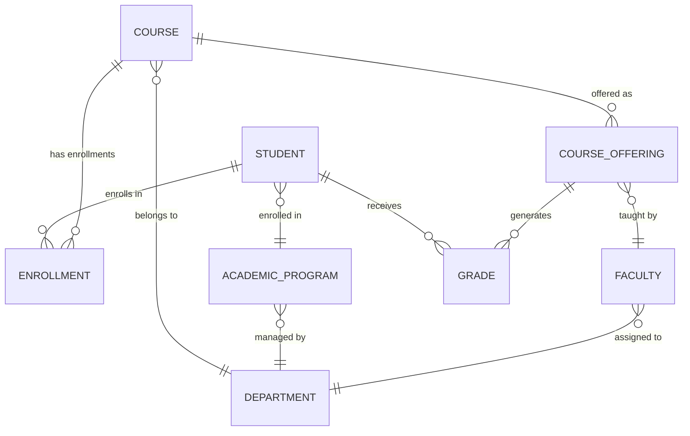
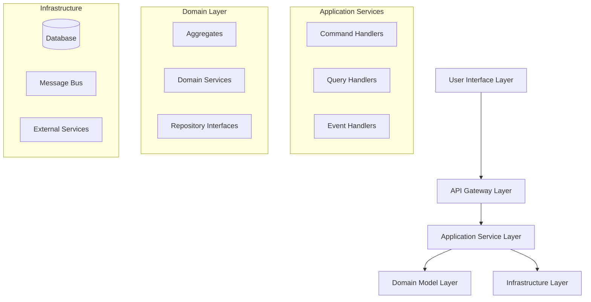

# Academic Management System - Project Overview

## Purpose

This document provides a comprehensive overview of the Academic Management System domain, defining core entities, business relationships, key invariants, and the high-level architecture that guides all development decisions.

## Scope

This document covers:

- Domain model and core academic entities
- Business rules and invariants
- Entity relationships and aggregate boundaries
- High-level system architecture
- Integration points and external dependencies

This document does not cover:

- Implementation-specific technical details
- Database schema definitions
- API specifications
- Deployment configurations

## Prerequisites

- Understanding of Domain-Driven Design (DDD) concepts
- Familiarity with CQRS and Event Sourcing patterns
- Knowledge of academic management processes
- Basic understanding of .NET 8.0 and C# 12

## Domain Overview

The Academic Management System is designed to manage the complete lifecycle of academic operations within educational institutions. The system handles student enrollment, course management, academic programs, assessments, and institutional administration while maintaining data integrity and supporting complex academic workflows.

### Core Business Capabilities

1. **Student Management**: Complete student lifecycle from application to graduation
2. **Academic Program Management**: Define and manage degree programs, specializations, and requirements
3. **Course Management**: Schedule, deliver, and assess academic courses
4. **Assessment & Grading**: Comprehensive assessment workflows with grade management
5. **Institutional Administration**: Manage departments, faculty, and administrative operations

## Core Domain Entities

### Student Aggregate

The Student aggregate represents individuals enrolled in the academic institution.

```csharp
public class Student : AggregateRoot<StudentId>
{
    public StudentNumber StudentNumber { get; private set; }
    public PersonalInfo PersonalInfo { get; private set; }
    public ContactInfo ContactInfo { get; private set; }
    public EnrollmentStatus Status { get; private set; }
    public AcademicRecord AcademicRecord { get; private set; }
    public IReadOnlyList<Enrollment> Enrollments => _enrollments.AsReadOnly();

    private readonly List<Enrollment> _enrollments = new();

    // Business methods
    public void EnrollInCourse(CourseId courseId, AcademicTerm term)
    {
        // Business logic for enrollment
        if (Status != EnrollmentStatus.Active)
            throw new DomainException("Student must be active to enroll in courses");

        var enrollment = new Enrollment(courseId, Id, term);
        _enrollments.Add(enrollment);

        AddDomainEvent(new StudentEnrolledInCourse(Id, courseId, term));
    }
}
```

### Course Aggregate

The Course aggregate represents academic courses offered by the institution.

```csharp
public class Course : AggregateRoot<CourseId>
{
    public CourseCode CourseCode { get; private set; }
    public CourseTitle Title { get; private set; }
    public Credits Credits { get; private set; }
    public DepartmentId DepartmentId { get; private set; }
    public CourseDescription Description { get; private set; }
    public Prerequisites Prerequisites { get; private set; }
    public CourseStatus Status { get; private set; }

    public void UpdatePrerequisites(Prerequisites newPrerequisites)
    {
        if (Status == CourseStatus.Active && HasActiveEnrollments())
            throw new DomainException("Cannot modify prerequisites for courses with active enrollments");

        Prerequisites = newPrerequisites;
        AddDomainEvent(new CoursePrerequisitesUpdated(Id, newPrerequisites));
    }
}
```

### Academic Program Aggregate

The Academic Program aggregate defines degree programs and their requirements.

```csharp
public class AcademicProgram : AggregateRoot<ProgramId>
{
    public ProgramCode ProgramCode { get; private set; }
    public ProgramTitle Title { get; private set; }
    public DegreeType DegreeType { get; private set; }
    public DepartmentId DepartmentId { get; private set; }
    public GraduationRequirements Requirements { get; private set; }
    public ProgramStatus Status { get; private set; }

    public bool CanStudentGraduate(StudentId studentId, AcademicRecord record)
    {
        return Requirements.AreMetBy(record) &&
               record.MinimumGpaRequirement >= Requirements.MinimumGpa;
    }
}
```

### Department Aggregate

The Department aggregate represents academic and administrative departments.

```csharp
public class Department : AggregateRoot<DepartmentId>
{
    public DepartmentCode Code { get; private set; }
    public DepartmentName Name { get; private set; }
    public FacultyId DepartmentHead { get; private set; }
    public IReadOnlyList<FacultyId> Faculty => _faculty.AsReadOnly();
    public Budget Budget { get; private set; }

    private readonly List<FacultyId> _faculty = new();

    public void AssignFaculty(FacultyId facultyId, FacultyRole role)
    {
        if (_faculty.Contains(facultyId))
            throw new DomainException("Faculty member already assigned to department");

        _faculty.Add(facultyId);
        AddDomainEvent(new FacultyAssignedToDepartment(Id, facultyId, role));
    }
}
```

### Faculty Aggregate

The Faculty aggregate represents teaching and administrative staff.

```csharp
public class Faculty : AggregateRoot<FacultyId>
{
    public EmployeeNumber EmployeeNumber { get; private set; }
    public PersonalInfo PersonalInfo { get; private set; }
    public AcademicRank Rank { get; private set; }
    public Specializations Specializations { get; private set; }
    public TeachingLoad TeachingLoad { get; private set; }
    public FacultyStatus Status { get; private set; }

    public bool CanTeachCourse(CourseId courseId, Course course)
    {
        return Status == FacultyStatus.Active &&
               Specializations.CanTeach(course.Subject) &&
               TeachingLoad.CanAccommodate(course.Credits);
    }
}
```

## Key Business Invariants

### Student Enrollment Rules

1. Students must be in Active status to enroll in courses
2. Students cannot exceed maximum credit hours per term (typically 21 credits)
3. Students must meet course prerequisites before enrollment
4. Students cannot enroll in conflicting time slots
5. Enrollment deadlines must be enforced per academic calendar

### Course Management Rules

1. Courses cannot be deleted if they have active enrollments
2. Prerequisites cannot be modified for courses with active enrollments
3. Course capacity limits must be enforced
4. Faculty assignment requires appropriate specializations
5. Course scheduling must prevent room and faculty conflicts

### Academic Program Rules

1. Program requirements cannot be changed retroactively for enrolled students
2. Students can only be enrolled in one primary degree program at a time
3. Graduation requirements must be met before degree conferral
4. Program deactivation requires all enrolled students to complete or transfer

### Grading and Assessment Rules

1. Final grades cannot be changed after submission deadline without approval
2. Grade calculations must follow defined rubrics and weightings
3. Incomplete grades must be resolved within specified timeframes
4. Grade point averages must be recalculated when grades change

## Entity Relationships



## Aggregate Boundaries

### Student Aggregate Boundary

- **Root**: Student
- **Entities**: Enrollment, AcademicRecord, ContactInfo
- **Value Objects**: StudentNumber, PersonalInfo, GPA
- **Invariants**: Enrollment capacity, prerequisite validation

### Course Aggregate Boundary

- **Root**: Course
- **Entities**: CourseOffering, Schedule
- **Value Objects**: CourseCode, Credits, Prerequisites
- **Invariants**: Scheduling conflicts, capacity limits

### Department Aggregate Boundary

- **Root**: Department
- **Entities**: Budget, FacultyAssignment
- **Value Objects**: DepartmentCode, DepartmentName
- **Invariants**: Faculty assignments, budget allocations

## High-Level Architecture

### Architectural Style

The system follows a **Hexagonal Architecture** (Ports and Adapters) with **CQRS** (Command Query Responsibility Segregation) and **Event Sourcing** patterns.



### Technology Stack

- **Runtime**: .NET 8.0 LTS with C# 12
- **Web Framework**: ASP.NET Core with Minimal APIs
- **Database**: Azure SQL Database with Entity Framework Core
- **Messaging**: Azure Service Bus for domain events
- **CQRS**: MediatR for command and query handling
- **Validation**: FluentValidation for input validation
- **Logging**: Serilog with structured logging
- **Testing**: xUnit with comprehensive test coverage

### Integration Patterns

#### External System Integration

```csharp
public interface IStudentInformationSystem
{
    Task<StudentVerificationResult> VerifyStudentEligibilityAsync(
        StudentId studentId,
        CancellationToken cancellationToken = default);
}

public interface IPaymentProcessingService
{
    Task<PaymentResult> ProcessTuitionPaymentAsync(
        PaymentRequest request,
        CancellationToken cancellationToken = default);
}

public interface IAcademicCalendarService
{
    Task<AcademicTerm> GetCurrentTermAsync(CancellationToken cancellationToken = default);
    Task<bool> IsEnrollmentPeriodActiveAsync(AcademicTerm term, CancellationToken cancellationToken = default);
}
```

## Performance Requirements

### Response Time Requirements

- **Query Operations**: p99 < 100ms
- **Command Operations**: p99 < 200ms
- **Batch Operations**: Complete within 5 minutes
- **Report Generation**: Complete within 30 seconds

### Scalability Requirements

- Support 50,000+ concurrent users during peak enrollment
- Handle 100,000+ student records
- Process 10,000+ enrollments per hour
- Store 5+ years of historical data

### Availability Requirements

- 99.9% uptime during academic terms
- 99.5% uptime during non-academic periods
- Recovery Time Objective (RTO): 4 hours
- Recovery Point Objective (RPO): 1 hour

## Security Considerations

### Data Classification

- **Highly Sensitive**: Social Security Numbers, Financial Information
- **Sensitive**: Academic Records, Personal Information
- **Internal**: Course Information, Faculty Data
- **Public**: Course Catalogs, Program Descriptions

### Access Control Requirements

- Role-based access control (RBAC) with principle of least privilege
- Multi-factor authentication for administrative functions
- Audit logging for all data access and modifications
- Data encryption at rest and in transit

## Implementation Guidelines

### Command Handler Example

```csharp
public class EnrollStudentInCourseCommandHandler : IRequestHandler<EnrollStudentInCourseCommand, Result>
{
    private readonly IStudentRepository _studentRepository;
    private readonly ICourseRepository _courseRepository;
    private readonly IAcademicCalendarService _calendarService;
    private readonly IUnitOfWork _unitOfWork;

    public async Task<Result> Handle(EnrollStudentInCourseCommand request, CancellationToken cancellationToken)
    {
        // Validate enrollment period
        var currentTerm = await _calendarService.GetCurrentTermAsync(cancellationToken);
        if (!await _calendarService.IsEnrollmentPeriodActiveAsync(currentTerm, cancellationToken))
            return Result.Failure("Enrollment period is not active");

        // Load aggregates
        var student = await _studentRepository.GetByIdAsync(request.StudentId, cancellationToken);
        if (student == null)
            return Result.Failure("Student not found");

        var course = await _courseRepository.GetByIdAsync(request.CourseId, cancellationToken);
        if (course == null)
            return Result.Failure("Course not found");

        // Execute business logic
        try
        {
            student.EnrollInCourse(request.CourseId, currentTerm);
            await _unitOfWork.SaveChangesAsync(cancellationToken);
            return Result.Success();
        }
        catch (DomainException ex)
        {
            return Result.Failure(ex.Message);
        }
    }
}
```

### Query Handler Example

```csharp
public class GetStudentEnrollmentsQueryHandler : IRequestHandler<GetStudentEnrollmentsQuery, PagedResult<EnrollmentDto>>
{
    private readonly IReadOnlyRepository<EnrollmentReadModel> _repository;

    public async Task<PagedResult<EnrollmentDto>> Handle(GetStudentEnrollmentsQuery request, CancellationToken cancellationToken)
    {
        var query = _repository.Query()
            .Where(e => e.StudentId == request.StudentId)
            .OrderByDescending(e => e.EnrollmentDate);

        if (request.AcademicTerm.HasValue)
            query = query.Where(e => e.AcademicTerm == request.AcademicTerm.Value);

        var totalCount = await query.CountAsync(cancellationToken);
        var items = await query
            .Skip((request.PageNumber - 1) * request.PageSize)
            .Take(request.PageSize)
            .Select(e => new EnrollmentDto
            {
                CourseId = e.CourseId,
                CourseCode = e.CourseCode,
                CourseTitle = e.CourseTitle,
                Credits = e.Credits,
                Status = e.Status,
                EnrollmentDate = e.EnrollmentDate
            })
            .ToListAsync(cancellationToken);

        return new PagedResult<EnrollmentDto>(items, totalCount, request.PageNumber, request.PageSize);
    }
}
```

## Cross-Cutting Concerns

### Error Handling Strategy

```csharp
public class GlobalExceptionMiddleware
{
    private readonly RequestDelegate _next;
    private readonly ILogger<GlobalExceptionMiddleware> _logger;

    public async Task InvokeAsync(HttpContext context)
    {
        try
        {
            await _next(context);
        }
        catch (DomainException ex)
        {
            _logger.LogWarning(ex, "Domain rule violation: {Message}", ex.Message);
            await HandleDomainExceptionAsync(context, ex);
        }
        catch (ValidationException ex)
        {
            _logger.LogWarning(ex, "Validation error: {Message}", ex.Message);
            await HandleValidationExceptionAsync(context, ex);
        }
        catch (Exception ex)
        {
            _logger.LogError(ex, "Unexpected error occurred");
            await HandleGenericExceptionAsync(context, ex);
        }
    }
}
```

### Correlation ID Propagation

```csharp
public class CorrelationIdMiddleware
{
    private const string CorrelationIdHeader = "X-Correlation-ID";
    private readonly RequestDelegate _next;

    public async Task InvokeAsync(HttpContext context)
    {
        var correlationId = GetCorrelationId(context);
        context.Items[CorrelationIdHeader] = correlationId;
        context.Response.Headers[CorrelationIdHeader] = correlationId;

        using (LogContext.PushProperty("CorrelationId", correlationId))
        {
            await _next(context);
        }
    }

    private static string GetCorrelationId(HttpContext context)
    {
        return context.Request.Headers[CorrelationIdHeader].FirstOrDefault() ?? Guid.NewGuid().ToString();
    }
}
```

## Related Documentation References

- [CQRS Implementation Guidelines](./cqrs-implementation.instructions.md)
- [Architecture Design Patterns](./architecture-design.instructions.md)
- [Domain Glossary](./domain-glossary.instructions.md)
- [Security and Compliance Requirements](./security-compliance.instructions.md)
- [Testing Requirements](./testing-requirements.instructions.md)

## Validation Checklist

Before considering the project overview complete, verify:

- [ ] All core domain aggregates are defined with clear boundaries
- [ ] Business invariants are documented and enforceable
- [ ] Entity relationships are properly modeled
- [ ] Architecture patterns (CQRS, Hexagonal) are correctly applied
- [ ] Technology stack aligns with .NET 8.0 and specified frameworks
- [ ] Performance requirements are measurable and realistic
- [ ] Security considerations address data classification needs
- [ ] Integration patterns support external system connectivity
- [ ] Error handling strategy covers domain and validation exceptions
- [ ] Cross-cutting concerns (correlation, logging) are addressed
- [ ] Code examples demonstrate proper aggregate design
- [ ] All business capabilities are covered by the domain model
