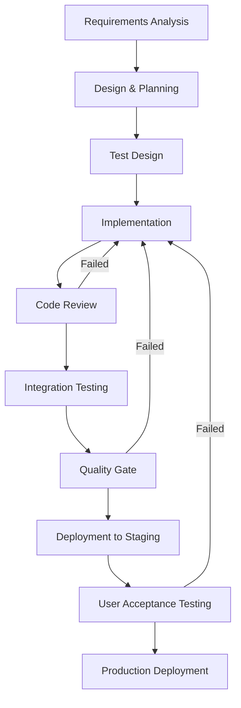
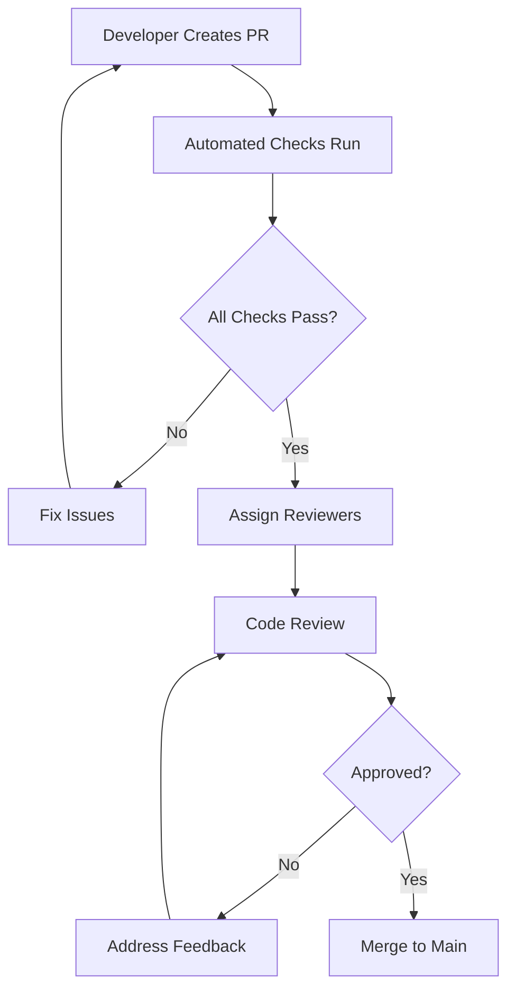

# Software Development Lifecycle Process

## Purpose

This document defines the complete software development lifecycle (SDLC) process for the Academic Management System, establishing workflows from requirement gathering to production deployment while ensuring code quality, maintainability, and reliability through Test-Driven Development (TDD) practices.

## Scope

This document covers:

- Development workflow stages and gates
- Code review requirements and criteria
- Definition of Done for all work items
- Test-Driven Development methodology
- Quality assurance processes
- Continuous integration practices

This document does not cover:

- Specific tooling configurations
- Infrastructure deployment procedures
- Security compliance processes
- Performance optimization techniques

## Prerequisites

- Understanding of Agile development principles
- Familiarity with Test-Driven Development (TDD)
- Knowledge of .NET 8.0 development practices
- Access to Azure DevOps or GitHub for work item tracking

## Development Workflow Overview

### Workflow Stages



## Stage 1: Requirements Analysis

### Requirements Gathering Process

1. **Business Requirement Documentation**

   - Capture functional requirements with acceptance criteria
   - Define non-functional requirements (performance, security, usability)
   - Identify integration touchpoints and dependencies
   - Document business rules and constraints

2. **Requirement Validation**
   - Review with business stakeholders
   - Validate technical feasibility
   - Estimate effort and complexity
   - Identify risks and mitigation strategies

### Requirements Template

```markdown
## User Story

As a [role], I want [functionality] so that [benefit].

## Acceptance Criteria

Given [context]
When [action]
Then [expected outcome]

## Business Rules

- Rule 1: [specific constraint or validation]
- Rule 2: [specific constraint or validation]

## Non-Functional Requirements

- Performance: [specific measurable requirement]
- Security: [specific security consideration]
- Usability: [specific usability requirement]

## Dependencies

- [External system or component dependency]

## Definition of Ready

- [ ] Acceptance criteria are clear and testable
- [ ] Business rules are documented
- [ ] Dependencies are identified
- [ ] Effort estimation completed
```

## Stage 2: Design & Planning

### Technical Design Process

1. **Architecture Review**

   - Validate alignment with system architecture
   - Identify affected aggregates and bounded contexts
   - Design API contracts and data models
   - Plan database schema changes

2. **Task Breakdown**
   - Decompose user story into technical tasks
   - Identify test scenarios and test data requirements
   - Plan integration points and external dependencies
   - Estimate development effort per task

### Design Documentation Requirements

```csharp
// Domain Model Design Example
public class EnrollmentService : IDomainService
{
    /// <summary>
    /// Validates student enrollment eligibility for a specific course
    /// </summary>
    /// <param name="studentId">The student attempting enrollment</param>
    /// <param name="courseId">The target course for enrollment</param>
    /// <param name="academicTerm">The academic term for enrollment</param>
    /// <returns>Validation result with specific failure reasons</returns>
    Task<EnrollmentValidationResult> ValidateEnrollmentEligibilityAsync(
        StudentId studentId,
        CourseId courseId,
        AcademicTerm academicTerm);
}
```

## Stage 3: Test Design (TDD Phase 1)

### Test-Driven Development Methodology

#### Red-Green-Refactor Cycle

1. **Red**: Write a failing test that defines desired functionality
2. **Green**: Write minimal code to make the test pass
3. **Refactor**: Improve code quality while keeping tests passing

### Test Design Requirements

```csharp
// Example: Unit Test Design Before Implementation
[Fact]
public async Task EnrollStudentInCourse_WhenStudentIsActive_ShouldCreateEnrollment()
{
    // Arrange
    var studentId = new StudentId(Guid.NewGuid());
    var courseId = new CourseId(Guid.NewGuid());
    var academicTerm = AcademicTerm.Fall2024;

    var student = Student.Create(studentId, "John Doe", "john.doe@university.edu");
    var course = Course.Create(courseId, "CS101", "Introduction to Computer Science", 3);

    var mockStudentRepository = new Mock<IStudentRepository>();
    var mockCourseRepository = new Mock<ICourseRepository>();

    mockStudentRepository.Setup(r => r.GetByIdAsync(studentId, It.IsAny<CancellationToken>()))
                        .ReturnsAsync(student);
    mockCourseRepository.Setup(r => r.GetByIdAsync(courseId, It.IsAny<CancellationToken>()))
                       .ReturnsAsync(course);

    var handler = new EnrollStudentInCourseCommandHandler(
        mockStudentRepository.Object,
        mockCourseRepository.Object);

    var command = new EnrollStudentInCourseCommand(studentId, courseId, academicTerm);

    // Act
    var result = await handler.Handle(command, CancellationToken.None);

    // Assert
    result.IsSuccess.Should().BeTrue();
    student.Enrollments.Should().Contain(e => e.CourseId == courseId);
}

[Theory]
[InlineData(StudentStatus.Inactive, "Student must be active to enroll")]
[InlineData(StudentStatus.Suspended, "Student must be active to enroll")]
[InlineData(StudentStatus.Graduated, "Student must be active to enroll")]
public async Task EnrollStudentInCourse_WhenStudentIsNotActive_ShouldReturnError(
    StudentStatus status,
    string expectedError)
{
    // Test implementation for various invalid states
}
```

### Test Categories and Coverage Requirements

#### Unit Tests (85% Code Coverage Minimum)

- Domain logic validation
- Business rule enforcement
- Value object behavior
- Aggregate invariants

#### Integration Tests (70% Critical Path Coverage)

- Database operations
- External service integrations
- Message publishing/handling
- API endpoint functionality

#### End-to-End Tests (90% Happy Path Coverage)

- Complete user workflows
- Cross-system integrations
- Performance validation
- Error handling scenarios

## Stage 4: Implementation (TDD Phase 2 & 3)

### Implementation Guidelines

#### Code Quality Standards

```xml
<!-- Directory.Build.props -->
<Project>
  <PropertyGroup>
    <TreatWarningsAsErrors>true</TreatWarningsAsErrors>
    <AnalysisMode>All</AnalysisMode>
    <Nullable>enable</Nullable>
    <ImplicitUsings>enable</ImplicitUsings>
    <TargetFramework>net8.0</TargetFramework>
  </PropertyGroup>
</Project>
```

#### Domain Implementation Example

```csharp
public class Student : AggregateRoot<StudentId>
{
    private readonly List<Enrollment> _enrollments = new();

    public StudentNumber StudentNumber { get; private set; }
    public PersonalInfo PersonalInfo { get; private set; }
    public StudentStatus Status { get; private set; }
    public IReadOnlyList<Enrollment> Enrollments => _enrollments.AsReadOnly();

    private Student() { } // EF Core constructor

    public static Student Create(StudentId id, string firstName, string lastName, string email)
    {
        // Validation logic
        if (string.IsNullOrWhiteSpace(firstName))
            throw new ArgumentException("First name is required", nameof(firstName));

        if (string.IsNullOrWhiteSpace(email) || !IsValidEmail(email))
            throw new ArgumentException("Valid email address is required", nameof(email));

        var student = new Student
        {
            Id = id,
            PersonalInfo = new PersonalInfo(firstName, lastName),
            Status = StudentStatus.Active,
            StudentNumber = StudentNumber.Generate()
        };

        student.AddDomainEvent(new StudentCreated(id, firstName, lastName, email));
        return student;
    }

    public Result EnrollInCourse(CourseId courseId, AcademicTerm term, Course course)
    {
        // Business rule validation
        if (Status != StudentStatus.Active)
            return Result.Failure("Student must be active to enroll in courses");

        if (_enrollments.Any(e => e.CourseId == courseId && e.AcademicTerm == term))
            return Result.Failure("Student is already enrolled in this course for the specified term");

        var totalCredits = _enrollments
            .Where(e => e.AcademicTerm == term)
            .Sum(e => e.Credits);

        if (totalCredits + course.Credits > MaxCreditsPerTerm)
            return Result.Failure($"Enrollment would exceed maximum credits per term ({MaxCreditsPerTerm})");

        // Create enrollment
        var enrollment = new Enrollment(courseId, Id, term, course.Credits);
        _enrollments.Add(enrollment);

        AddDomainEvent(new StudentEnrolledInCourse(Id, courseId, term));
        return Result.Success();
    }

    private static bool IsValidEmail(string email)
    {
        try
        {
            var addr = new System.Net.Mail.MailAddress(email);
            return addr.Address == email;
        }
        catch
        {
            return false;
        }
    }

    private const int MaxCreditsPerTerm = 21;
}
```

#### Command Handler Implementation

```csharp
public class EnrollStudentInCourseCommandHandler : IRequestHandler<EnrollStudentInCourseCommand, Result>
{
    private readonly IStudentRepository _studentRepository;
    private readonly ICourseRepository _courseRepository;
    private readonly IUnitOfWork _unitOfWork;
    private readonly ILogger<EnrollStudentInCourseCommandHandler> _logger;

    public EnrollStudentInCourseCommandHandler(
        IStudentRepository studentRepository,
        ICourseRepository courseRepository,
        IUnitOfWork unitOfWork,
        ILogger<EnrollStudentInCourseCommandHandler> logger)
    {
        _studentRepository = studentRepository ?? throw new ArgumentNullException(nameof(studentRepository));
        _courseRepository = courseRepository ?? throw new ArgumentNullException(nameof(courseRepository));
        _unitOfWork = unitOfWork ?? throw new ArgumentNullException(nameof(unitOfWork));
        _logger = logger ?? throw new ArgumentNullException(nameof(logger));
    }

    public async Task<Result> Handle(EnrollStudentInCourseCommand request, CancellationToken cancellationToken)
    {
        _logger.LogInformation("Processing enrollment for student {StudentId} in course {CourseId}",
            request.StudentId, request.CourseId);

        try
        {
            // Load aggregates
            var student = await _studentRepository.GetByIdAsync(request.StudentId, cancellationToken);
            if (student == null)
            {
                _logger.LogWarning("Student {StudentId} not found", request.StudentId);
                return Result.Failure("Student not found");
            }

            var course = await _courseRepository.GetByIdAsync(request.CourseId, cancellationToken);
            if (course == null)
            {
                _logger.LogWarning("Course {CourseId} not found", request.CourseId);
                return Result.Failure("Course not found");
            }

            // Execute business logic
            var enrollmentResult = student.EnrollInCourse(request.CourseId, request.AcademicTerm, course);
            if (enrollmentResult.IsFailure)
            {
                _logger.LogWarning("Enrollment failed for student {StudentId} in course {CourseId}: {Error}",
                    request.StudentId, request.CourseId, enrollmentResult.Error);
                return enrollmentResult;
            }

            // Persist changes
            await _unitOfWork.SaveChangesAsync(cancellationToken);

            _logger.LogInformation("Successfully enrolled student {StudentId} in course {CourseId}",
                request.StudentId, request.CourseId);

            return Result.Success();
        }
        catch (Exception ex)
        {
            _logger.LogError(ex, "Error processing enrollment for student {StudentId} in course {CourseId}",
                request.StudentId, request.CourseId);
            return Result.Failure("An error occurred processing the enrollment");
        }
    }
}
```

### Implementation Checklist

- [ ] All tests written before implementation (TDD Red phase)
- [ ] Minimal code written to pass tests (TDD Green phase)
- [ ] Code refactored for quality while maintaining test coverage (TDD Refactor phase)
- [ ] Business rules properly enforced in domain layer
- [ ] Error handling implemented with structured logging
- [ ] Null reference types properly handled
- [ ] All compiler warnings treated as errors resolved

## Stage 5: Code Review

### Code Review Requirements

#### Mandatory Review Criteria

1. **Functional Requirements**

   - All acceptance criteria met
   - Business rules properly implemented
   - Edge cases handled appropriately

2. **Code Quality**

   - Follows established coding standards
   - Proper separation of concerns
   - No code duplication (DRY principle)
   - Clear and meaningful naming conventions

3. **Test Coverage**

   - Unit tests cover all business logic paths
   - Integration tests cover critical workflows
   - Test names clearly describe scenarios
   - Arrange-Act-Assert pattern followed

4. **Security Considerations**
   - No hardcoded secrets or sensitive data
   - Input validation implemented
   - Authentication and authorization enforced
   - SQL injection and XSS vulnerabilities addressed

### Code Review Process



#### Automated Checks

- Build compilation without warnings
- All unit tests passing (minimum 85% coverage)
- Integration tests passing
- Code analysis rules (no critical or high issues)
- Security scan (no high or critical vulnerabilities)

#### Review Checklist Template

```markdown
## Functional Review

- [ ] All acceptance criteria implemented
- [ ] Business rules enforced
- [ ] Error scenarios handled
- [ ] Performance considerations addressed

## Code Quality Review

- [ ] Code follows project standards
- [ ] Proper abstraction levels maintained
- [ ] Dependencies properly injected
- [ ] Logging appropriately implemented

## Test Review

- [ ] Unit test coverage >= 85%
- [ ] Integration tests cover critical paths
- [ ] Test names are descriptive
- [ ] Tests are independent and repeatable

## Security Review

- [ ] No hardcoded secrets
- [ ] Input validation implemented
- [ ] Authorization checks in place
- [ ] SQL injection prevention verified
```

## Stage 6: Integration Testing

### Integration Test Requirements

```csharp
[Collection("DatabaseCollection")]
public class StudentEnrollmentIntegrationTests : IClassFixture<WebApplicationFactory<Program>>
{
    private readonly WebApplicationFactory<Program> _factory;
    private readonly HttpClient _client;

    public StudentEnrollmentIntegrationTests(WebApplicationFactory<Program> factory)
    {
        _factory = factory;
        _client = factory.CreateClient();
    }

    [Fact]
    public async Task POST_EnrollStudent_WithValidData_ReturnsSuccess()
    {
        // Arrange
        var studentId = await CreateTestStudentAsync();
        var courseId = await CreateTestCourseAsync();

        var enrollmentRequest = new
        {
            StudentId = studentId,
            CourseId = courseId,
            AcademicTerm = "Fall2024"
        };

        // Act
        var response = await _client.PostAsJsonAsync("/api/enrollments", enrollmentRequest);

        // Assert
        response.StatusCode.Should().Be(HttpStatusCode.Created);

        var content = await response.Content.ReadAsStringAsync();
        var result = JsonSerializer.Deserialize<EnrollmentResponse>(content);
        result.Should().NotBeNull();
        result.StudentId.Should().Be(studentId);
        result.CourseId.Should().Be(courseId);
    }

    [Fact]
    public async Task POST_EnrollStudent_ExceedingCreditLimit_ReturnsBadRequest()
    {
        // Test implementation for credit limit validation
    }
}
```

## Stage 7: Quality Gate

### Quality Gate Criteria

#### Code Quality Metrics

- **Unit Test Coverage**: Minimum 85%
- **Integration Test Coverage**: Minimum 70% of critical paths
- **Code Duplication**: Maximum 3%
- **Technical Debt Ratio**: Maximum 5%
- **Maintainability Index**: Minimum 70

#### Performance Criteria

- **API Response Time**: p99 < 200ms for commands, p99 < 100ms for queries
- **Database Query Performance**: No queries exceeding 1 second
- **Memory Usage**: No memory leaks detected in 24-hour stress test

#### Security Criteria

- **Vulnerability Scan**: No high or critical vulnerabilities
- **Dependency Check**: All dependencies up to date with no known vulnerabilities
- **Code Analysis**: No security-related code analysis warnings

### Quality Gate Implementation

```yaml
# azure-pipelines.yml
- task: SonarCloudAnalyze@1
  displayName: "Run SonarCloud Analysis"

- task: SonarCloudPublish@1
  displayName: "Publish SonarCloud Results"

- task: BuildQualityChecks@8
  displayName: "Check Quality Gate"
  inputs:
    checkCoverage: true
    coverageFailOption: "fixed"
    coverageThreshold: "85"
    checkWarnings: true
    warningFailOption: "fixed"
    warningThreshold: "0"
```

## Definition of Done

### User Story Definition of Done

A user story is considered "Done" when ALL the following criteria are met:

#### Functional Completeness

- [ ] All acceptance criteria implemented and tested
- [ ] Business rules properly enforced
- [ ] Error scenarios handled with appropriate user feedback
- [ ] Performance requirements met

#### Code Quality Standards

- [ ] Code compiles without warnings in Release mode
- [ ] All static analysis rules pass
- [ ] Code coverage meets minimum thresholds (85% unit, 70% integration)
- [ ] No code duplication above acceptable threshold (3%)

#### Testing Requirements

- [ ] Unit tests written following TDD approach
- [ ] Integration tests cover critical user workflows
- [ ] All tests are passing and stable
- [ ] Test names clearly describe scenarios

#### Documentation Requirements

- [ ] API documentation updated (if applicable)
- [ ] Code comments explain complex business logic
- [ ] Architecture decision records updated (if applicable)
- [ ] User-facing documentation updated (if applicable)

#### Review and Validation

- [ ] Code review completed with at least one approval
- [ ] All review feedback addressed
- [ ] Product owner acceptance obtained
- [ ] Security review completed (for security-sensitive features)

#### Deployment Readiness

- [ ] Feature flag configuration completed (if applicable)
- [ ] Database migration scripts tested
- [ ] Configuration changes documented
- [ ] Rollback plan documented

### Sprint Definition of Done

A sprint is considered "Done" when:

- [ ] All committed user stories meet individual Definition of Done
- [ ] Sprint retrospective completed with improvement actions identified
- [ ] All code merged to main branch
- [ ] Release notes updated
- [ ] Deployment to staging environment successful
- [ ] Stakeholder demo completed

## Continuous Improvement Process

### Metrics Collection

```csharp
public class DevelopmentMetrics
{
    public TimeSpan LeadTime { get; set; }           // Idea to production
    public TimeSpan CycleTime { get; set; }          // Development start to done
    public int DefectEscapeRate { get; set; }        // Defects found in production
    public double TestCoverage { get; set; }         // Percentage of code covered by tests
    public int TechnicalDebtHours { get; set; }      // Estimated hours to resolve debt
    public double CustomerSatisfaction { get; set; }  // Customer satisfaction score
}
```

### Process Improvement Actions

1. **Weekly Metrics Review**

   - Analyze development velocity trends
   - Review defect escape rates
   - Assess test coverage trends

2. **Monthly Process Assessment**

   - Evaluate Definition of Done effectiveness
   - Review quality gate criteria relevance
   - Assess automation opportunities

3. **Quarterly Process Evolution**
   - Update processes based on lessons learned
   - Incorporate new industry best practices
   - Adjust quality thresholds based on data

## Related Documentation References

- [Git Workflow Guidelines](./git-workflow.instructions.md)
- [Testing Requirements](./testing-requirements.instructions.md)
- [Code Review Standards](./documentation-guidelines.instructions.md)
- [Quality Assurance Process](./monitoring-observability.instructions.md)

## Validation Checklist

Before considering the SDLC process implementation complete, verify:

- [ ] All workflow stages are clearly defined with entry/exit criteria
- [ ] Test-Driven Development process is mandated and documented
- [ ] Code review requirements include functional, quality, test, and security criteria
- [ ] Definition of Done criteria are comprehensive and measurable
- [ ] Quality gate thresholds align with project requirements
- [ ] Integration testing strategy covers critical system workflows
- [ ] Continuous improvement process includes metrics collection and analysis
- [ ] All team members understand and can execute the defined processes
- [ ] Automation tools are configured to enforce process compliance
- [ ] Process documentation is maintained and version controlled
- [ ] Escalation procedures are defined for quality gate failures
- [ ] Training materials are available for new team members
