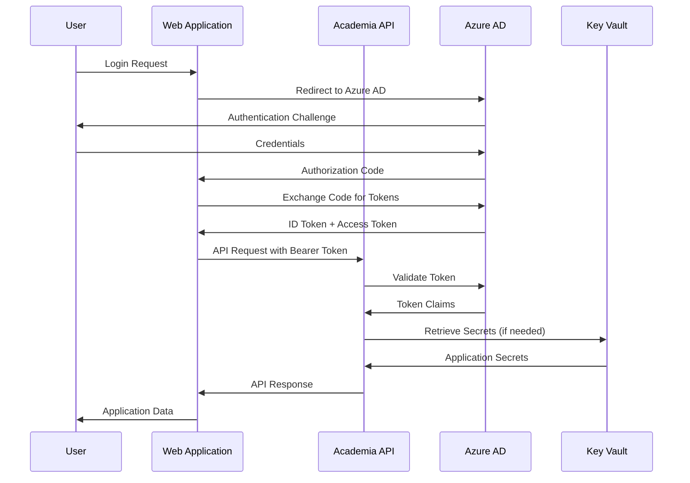

# Security and Compliance Guidelines

## Purpose

This document establishes comprehensive security and compliance standards for the Academic Management System, defining authentication and authorization patterns, data protection requirements, compliance frameworks adherence, security monitoring, and incident response procedures to ensure the system meets enterprise security standards and regulatory requirements.

## Scope

This document covers:

- Authentication and authorization implementation with Azure AD
- Data protection and encryption standards
- GDPR, FERPA, and SOC 2 compliance requirements
- Security monitoring and threat detection
- Incident response and security governance

This document does not cover:

- Infrastructure security configurations (covered in azure-infrastructure.instructions.md)
- Network security and firewall rules
- Physical security requirements
- Third-party vendor security assessments

## Prerequisites

- Understanding of OAuth 2.0 and OpenID Connect protocols
- Familiarity with Azure Active Directory services
- Knowledge of data protection regulations (GDPR, FERPA)
- Understanding of security frameworks and compliance standards

## Authentication and Authorization Architecture

### Authentication Flow



### Authorization Model

```csharp
// Role-Based Access Control (RBAC) Implementation
public static class Roles
{
    public const string Administrator = "Administrator";
    public const string AcademicAffairs = "AcademicAffairs";
    public const string Faculty = "Faculty";
    public const string Student = "Student";
    public const string Registrar = "Registrar";
    public const string FinancialAid = "FinancialAid";
}

public static class Permissions
{
    // Student Management
    public const string ViewStudents = "Students.View";
    public const string CreateStudents = "Students.Create";
    public const string UpdateStudents = "Students.Update";
    public const string DeleteStudents = "Students.Delete";

    // Course Management
    public const string ViewCourses = "Courses.View";
    public const string CreateCourses = "Courses.Create";
    public const string UpdateCourses = "Courses.Update";
    public const string DeleteCourses = "Courses.Delete";

    // Enrollment Management
    public const string ViewEnrollments = "Enrollments.View";
    public const string CreateEnrollments = "Enrollments.Create";
    public const string UpdateEnrollments = "Enrollments.Update";
    public const string DeleteEnrollments = "Enrollments.Delete";

    // Grade Management
    public const string ViewGrades = "Grades.View";
    public const string AssignGrades = "Grades.Assign";
    public const string UpdateGrades = "Grades.Update";

    // Administrative Functions
    public const string ManageUsers = "Administration.ManageUsers";
    public const string ViewAuditLogs = "Administration.ViewAuditLogs";
    public const string ManageSystem = "Administration.ManageSystem";
}

// Permission-based authorization policy
public class PermissionRequirement : IAuthorizationRequirement
{
    public string Permission { get; }

    public PermissionRequirement(string permission)
    {
        Permission = permission;
    }
}

public class PermissionHandler : AuthorizationHandler<PermissionRequirement>
{
    protected override Task HandleRequirementAsync(
        AuthorizationHandlerContext context,
        PermissionRequirement requirement)
    {
        var permissions = context.User.FindAll("permissions")
            .Select(c => c.Value)
            .ToList();

        if (permissions.Contains(requirement.Permission))
        {
            context.Succeed(requirement);
        }

        return Task.CompletedTask;
    }
}

// Resource-based authorization for data access
public interface IResourceAuthorizationService
{
    Task<bool> CanAccessStudentAsync(ClaimsPrincipal user, StudentId studentId);
    Task<bool> CanAccessCourseAsync(ClaimsPrincipal user, CourseId courseId);
    Task<bool> CanAccessEnrollmentAsync(ClaimsPrincipal user, EnrollmentId enrollmentId);
}

public class ResourceAuthorizationService : IResourceAuthorizationService
{
    private readonly IStudentRepository _studentRepository;
    private readonly ICourseRepository _courseRepository;
    private readonly IEnrollmentRepository _enrollmentRepository;

    public ResourceAuthorizationService(
        IStudentRepository studentRepository,
        ICourseRepository courseRepository,
        IEnrollmentRepository enrollmentRepository)
    {
        _studentRepository = studentRepository;
        _courseRepository = courseRepository;
        _enrollmentRepository = enrollmentRepository;
    }

    public async Task<bool> CanAccessStudentAsync(ClaimsPrincipal user, StudentId studentId)
    {
        // Administrators can access all student records
        if (user.IsInRole(Roles.Administrator) || user.IsInRole(Roles.Registrar))
        {
            return true;
        }

        // Students can only access their own records
        if (user.IsInRole(Roles.Student))
        {
            var userStudentId = user.GetStudentId();
            return userStudentId == studentId;
        }

        // Faculty can access students in their courses
        if (user.IsInRole(Roles.Faculty))
        {
            var facultyId = user.GetFacultyId();
            return await _studentRepository.IsStudentInFacultyCourseAsync(studentId, facultyId);
        }

        return false;
    }

    public async Task<bool> CanAccessCourseAsync(ClaimsPrincipal user, CourseId courseId)
    {
        // Administrators and academic affairs can access all courses
        if (user.IsInRole(Roles.Administrator) || user.IsInRole(Roles.AcademicAffairs))
        {
            return true;
        }

        // Faculty can access courses they teach
        if (user.IsInRole(Roles.Faculty))
        {
            var facultyId = user.GetFacultyId();
            return await _courseRepository.IsFacultyAssignedToCourseAsync(facultyId, courseId);
        }

        // Students can access courses they're enrolled in
        if (user.IsInRole(Roles.Student))
        {
            var studentId = user.GetStudentId();
            return await _courseRepository.IsStudentEnrolledInCourseAsync(studentId, courseId);
        }

        return false;
    }

    public async Task<bool> CanAccessEnrollmentAsync(ClaimsPrincipal user, EnrollmentId enrollmentId)
    {
        var enrollment = await _enrollmentRepository.GetByIdAsync(enrollmentId);
        if (enrollment == null)
        {
            return false;
        }

        // Check student access
        if (!await CanAccessStudentAsync(user, enrollment.StudentId))
        {
            return false;
        }

        // Check course access
        return await CanAccessCourseAsync(user, enrollment.CourseId);
    }
}
```

### Authentication Configuration

```csharp
// Authentication service registration
public static class AuthenticationExtensions
{
    public static IServiceCollection AddAcademiaAuthentication(
        this IServiceCollection services,
        IConfiguration configuration)
    {
        var authConfig = configuration.GetSection("Academia:Authentication")
            .Get<AuthenticationConfiguration>()
            ?? throw new InvalidOperationException("Authentication configuration is required");

        services.AddAuthentication(JwtBearerDefaults.AuthenticationScheme)
            .AddJwtBearer(options =>
            {
                options.Authority = authConfig.Authority;
                options.Audience = authConfig.Audience;
                options.RequireHttpsMetadata = authConfig.RequireHttpsMetadata;

                options.TokenValidationParameters = new TokenValidationParameters
                {
                    ValidateIssuer = true,
                    ValidateAudience = true,
                    ValidateLifetime = true,
                    ValidateIssuerSigningKey = true,
                    ClockSkew = TimeSpan.FromMinutes(5),
                    RoleClaimType = "roles",
                    NameClaimType = "name"
                };

                options.Events = new JwtBearerEvents
                {
                    OnAuthenticationFailed = context =>
                    {
                        var logger = context.HttpContext.RequestServices
                            .GetRequiredService<ILogger<JwtBearerEvents>>();

                        logger.LogWarning("Authentication failed: {Exception}", context.Exception);
                        return Task.CompletedTask;
                    },

                    OnTokenValidated = context =>
                    {
                        var logger = context.HttpContext.RequestServices
                            .GetRequiredService<ILogger<JwtBearerEvents>>();

                        var userId = context.Principal?.Identity?.Name;
                        logger.LogInformation("Token validated for user: {UserId}", userId);
                        return Task.CompletedTask;
                    }
                };
            });

        services.AddAuthorization(options =>
        {
            // Role-based policies
            options.AddPolicy("RequireAdministrator", policy =>
                policy.RequireRole(Roles.Administrator));

            options.AddPolicy("RequireFaculty", policy =>
                policy.RequireRole(Roles.Faculty, Roles.Administrator));

            options.AddPolicy("RequireStudent", policy =>
                policy.RequireRole(Roles.Student, Roles.Faculty, Roles.Administrator));

            // Permission-based policies
            options.AddPolicy("CanViewStudents", policy =>
                policy.Requirements.Add(new PermissionRequirement(Permissions.ViewStudents)));

            options.AddPolicy("CanManageEnrollments", policy =>
                policy.Requirements.Add(new PermissionRequirement(Permissions.CreateEnrollments)));

            options.AddPolicy("CanAssignGrades", policy =>
                policy.Requirements.Add(new PermissionRequirement(Permissions.AssignGrades)));
        });

        services.AddScoped<IAuthorizationHandler, PermissionHandler>();
        services.AddScoped<IResourceAuthorizationService, ResourceAuthorizationService>();

        return services;
    }
}
```

## Data Protection and Encryption

### Data Classification

```csharp
// Data classification attributes for sensitive data
[AttributeUsage(AttributeTargets.Property | AttributeTargets.Field)]
public class DataClassificationAttribute : Attribute
{
    public DataSensitivityLevel SensitivityLevel { get; }
    public bool RequiresEncryption { get; }
    public bool RequiresAuditLog { get; }

    public DataClassificationAttribute(
        DataSensitivityLevel sensitivityLevel,
        bool requiresEncryption = false,
        bool requiresAuditLog = false)
    {
        SensitivityLevel = sensitivityLevel;
        RequiresEncryption = requiresEncryption;
        RequiresAuditLog = requiresAuditLog;
    }
}

public enum DataSensitivityLevel
{
    Public = 0,
    Internal = 1,
    Confidential = 2,
    Restricted = 3
}

// Personal data attribute for GDPR compliance
[AttributeUsage(AttributeTargets.Property | AttributeTargets.Field)]
public class PersonalDataAttribute : Attribute
{
    public bool IsRequired { get; }
    public string Purpose { get; }
    public TimeSpan RetentionPeriod { get; }

    public PersonalDataAttribute(
        bool isRequired = false,
        string purpose = "",
        int retentionYears = 7)
    {
        IsRequired = isRequired;
        Purpose = purpose;
        RetentionPeriod = TimeSpan.FromDays(365 * retentionYears);
    }
}

// Example usage in domain models
public class Student : AggregateRoot<StudentId>
{
    [PersonalData(isRequired: true, purpose: "Student identification", retentionYears: 10)]
    [DataClassification(DataSensitivityLevel.Confidential, requiresEncryption: true, requiresAuditLog: true)]
    public PersonalInfo PersonalInfo { get; private set; }

    [PersonalData(isRequired: true, purpose: "Communication and notifications")]
    [DataClassification(DataSensitivityLevel.Confidential, requiresEncryption: true)]
    public ContactInfo ContactInfo { get; private set; }

    [DataClassification(DataSensitivityLevel.Internal)]
    public StudentStatus Status { get; private set; }

    // Academic records - FERPA protected
    [DataClassification(DataSensitivityLevel.Restricted, requiresEncryption: true, requiresAuditLog: true)]
    public List<AcademicRecord> AcademicRecords { get; private set; }
}
```

### Encryption Implementation

```csharp
// Field-level encryption for sensitive data
public interface IFieldEncryptionService
{
    string Encrypt(string plaintext);
    string Decrypt(string ciphertext);
    Task<string> EncryptAsync(string plaintext, CancellationToken cancellationToken = default);
    Task<string> DecryptAsync(string ciphertext, CancellationToken cancellationToken = default);
}

public class AzureKeyVaultEncryptionService : IFieldEncryptionService
{
    private readonly CryptographyClient _cryptographyClient;
    private readonly ILogger<AzureKeyVaultEncryptionService> _logger;

    public AzureKeyVaultEncryptionService(
        IOptions<EncryptionOptions> options,
        ILogger<AzureKeyVaultEncryptionService> logger)
    {
        _logger = logger;

        var keyVaultUri = new Uri($"https://{options.Value.KeyVaultName}.vault.azure.net/");
        var keyClient = new KeyClient(keyVaultUri, new DefaultAzureCredential());
        _cryptographyClient = keyClient.GetCryptographyClient(options.Value.EncryptionKeyName);
    }

    public string Encrypt(string plaintext)
    {
        if (string.IsNullOrEmpty(plaintext))
        {
            return plaintext;
        }

        try
        {
            var data = Encoding.UTF8.GetBytes(plaintext);
            var result = _cryptographyClient.Encrypt(EncryptionAlgorithm.RsaOaep, data);

            return Convert.ToBase64String(result.Ciphertext);
        }
        catch (Exception ex)
        {
            _logger.LogError(ex, "Error encrypting data");
            throw;
        }
    }

    public string Decrypt(string ciphertext)
    {
        if (string.IsNullOrEmpty(ciphertext))
        {
            return ciphertext;
        }

        try
        {
            var data = Convert.FromBase64String(ciphertext);
            var result = _cryptographyClient.Decrypt(EncryptionAlgorithm.RsaOaep, data);

            return Encoding.UTF8.GetString(result.Plaintext);
        }
        catch (Exception ex)
        {
            _logger.LogError(ex, "Error decrypting data");
            throw;
        }
    }

    public async Task<string> EncryptAsync(string plaintext, CancellationToken cancellationToken = default)
    {
        if (string.IsNullOrEmpty(plaintext))
        {
            return plaintext;
        }

        try
        {
            var data = Encoding.UTF8.GetBytes(plaintext);
            var result = await _cryptographyClient.EncryptAsync(EncryptionAlgorithm.RsaOaep, data, cancellationToken);

            return Convert.ToBase64String(result.Ciphertext);
        }
        catch (Exception ex)
        {
            _logger.LogError(ex, "Error encrypting data");
            throw;
        }
    }

    public async Task<string> DecryptAsync(string ciphertext, CancellationToken cancellationToken = default)
    {
        if (string.IsNullOrEmpty(ciphertext))
        {
            return ciphertext;
        }

        try
        {
            var data = Convert.FromBase64String(ciphertext);
            var result = await _cryptographyClient.DecryptAsync(EncryptionAlgorithm.RsaOaep, data, cancellationToken);

            return Encoding.UTF8.GetString(result.Plaintext);
        }
        catch (Exception ex)
        {
            _logger.LogError(ex, "Error decrypting data");
            throw;
        }
    }
}

// Entity Framework encryption converter
public class EncryptedStringConverter : ValueConverter<string, string>
{
    public EncryptedStringConverter(IFieldEncryptionService encryptionService)
        : base(
            v => encryptionService.Encrypt(v),
            v => encryptionService.Decrypt(v))
    {
    }
}

// Configure encryption in DbContext
public class AcademiaDbContext : DbContext
{
    private readonly IFieldEncryptionService _encryptionService;

    protected override void OnModelCreating(ModelBuilder modelBuilder)
    {
        // Apply encryption to sensitive fields
        modelBuilder.Entity<Student>(entity =>
        {
            entity.OwnsOne(s => s.PersonalInfo, pi =>
            {
                pi.Property(p => p.SocialSecurityNumber)
                  .HasConversion(new EncryptedStringConverter(_encryptionService));

                pi.Property(p => p.DateOfBirth)
                  .HasConversion(new EncryptedStringConverter(_encryptionService));
            });

            entity.OwnsOne(s => s.ContactInfo, ci =>
            {
                ci.Property(c => c.Email)
                  .HasConversion(new EncryptedStringConverter(_encryptionService));
            });
        });

        base.OnModelCreating(modelBuilder);
    }
}
```

## Compliance Framework Implementation

### GDPR Compliance

```csharp
// GDPR data subject rights implementation
public interface IGdprComplianceService
{
    Task<DataPortabilityReport> ExportPersonalDataAsync(string dataSubjectId, CancellationToken cancellationToken = default);
    Task<DataDeletionResult> DeletePersonalDataAsync(string dataSubjectId, CancellationToken cancellationToken = default);
    Task<ConsentStatus> GetConsentStatusAsync(string dataSubjectId, CancellationToken cancellationToken = default);
    Task UpdateConsentAsync(string dataSubjectId, ConsentUpdate consent, CancellationToken cancellationToken = default);
}

public class GdprComplianceService : IGdprComplianceService
{
    private readonly IPersonalDataRepository _personalDataRepository;
    private readonly IConsentRepository _consentRepository;
    private readonly IAuditLogger _auditLogger;
    private readonly ILogger<GdprComplianceService> _logger;

    public GdprComplianceService(
        IPersonalDataRepository personalDataRepository,
        IConsentRepository consentRepository,
        IAuditLogger auditLogger,
        ILogger<GdprComplianceService> logger)
    {
        _personalDataRepository = personalDataRepository;
        _consentRepository = consentRepository;
        _auditLogger = auditLogger;
        _logger = logger;
    }

    public async Task<DataPortabilityReport> ExportPersonalDataAsync(
        string dataSubjectId,
        CancellationToken cancellationToken = default)
    {
        _logger.LogInformation("Starting personal data export for data subject: {DataSubjectId}", dataSubjectId);

        try
        {
            var personalData = await _personalDataRepository.GetAllPersonalDataAsync(dataSubjectId, cancellationToken);

            var report = new DataPortabilityReport
            {
                DataSubjectId = dataSubjectId,
                ExportDate = DateTime.UtcNow,
                PersonalData = personalData,
                ProcessingActivities = await GetProcessingActivitiesAsync(dataSubjectId, cancellationToken),
                Consents = await _consentRepository.GetConsentsAsync(dataSubjectId, cancellationToken)
            };

            await _auditLogger.LogAsync(new AuditEvent
            {
                EventType = "GDPR_DATA_EXPORT",
                DataSubjectId = dataSubjectId,
                Timestamp = DateTime.UtcNow,
                Details = "Personal data exported per GDPR Article 20"
            }, cancellationToken);

            return report;
        }
        catch (Exception ex)
        {
            _logger.LogError(ex, "Error exporting personal data for data subject: {DataSubjectId}", dataSubjectId);
            throw;
        }
    }

    public async Task<DataDeletionResult> DeletePersonalDataAsync(
        string dataSubjectId,
        CancellationToken cancellationToken = default)
    {
        _logger.LogInformation("Starting personal data deletion for data subject: {DataSubjectId}", dataSubjectId);

        try
        {
            // Check for legal obligations that prevent deletion
            var legalHolds = await CheckLegalObligationsAsync(dataSubjectId, cancellationToken);
            if (legalHolds.Any())
            {
                return DataDeletionResult.Failure("Cannot delete data due to legal obligations", legalHolds);
            }

            // Perform soft delete with retention period
            await _personalDataRepository.MarkForDeletionAsync(dataSubjectId, cancellationToken);

            await _auditLogger.LogAsync(new AuditEvent
            {
                EventType = "GDPR_DATA_DELETION",
                DataSubjectId = dataSubjectId,
                Timestamp = DateTime.UtcNow,
                Details = "Personal data marked for deletion per GDPR Article 17"
            }, cancellationToken);

            return DataDeletionResult.Success();
        }
        catch (Exception ex)
        {
            _logger.LogError(ex, "Error deleting personal data for data subject: {DataSubjectId}", dataSubjectId);
            throw;
        }
    }

    private async Task<List<ProcessingActivity>> GetProcessingActivitiesAsync(
        string dataSubjectId,
        CancellationToken cancellationToken)
    {
        // Return record of processing activities for this data subject
        return await _personalDataRepository.GetProcessingActivitiesAsync(dataSubjectId, cancellationToken);
    }

    private async Task<List<LegalObligation>> CheckLegalObligationsAsync(
        string dataSubjectId,
        CancellationToken cancellationToken)
    {
        // Check for academic records retention requirements, financial aid records, etc.
        return await _personalDataRepository.GetLegalObligationsAsync(dataSubjectId, cancellationToken);
    }
}
```

### FERPA Compliance

```csharp
// FERPA educational records protection
public interface IFerpaComplianceService
{
    Task<bool> CanAccessEducationalRecordAsync(ClaimsPrincipal user, StudentId studentId, CancellationToken cancellationToken = default);
    Task LogEducationalRecordAccessAsync(ClaimsPrincipal user, StudentId studentId, string recordType, CancellationToken cancellationToken = default);
    Task<List<DirectoryInformation>> GetDirectoryInformationAsync(StudentId studentId, CancellationToken cancellationToken = default);
    Task UpdateDirectoryInformationOptOutAsync(StudentId studentId, bool optOut, CancellationToken cancellationToken = default);
}

public class FerpaComplianceService : IFerpaComplianceService
{
    private readonly IStudentRepository _studentRepository;
    private readonly IFacultyRepository _facultyRepository;
    private readonly IAuditLogger _auditLogger;

    public FerpaComplianceService(
        IStudentRepository studentRepository,
        IFacultyRepository facultyRepository,
        IAuditLogger auditLogger)
    {
        _studentRepository = studentRepository;
        _facultyRepository = facultyRepository;
        _auditLogger = auditLogger;
    }

    public async Task<bool> CanAccessEducationalRecordAsync(
        ClaimsPrincipal user,
        StudentId studentId,
        CancellationToken cancellationToken = default)
    {
        // Student can access their own records
        if (user.IsInRole(Roles.Student))
        {
            var userStudentId = user.GetStudentId();
            return userStudentId == studentId;
        }

        // School officials with legitimate educational interest
        if (user.IsInRole(Roles.Administrator) || user.IsInRole(Roles.Registrar))
        {
            return true;
        }

        // Faculty can access records for students in their courses
        if (user.IsInRole(Roles.Faculty))
        {
            var facultyId = user.GetFacultyId();
            return await _facultyRepository.HasLegitimateEducationalInterestAsync(facultyId, studentId, cancellationToken);
        }

        return false;
    }

    public async Task LogEducationalRecordAccessAsync(
        ClaimsPrincipal user,
        StudentId studentId,
        string recordType,
        CancellationToken cancellationToken = default)
    {
        var userId = user.Identity?.Name ?? "Unknown";
        var userRole = user.FindFirst(ClaimTypes.Role)?.Value ?? "Unknown";

        await _auditLogger.LogAsync(new AuditEvent
        {
            EventType = "FERPA_RECORD_ACCESS",
            UserId = userId,
            DataSubjectId = studentId.ToString(),
            Timestamp = DateTime.UtcNow,
            Details = $"Educational record accessed: {recordType} by {userRole}"
        }, cancellationToken);
    }
}

// FERPA authorization attribute
public class RequiresFerpaAuthorizationAttribute : Attribute, IAuthorizationFilter
{
    private readonly string _recordType;

    public RequiresFerpaAuthorizationAttribute(string recordType)
    {
        _recordType = recordType;
    }

    public void OnAuthorization(AuthorizationFilterContext context)
    {
        var user = context.HttpContext.User;
        var studentId = GetStudentIdFromRoute(context.RouteData);

        if (studentId == null)
        {
            context.Result = new ForbidResult();
            return;
        }

        var ferpaService = context.HttpContext.RequestServices
            .GetRequiredService<IFerpaComplianceService>();

        var canAccess = ferpaService.CanAccessEducationalRecordAsync(user, studentId.Value)
            .GetAwaiter()
            .GetResult();

        if (!canAccess)
        {
            context.Result = new ForbidResult();
            return;
        }

        // Log the access
        ferpaService.LogEducationalRecordAccessAsync(user, studentId.Value, _recordType)
            .GetAwaiter()
            .GetResult();
    }

    private static StudentId? GetStudentIdFromRoute(RouteData routeData)
    {
        if (routeData.Values.TryGetValue("studentId", out var value) &&
            Guid.TryParse(value?.ToString(), out var guid))
        {
            return StudentId.From(guid);
        }

        return null;
    }
}
```

## Security Monitoring and Threat Detection

### Security Event Monitoring

```csharp
public interface ISecurityEventService
{
    Task LogSecurityEventAsync(SecurityEvent securityEvent, CancellationToken cancellationToken = default);
    Task<List<SecurityThreat>> DetectThreatsAsync(TimeSpan lookbackPeriod, CancellationToken cancellationToken = default);
    Task RespondToThreatAsync(SecurityThreat threat, CancellationToken cancellationToken = default);
}

public class SecurityEventService : ISecurityEventService
{
    private readonly ISecurityEventRepository _eventRepository;
    private readonly IThreatDetectionEngine _threatDetectionEngine;
    private readonly IIncidentResponseService _incidentResponseService;
    private readonly ILogger<SecurityEventService> _logger;

    public SecurityEventService(
        ISecurityEventRepository eventRepository,
        IThreatDetectionEngine threatDetectionEngine,
        IIncidentResponseService incidentResponseService,
        ILogger<SecurityEventService> logger)
    {
        _eventRepository = eventRepository;
        _threatDetectionEngine = threatDetectionEngine;
        _incidentResponseService = incidentResponseService;
        _logger = logger;
    }

    public async Task LogSecurityEventAsync(
        SecurityEvent securityEvent,
        CancellationToken cancellationToken = default)
    {
        await _eventRepository.AddAsync(securityEvent, cancellationToken);

        // Real-time threat detection
        if (IsHighRiskEvent(securityEvent))
        {
            var threats = await _threatDetectionEngine.AnalyzeEventAsync(securityEvent, cancellationToken);

            foreach (var threat in threats)
            {
                await RespondToThreatAsync(threat, cancellationToken);
            }
        }
    }

    public async Task<List<SecurityThreat>> DetectThreatsAsync(
        TimeSpan lookbackPeriod,
        CancellationToken cancellationToken = default)
    {
        var events = await _eventRepository.GetEventsSinceAsync(
            DateTime.UtcNow - lookbackPeriod,
            cancellationToken);

        return await _threatDetectionEngine.AnalyzeEventsAsync(events, cancellationToken);
    }

    public async Task RespondToThreatAsync(
        SecurityThreat threat,
        CancellationToken cancellationToken = default)
    {
        _logger.LogCritical("Security threat detected: {ThreatType} - {Description}",
            threat.ThreatType, threat.Description);

        // Automated response based on threat severity
        switch (threat.Severity)
        {
            case ThreatSeverity.Critical:
                await _incidentResponseService.InitiateEmergencyResponseAsync(threat, cancellationToken);
                break;

            case ThreatSeverity.High:
                await _incidentResponseService.InitiateIncidentResponseAsync(threat, cancellationToken);
                break;

            case ThreatSeverity.Medium:
                await _incidentResponseService.CreateSecurityAlertAsync(threat, cancellationToken);
                break;

            case ThreatSeverity.Low:
                await _incidentResponseService.LogSecurityWarningAsync(threat, cancellationToken);
                break;
        }
    }

    private static bool IsHighRiskEvent(SecurityEvent securityEvent)
    {
        return securityEvent.EventType switch
        {
            SecurityEventType.FailedAuthentication => true,
            SecurityEventType.PrivilegeEscalation => true,
            SecurityEventType.SuspiciousDataAccess => true,
            SecurityEventType.UnauthorizedApiCall => true,
            _ => false
        };
    }
}

// Security event types
public enum SecurityEventType
{
    SuccessfulAuthentication,
    FailedAuthentication,
    PasswordChange,
    PrivilegeEscalation,
    DataAccess,
    SuspiciousDataAccess,
    UnauthorizedApiCall,
    ConfigurationChange,
    SystemError
}

public class SecurityEvent
{
    public Guid Id { get; set; } = Guid.NewGuid();
    public SecurityEventType EventType { get; set; }
    public DateTime Timestamp { get; set; } = DateTime.UtcNow;
    public string UserId { get; set; } = string.Empty;
    public string IPAddress { get; set; } = string.Empty;
    public string UserAgent { get; set; } = string.Empty;
    public string Resource { get; set; } = string.Empty;
    public string Action { get; set; } = string.Empty;
    public string Details { get; set; } = string.Empty;
    public SecurityRiskLevel RiskLevel { get; set; }
}

public enum SecurityRiskLevel
{
    Low,
    Medium,
    High,
    Critical
}
```

## Related Documentation References

- [Authentication Implementation](./cqrs-implementation.instructions.md)
- [Azure Infrastructure Security](./azure-infrastructure.instructions.md)
- [Configuration Management](./configuration-management.instructions.md)
- [Monitoring and Observability](./monitoring-observability.instructions.md)

## Validation Checklist

Before considering the security and compliance implementation complete, verify:

- [ ] Authentication is configured with Azure AD and JWT validation
- [ ] Authorization policies implement both role-based and resource-based access control
- [ ] Personal data is properly classified and encrypted at rest
- [ ] GDPR data subject rights are implemented (export, deletion, consent management)
- [ ] FERPA educational records access controls are enforced
- [ ] Security event monitoring captures all authentication and authorization events
- [ ] Threat detection engine analyzes security events for suspicious patterns
- [ ] Incident response procedures are automated for different threat severity levels
- [ ] Audit logging captures all access to sensitive data with tamper-proof storage
- [ ] Data retention policies comply with regulatory requirements
- [ ] Security policies are enforced at the application and infrastructure levels
- [ ] Regular security assessments and penetration testing procedures are documented
