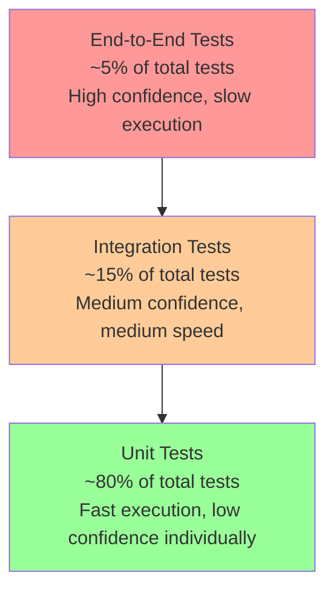

# Testing Requirements Guidelines

## Purpose

This document establishes comprehensive testing requirements for the Academic Management System, defining the testing pyramid structure, unit/integration/end-to-end test implementations with xUnit, coverage targets, and quality assurance processes to ensure reliable, maintainable, and high-quality software delivery.

## Scope

This document covers:

- Testing pyramid implementation with specific coverage targets
- Unit testing standards and patterns using xUnit
- Integration testing strategies for database and external services
- End-to-end testing scenarios and automation
- Test data management and fixture patterns
- Performance testing requirements and benchmarks

This document does not cover:

- Manual testing procedures
- User acceptance testing processes
- Load testing infrastructure setup
- Security penetration testing methodologies

## Prerequisites

- Understanding of Test-Driven Development (TDD) principles
- Familiarity with xUnit testing framework
- Knowledge of .NET 8.0 testing tools and libraries
- Understanding of testing patterns and best practices

## Testing Pyramid Structure

### Testing Pyramid Overview



### Coverage Targets by Test Type

```yaml
Unit Tests:
  Target Coverage: 85% minimum
  Focus Areas:
    - Domain logic and business rules
    - Value objects and entities
    - Command and query handlers
    - Domain services

Integration Tests:
  Target Coverage: 70% of critical paths
  Focus Areas:
    - Database operations
    - External service integrations
    - API endpoints
    - Message handling

End-to-End Tests:
  Target Coverage: 90% of happy path scenarios
  Focus Areas:
    - Complete user workflows
    - Cross-system integrations
    - Business process validation
```

## Unit Testing Standards

### Unit Test Structure and Naming

```csharp
// Test class naming: [ClassUnderTest]Tests
// Test method naming: [MethodUnderTest]_[Scenario]_[ExpectedBehavior]

public class StudentTests
{
    [Fact]
    public void EnrollInCourse_WithValidCourseAndActiveTerm_ShouldCreateEnrollment()
    {
        // Arrange
        var student = CreateActiveStudent();
        var course = CreateValidCourse();
        var term = AcademicTerm.Fall2024;

        // Act
        var result = student.EnrollInCourse(course, term);

        // Assert
        result.IsSuccess.Should().BeTrue();
        student.Enrollments.Should().Contain(e => e.CourseId == course.Id);
    }

    [Theory]
    [InlineData(StudentStatus.Inactive, "Student must be active")]
    [InlineData(StudentStatus.Suspended, "Student must be active")]
    [InlineData(StudentStatus.Graduated, "Student must be active")]
    public void EnrollInCourse_WithInactiveStudent_ShouldReturnError(
        StudentStatus status,
        string expectedErrorMessage)
    {
        // Arrange
        var student = CreateStudentWithStatus(status);
        var course = CreateValidCourse();
        var term = AcademicTerm.Fall2024;

        // Act
        var result = student.EnrollInCourse(course, term);

        // Assert
        result.IsFailure.Should().BeTrue();
        result.Error.Should().Contain(expectedErrorMessage);
    }

    private Student CreateActiveStudent()
    {
        return Student.Create(
            StudentId.New(),
            new PersonalInfo("John", "Doe"),
            new ContactInfo("john.doe@university.edu", "555-0123"),
            ProgramId.New());
    }

    private Student CreateStudentWithStatus(StudentStatus status)
    {
        var student = CreateActiveStudent();
        // Use reflection or internal methods to set status for testing
        student.GetType()
            .GetProperty(nameof(Student.Status))
            ?.SetValue(student, status);
        return student;
    }

    private Course CreateValidCourse()
    {
        return Course.Create(
            CourseId.New(),
            new CourseCode("CS101"),
            new CourseTitle("Introduction to Computer Science"),
            new Credits(3),
            DepartmentId.New());
    }
}
```

### Domain Logic Testing Patterns

```csharp
public class EnrollmentServiceTests
{
    private readonly Mock<IStudentRepository> _mockStudentRepository;
    private readonly Mock<ICourseRepository> _mockCourseRepository;
    private readonly Mock<IAcademicCalendarService> _mockCalendarService;
    private readonly EnrollmentService _enrollmentService;

    public EnrollmentServiceTests()
    {
        _mockStudentRepository = new Mock<IStudentRepository>();
        _mockCourseRepository = new Mock<ICourseRepository>();
        _mockCalendarService = new Mock<IAcademicCalendarService>();

        _enrollmentService = new EnrollmentService(
            _mockStudentRepository.Object,
            _mockCourseRepository.Object,
            _mockCalendarService.Object);
    }

    [Fact]
    public async Task ValidateEnrollmentEligibility_WithValidStudentAndCourse_ShouldReturnSuccess()
    {
        // Arrange
        var studentId = StudentId.New();
        var courseId = CourseId.New();
        var term = AcademicTerm.Fall2024;

        var student = CreateActiveStudentWithCredits(15); // Below limit
        var course = CreateCourseWithCredits(3);

        _mockStudentRepository
            .Setup(r => r.GetByIdAsync(studentId, It.IsAny<CancellationToken>()))
            .ReturnsAsync(student);

        _mockCourseRepository
            .Setup(r => r.GetByIdAsync(courseId, It.IsAny<CancellationToken>()))
            .ReturnsAsync(course);

        _mockCalendarService
            .Setup(s => s.IsEnrollmentPeriodActiveAsync(term, It.IsAny<CancellationToken>()))
            .ReturnsAsync(true);

        // Act
        var result = await _enrollmentService.ValidateEnrollmentEligibilityAsync(
            studentId, courseId, term);

        // Assert
        result.IsValid.Should().BeTrue();
        result.ValidationErrors.Should().BeEmpty();
    }

    [Fact]
    public async Task ValidateEnrollmentEligibility_ExceedingCreditLimit_ShouldReturnValidationError()
    {
        // Arrange
        var studentId = StudentId.New();
        var courseId = CourseId.New();
        var term = AcademicTerm.Fall2024;

        var student = CreateActiveStudentWithCredits(20); // Near limit
        var course = CreateCourseWithCredits(4); // Would exceed 21 credit limit

        SetupRepositoryMocks(studentId, student, courseId, course);

        // Act
        var result = await _enrollmentService.ValidateEnrollmentEligibilityAsync(
            studentId, courseId, term);

        // Assert
        result.IsValid.Should().BeFalse();
        result.ValidationErrors.Should().Contain(error =>
            error.Code == "CREDIT_LIMIT_EXCEEDED");
    }

    private void SetupRepositoryMocks(StudentId studentId, Student student, CourseId courseId, Course course)
    {
        _mockStudentRepository
            .Setup(r => r.GetByIdAsync(studentId, It.IsAny<CancellationToken>()))
            .ReturnsAsync(student);

        _mockCourseRepository
            .Setup(r => r.GetByIdAsync(courseId, It.IsAny<CancellationToken>()))
            .ReturnsAsync(course);
    }
}
```

### Command Handler Testing

```csharp
public class EnrollStudentInCourseCommandHandlerTests
{
    private readonly Mock<IStudentRepository> _mockStudentRepository;
    private readonly Mock<ICourseRepository> _mockCourseRepository;
    private readonly Mock<IEnrollmentRepository> _mockEnrollmentRepository;
    private readonly Mock<IUnitOfWork> _mockUnitOfWork;
    private readonly Mock<ILogger<EnrollStudentInCourseCommandHandler>> _mockLogger;
    private readonly EnrollStudentInCourseCommandHandler _handler;

    public EnrollStudentInCourseCommandHandlerTests()
    {
        _mockStudentRepository = new Mock<IStudentRepository>();
        _mockCourseRepository = new Mock<ICourseRepository>();
        _mockEnrollmentRepository = new Mock<IEnrollmentRepository>();
        _mockUnitOfWork = new Mock<IUnitOfWork>();
        _mockLogger = new Mock<ILogger<EnrollStudentInCourseCommandHandler>>();

        _handler = new EnrollStudentInCourseCommandHandler(
            _mockStudentRepository.Object,
            _mockCourseRepository.Object,
            _mockEnrollmentRepository.Object,
            _mockUnitOfWork.Object,
            _mockLogger.Object);
    }

    [Fact]
    public async Task Handle_WithValidCommand_ShouldCreateEnrollmentAndReturnSuccess()
    {
        // Arrange
        var command = new EnrollStudentInCourseCommand(
            StudentId.New(),
            CourseId.New(),
            AcademicTerm.Fall2024);

        var student = CreateActiveStudent();
        var course = CreateValidCourse();

        _mockStudentRepository
            .Setup(r => r.GetByIdAsync(command.StudentId, It.IsAny<CancellationToken>()))
            .ReturnsAsync(student);

        _mockCourseRepository
            .Setup(r => r.GetByIdAsync(command.CourseId, It.IsAny<CancellationToken>()))
            .ReturnsAsync(course);

        _mockEnrollmentRepository
            .Setup(r => r.GetByStudentAndCourseAsync(
                command.StudentId,
                command.CourseId,
                command.AcademicTerm,
                It.IsAny<CancellationToken>()))
            .ReturnsAsync((Enrollment?)null); // No existing enrollment

        // Act
        var result = await _handler.Handle(command, CancellationToken.None);

        // Assert
        result.IsSuccess.Should().BeTrue();
        _mockEnrollmentRepository.Verify(
            r => r.Add(It.IsAny<Enrollment>()),
            Times.Once);
        _mockUnitOfWork.Verify(
            uow => uow.SaveChangesAsync(It.IsAny<CancellationToken>()),
            Times.Once);
    }

    [Fact]
    public async Task Handle_WithNonExistentStudent_ShouldReturnFailure()
    {
        // Arrange
        var command = new EnrollStudentInCourseCommand(
            StudentId.New(),
            CourseId.New(),
            AcademicTerm.Fall2024);

        _mockStudentRepository
            .Setup(r => r.GetByIdAsync(command.StudentId, It.IsAny<CancellationToken>()))
            .ReturnsAsync((Student?)null);

        // Act
        var result = await _handler.Handle(command, CancellationToken.None);

        // Assert
        result.IsFailure.Should().BeTrue();
        result.Error.Should().Contain("Student not found");
        _mockUnitOfWork.Verify(
            uow => uow.SaveChangesAsync(It.IsAny<CancellationToken>()),
            Times.Never);
    }
}
```

## Integration Testing Standards

### Database Integration Tests

```csharp
[Collection("DatabaseCollection")]
public class StudentRepositoryIntegrationTests : IClassFixture<DatabaseTestFixture>
{
    private readonly DatabaseTestFixture _fixture;
    private readonly AcademiaDbContext _context;
    private readonly StudentRepository _repository;

    public StudentRepositoryIntegrationTests(DatabaseTestFixture fixture)
    {
        _fixture = fixture;
        _context = _fixture.CreateContext();
        _repository = new StudentRepository(_context);
    }

    [Fact]
    public async Task GetByIdAsync_WithExistingStudent_ShouldReturnStudent()
    {
        // Arrange
        var student = CreateTestStudent();
        _context.Students.Add(student);
        await _context.SaveChangesAsync();

        // Act
        var retrievedStudent = await _repository.GetByIdAsync(student.Id);

        // Assert
        retrievedStudent.Should().NotBeNull();
        retrievedStudent!.Id.Should().Be(student.Id);
        retrievedStudent.PersonalInfo.FirstName.Should().Be(student.PersonalInfo.FirstName);
    }

    [Fact]
    public async Task Add_WithNewStudent_ShouldPersistToDatabase()
    {
        // Arrange
        var student = CreateTestStudent();

        // Act
        _repository.Add(student);
        await _context.SaveChangesAsync();

        // Assert
        var persistedStudent = await _context.Students
            .FirstOrDefaultAsync(s => s.Id == student.Id);
        persistedStudent.Should().NotBeNull();
    }

    [Fact]
    public async Task GetBySearchCriteria_WithNameFilter_ShouldReturnMatchingStudents()
    {
        // Arrange
        var student1 = CreateTestStudentWithName("John", "Doe");
        var student2 = CreateTestStudentWithName("Jane", "Smith");
        var student3 = CreateTestStudentWithName("John", "Smith");

        _context.Students.AddRange(student1, student2, student3);
        await _context.SaveChangesAsync();

        var searchCriteria = new StudentSearchCriteria
        {
            FirstName = "John"
        };

        // Act
        var results = await _repository.GetBySearchCriteriaAsync(searchCriteria);

        // Assert
        results.Should().HaveCount(2);
        results.Should().Contain(s => s.Id == student1.Id);
        results.Should().Contain(s => s.Id == student3.Id);
    }

    public void Dispose()
    {
        _context.Dispose();
    }
}
```

### API Integration Tests

```csharp
public class EnrollmentsControllerIntegrationTests : IClassFixture<WebApplicationFactory<Program>>
{
    private readonly WebApplicationFactory<Program> _factory;
    private readonly HttpClient _client;

    public EnrollmentsControllerIntegrationTests(WebApplicationFactory<Program> factory)
    {
        _factory = factory;
        _client = _factory.CreateClient();
    }

    [Fact]
    public async Task POST_EnrollStudent_WithValidData_ShouldReturn201Created()
    {
        // Arrange
        var studentId = await CreateTestStudentAsync();
        var courseId = await CreateTestCourseAsync();

        var request = new EnrollStudentRequest
        {
            StudentId = studentId.ToString(),
            CourseId = courseId.ToString(),
            AcademicTerm = "FALL2024"
        };

        // Act
        var response = await _client.PostAsJsonAsync("/api/enrollments", request);

        // Assert
        response.StatusCode.Should().Be(HttpStatusCode.Created);

        var content = await response.Content.ReadAsStringAsync();
        var enrollmentResponse = JsonSerializer.Deserialize<EnrollmentResponse>(content, JsonOptions);

        enrollmentResponse.Should().NotBeNull();
        enrollmentResponse!.StudentId.Should().Be(request.StudentId);
        enrollmentResponse.CourseId.Should().Be(request.CourseId);

        // Verify persistence
        var location = response.Headers.Location;
        location.Should().NotBeNull();

        var getResponse = await _client.GetAsync(location);
        getResponse.StatusCode.Should().Be(HttpStatusCode.OK);
    }

    [Fact]
    public async Task POST_EnrollStudent_WithInvalidStudent_ShouldReturn400BadRequest()
    {
        // Arrange
        var courseId = await CreateTestCourseAsync();

        var request = new EnrollStudentRequest
        {
            StudentId = Guid.NewGuid().ToString(), // Non-existent student
            CourseId = courseId.ToString(),
            AcademicTerm = "FALL2024"
        };

        // Act
        var response = await _client.PostAsJsonAsync("/api/enrollments", request);

        // Assert
        response.StatusCode.Should().Be(HttpStatusCode.BadRequest);

        var content = await response.Content.ReadAsStringAsync();
        var problemDetails = JsonSerializer.Deserialize<ProblemDetails>(content, JsonOptions);

        problemDetails.Should().NotBeNull();
        problemDetails!.Detail.Should().Contain("Student not found");
    }

    [Theory]
    [InlineData("")]
    [InlineData(null)]
    [InlineData("invalid-guid")]
    public async Task POST_EnrollStudent_WithInvalidStudentId_ShouldReturn400BadRequest(string invalidStudentId)
    {
        // Arrange
        var courseId = await CreateTestCourseAsync();

        var request = new EnrollStudentRequest
        {
            StudentId = invalidStudentId,
            CourseId = courseId.ToString(),
            AcademicTerm = "FALL2024"
        };

        // Act
        var response = await _client.PostAsJsonAsync("/api/enrollments", request);

        // Assert
        response.StatusCode.Should().Be(HttpStatusCode.BadRequest);
    }

    private async Task<StudentId> CreateTestStudentAsync()
    {
        var createRequest = new CreateStudentRequest
        {
            FirstName = "Test",
            LastName = "Student",
            Email = $"test.{Guid.NewGuid():N}@university.edu",
            ProgramId = (await CreateTestProgramAsync()).ToString()
        };

        var response = await _client.PostAsJsonAsync("/api/students", createRequest);
        response.EnsureSuccessStatusCode();

        var content = await response.Content.ReadAsStringAsync();
        var studentResponse = JsonSerializer.Deserialize<StudentResponse>(content, JsonOptions);

        return StudentId.From(studentResponse!.Id);
    }

    private static readonly JsonSerializerOptions JsonOptions = new()
    {
        PropertyNamingPolicy = JsonNamingPolicy.CamelCase
    };
}
```

## End-to-End Testing

### E2E Test Scenarios

```csharp
[Collection("E2E Collection")]
public class StudentEnrollmentE2ETests : IClassFixture<E2ETestFixture>
{
    private readonly E2ETestFixture _fixture;

    public StudentEnrollmentE2ETests(E2ETestFixture fixture)
    {
        _fixture = fixture;
    }

    [Fact]
    public async Task CompleteEnrollmentWorkflow_FromStudentCreationToGradeAssignment()
    {
        // Scenario: Complete student enrollment and grading workflow

        // Step 1: Create Academic Program
        var program = await _fixture.CreateAcademicProgramAsync(
            "Computer Science",
            DegreeType.Bachelor);

        // Step 2: Create Department and Faculty
        var department = await _fixture.CreateDepartmentAsync("Computer Science Department");
        var faculty = await _fixture.CreateFacultyAsync("Dr. Jane Smith", department.Id);

        // Step 3: Create Course
        var course = await _fixture.CreateCourseAsync(
            "CS101",
            "Introduction to Programming",
            3,
            department.Id);

        // Step 4: Schedule Course Offering
        var offering = await _fixture.CreateCourseOfferingAsync(
            course.Id,
            faculty.Id,
            AcademicTerm.Fall2024,
            capacity: 30);

        // Step 5: Create Student
        var student = await _fixture.CreateStudentAsync(
            "John Doe",
            "john.doe@university.edu",
            program.Id);

        // Step 6: Enroll Student in Course
        var enrollment = await _fixture.EnrollStudentAsync(
            student.Id,
            course.Id,
            AcademicTerm.Fall2024);

        enrollment.Should().NotBeNull();
        enrollment.Status.Should().Be(EnrollmentStatus.Active);

        // Step 7: Assign Grade
        var grade = await _fixture.AssignGradeAsync(
            enrollment.Id,
            GradeValue.A,
            faculty.Id);

        grade.Should().NotBeNull();
        grade.Value.Should().Be(GradeValue.A);

        // Step 8: Verify Academic Record Update
        var academicRecord = await _fixture.GetAcademicRecordAsync(student.Id);

        academicRecord.Should().NotBeNull();
        academicRecord.TotalCredits.Should().Be(3);
        academicRecord.GradePointAverage.Should().Be(4.0m); // A = 4.0

        // Step 9: Generate Transcript
        var transcript = await _fixture.GenerateTranscriptAsync(student.Id);

        transcript.Should().NotBeNull();
        transcript.Courses.Should().HaveCount(1);
        transcript.Courses.First().Grade.Should().Be("A");
    }

    [Fact]
    public async Task EnrollmentCapacityManagement_ShouldEnforceCapacityLimits()
    {
        // Scenario: Test enrollment capacity enforcement

        var course = await _fixture.CreateCourseAsync("CS102", "Data Structures", 3);
        var offering = await _fixture.CreateCourseOfferingAsync(
            course.Id,
            capacity: 2); // Limited capacity

        // Enroll first student - should succeed
        var student1 = await _fixture.CreateStudentAsync("Student One");
        var enrollment1 = await _fixture.EnrollStudentAsync(student1.Id, course.Id);
        enrollment1.Should().NotBeNull();

        // Enroll second student - should succeed
        var student2 = await _fixture.CreateStudentAsync("Student Two");
        var enrollment2 = await _fixture.EnrollStudentAsync(student2.Id, course.Id);
        enrollment2.Should().NotBeNull();

        // Attempt to enroll third student - should fail due to capacity
        var student3 = await _fixture.CreateStudentAsync("Student Three");
        var enrollmentResult = await _fixture.TryEnrollStudentAsync(student3.Id, course.Id);

        enrollmentResult.IsFailure.Should().BeTrue();
        enrollmentResult.Error.Should().Contain("capacity");
    }
}
```

## Test Data Management

### Test Fixture Implementation

```csharp
public class DatabaseTestFixture : IDisposable
{
    private readonly string _connectionString;
    private readonly IServiceScope _scope;
    private readonly AcademiaDbContext _context;

    public DatabaseTestFixture()
    {
        var services = new ServiceCollection();

        _connectionString = $"Server=(localdb)\\mssqllocaldb;Database=AcademiaTest_{Guid.NewGuid():N};Trusted_Connection=true;MultipleActiveResultSets=true";

        services.AddDbContext<AcademiaDbContext>(options =>
            options.UseSqlServer(_connectionString));

        services.AddScoped<IStudentRepository, StudentRepository>();
        services.AddScoped<ICourseRepository, CourseRepository>();

        var serviceProvider = services.BuildServiceProvider();
        _scope = serviceProvider.CreateScope();
        _context = _scope.ServiceProvider.GetRequiredService<AcademiaDbContext>();

        _context.Database.EnsureCreated();
    }

    public AcademiaDbContext CreateContext()
    {
        return _scope.ServiceProvider.GetRequiredService<AcademiaDbContext>();
    }

    public async Task<Student> CreateTestStudentAsync(
        string firstName = "Test",
        string lastName = "Student",
        string email = null)
    {
        email ??= $"test.{Guid.NewGuid():N}@university.edu";

        var student = Student.Create(
            StudentId.New(),
            new PersonalInfo(firstName, lastName),
            new ContactInfo(email, "555-0123"),
            ProgramId.New());

        _context.Students.Add(student);
        await _context.SaveChangesAsync();

        return student;
    }

    public void Dispose()
    {
        _context?.Database.EnsureDeleted();
        _context?.Dispose();
        _scope?.Dispose();
    }
}

[CollectionDefinition("DatabaseCollection")]
public class DatabaseCollection : ICollectionFixture<DatabaseTestFixture>
{
    // This class has no code, and is never created. Its purpose is simply
    // to be the place to apply [CollectionDefinition] and all the
    // ICollectionFixture<> interfaces.
}
```

### Test Data Builders

```csharp
public class StudentBuilder
{
    private StudentId _id = StudentId.New();
    private PersonalInfo _personalInfo = new("John", "Doe");
    private ContactInfo _contactInfo = new("john.doe@university.edu", "555-0123");
    private ProgramId _programId = ProgramId.New();
    private StudentStatus _status = StudentStatus.Active;

    public StudentBuilder WithId(StudentId id)
    {
        _id = id;
        return this;
    }

    public StudentBuilder WithPersonalInfo(string firstName, string lastName)
    {
        _personalInfo = new PersonalInfo(firstName, lastName);
        return this;
    }

    public StudentBuilder WithEmail(string email)
    {
        _contactInfo = new ContactInfo(email, _contactInfo.PhoneNumber);
        return this;
    }

    public StudentBuilder WithStatus(StudentStatus status)
    {
        _status = status;
        return this;
    }

    public StudentBuilder WithProgram(ProgramId programId)
    {
        _programId = programId;
        return this;
    }

    public Student Build()
    {
        var student = Student.Create(_id, _personalInfo, _contactInfo, _programId);

        if (_status != StudentStatus.Active)
        {
            // Use reflection or internal methods to set non-default status
            var statusProperty = typeof(Student).GetProperty(nameof(Student.Status));
            statusProperty?.SetValue(student, _status);
        }

        return student;
    }

    public static implicit operator Student(StudentBuilder builder) => builder.Build();
}

// Usage in tests:
public class ExampleUsage
{
    [Fact]
    public void ExampleTest()
    {
        var student = new StudentBuilder()
            .WithPersonalInfo("Jane", "Smith")
            .WithEmail("jane.smith@university.edu")
            .WithStatus(StudentStatus.Active)
            .Build();

        // Test logic here
    }
}
```

## Performance Testing

### Performance Test Requirements

```csharp
[Collection("Performance Tests")]
public class EnrollmentPerformanceTests
{
    [Fact]
    public async Task EnrollmentCommand_ProcessingTime_ShouldBeLessThan200ms()
    {
        // Arrange
        var handler = CreateCommandHandler();
        var command = CreateValidEnrollmentCommand();
        var stopwatch = Stopwatch.StartNew();

        // Act
        var result = await handler.Handle(command, CancellationToken.None);
        stopwatch.Stop();

        // Assert
        result.IsSuccess.Should().BeTrue();
        stopwatch.ElapsedMilliseconds.Should().BeLessThan(200);
    }

    [Fact]
    public async Task EnrollmentQuery_ResponseTime_ShouldBeLessThan100ms()
    {
        // Arrange
        var handler = CreateQueryHandler();
        var query = new GetStudentEnrollmentsQuery(StudentId.New());
        var stopwatch = Stopwatch.StartNew();

        // Act
        var result = await handler.Handle(query, CancellationToken.None);
        stopwatch.Stop();

        // Assert
        result.Should().NotBeNull();
        stopwatch.ElapsedMilliseconds.Should().BeLessThan(100);
    }

    [Fact]
    public async Task ConcurrentEnrollments_ShouldHandleWithoutDeadlock()
    {
        // Arrange
        var tasks = new List<Task>();
        const int concurrentRequests = 50;

        // Act
        for (int i = 0; i < concurrentRequests; i++)
        {
            tasks.Add(Task.Run(async () =>
            {
                var handler = CreateCommandHandler();
                var command = CreateValidEnrollmentCommand();
                var result = await handler.Handle(command, CancellationToken.None);
                result.IsSuccess.Should().BeTrue();
            }));
        }

        // Assert
        await Task.WhenAll(tasks);
        // If we reach here without timeout, the test passes
    }
}
```

## Test Configuration and Setup

### Test Project Configuration

```xml
<Project Sdk="Microsoft.NET.Sdk">

  <PropertyGroup>
    <TargetFramework>net8.0</TargetFramework>
    <ImplicitUsings>enable</ImplicitUsings>
    <Nullable>enable</Nullable>
    <IsPackable>false</IsPackable>
    <TreatWarningsAsErrors>true</TreatWarningsAsErrors>
    <WarningsAsErrors />
  </PropertyGroup>

  <ItemGroup>
    <PackageReference Include="Microsoft.NET.Test.Sdk" Version="17.8.0" />
    <PackageReference Include="xunit" Version="2.4.2" />
    <PackageReference Include="xunit.runner.visualstudio" Version="2.4.5" />
    <PackageReference Include="FluentAssertions" Version="6.12.0" />
    <PackageReference Include="Moq" Version="4.20.69" />
    <PackageReference Include="Microsoft.EntityFrameworkCore.InMemory" Version="8.0.0" />
    <PackageReference Include="Microsoft.AspNetCore.Mvc.Testing" Version="8.0.0" />
    <PackageReference Include="Testcontainers.SqlServer" Version="3.6.0" />
    <PackageReference Include="Bogus" Version="34.0.2" />
    <PackageReference Include="NBomber" Version="5.0.0" />
  </ItemGroup>

  <ItemGroup>
    <ProjectReference Include="..\..\src\Academia.Domain\Academia.Domain.csproj" />
    <ProjectReference Include="..\..\src\Academia.Application\Academia.Application.csproj" />
    <ProjectReference Include="..\..\src\Academia.Infrastructure\Academia.Infrastructure.csproj" />
  </ItemGroup>

</Project>
```

## Continuous Integration Testing

### Test Execution Pipeline

```yaml
name: Test Execution Pipeline

on:
  push:
    branches: [main, develop]
  pull_request:
    branches: [main]

jobs:
  test:
    runs-on: ubuntu-latest

    services:
      sqlserver:
        image: mcr.microsoft.com/mssql/server:2022-latest
        env:
          ACCEPT_EULA: Y
          SA_PASSWORD: YourPassword123
        options: >-
          --health-cmd "/opt/mssql-tools/bin/sqlcmd -S localhost -U sa -P YourPassword123 -Q 'SELECT 1'"
          --health-interval 10s
          --health-timeout 3s
          --health-retries 10
          --health-start-period 10s

    steps:
      - uses: actions/checkout@v4

      - name: Setup .NET
        uses: actions/setup-dotnet@v3
        with:
          dotnet-version: 8.0.x

      - name: Restore dependencies
        run: dotnet restore

      - name: Build
        run: dotnet build --no-restore --configuration Release

      - name: Run Unit Tests
        run: |
          dotnet test tests/Academia.Domain.Tests/ \
            --configuration Release \
            --no-build \
            --logger trx \
            --collect:"XPlat Code Coverage" \
            --results-directory ./TestResults/Unit

      - name: Run Integration Tests
        run: |
          dotnet test tests/Academia.Infrastructure.Tests/ \
            --configuration Release \
            --no-build \
            --logger trx \
            --collect:"XPlat Code Coverage" \
            --results-directory ./TestResults/Integration
        env:
          ConnectionStrings__DefaultConnection: "Server=localhost;Database=AcademiaTest;User Id=sa;Password=YourPassword123;TrustServerCertificate=true;"

      - name: Run API Tests
        run: |
          dotnet test tests/Academia.API.Tests/ \
            --configuration Release \
            --no-build \
            --logger trx \
            --collect:"XPlat Code Coverage" \
            --results-directory ./TestResults/API

      - name: Generate Code Coverage Report
        uses: danielpalme/ReportGenerator-GitHub-Action@5.1.23
        with:
          reports: "./TestResults/**/coverage.cobertura.xml"
          targetdir: "./TestResults/CoverageReport"
          reporttypes: "Html;Cobertura;JsonSummary"

      - name: Code Coverage Summary
        run: |
          COVERAGE=$(jq -r '.summary.linecoverage' ./TestResults/CoverageReport/Summary.json)
          echo "Code Coverage: $COVERAGE%"

          if (( $(echo "$COVERAGE < 85" | bc -l) )); then
            echo "Code coverage ($COVERAGE%) is below minimum threshold (85%)"
            exit 1
          fi
```

## Related Documentation References

- [SDLC Process Guidelines](./sdlc-process.instructions.md)
- [CQRS Implementation](./cqrs-implementation.instructions.md)
- [Architecture Design](./architecture-design.instructions.md)
- [CI/CD Pipeline](./deployment-operations.instructions.md)

## Validation Checklist

Before considering the testing implementation complete, verify:

- [ ] Testing pyramid structure is implemented with appropriate coverage targets (85% unit, 70% integration, 90% E2E happy path)
- [ ] Unit tests follow consistent naming conventions and AAA pattern
- [ ] Integration tests cover database operations and external service interactions
- [ ] End-to-end tests validate complete business workflows
- [ ] Test data management uses builders and fixtures for maintainability
- [ ] Performance tests validate response time requirements
- [ ] Continuous integration pipeline executes all test categories
- [ ] Code coverage reporting is automated and enforced
- [ ] Test isolation is maintained between test runs
- [ ] Mock objects are used appropriately for external dependencies
- [ ] Test documentation explains testing strategy and patterns
- [ ] All critical business scenarios are covered by automated tests
